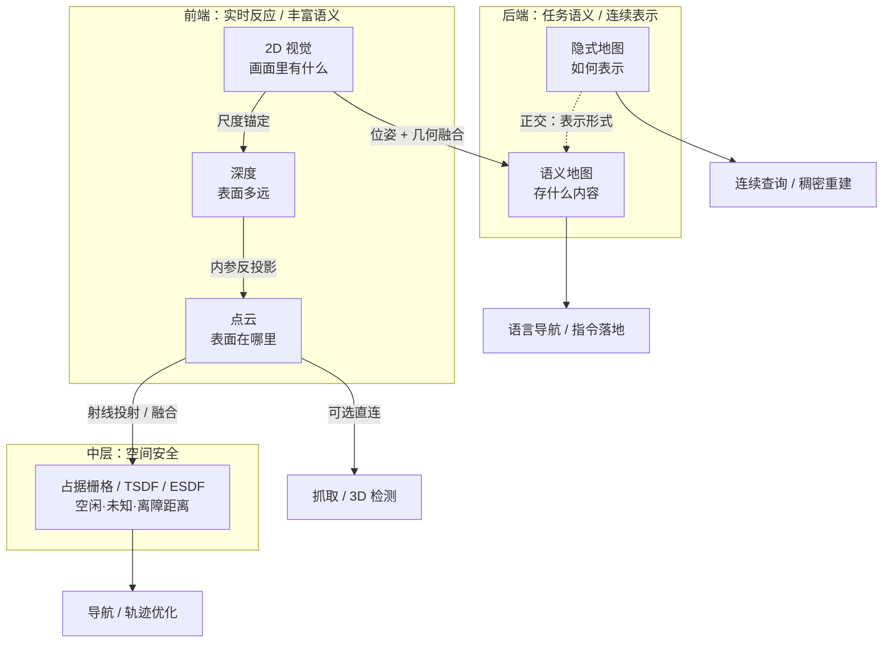

# 具身感知六种空间表征

## 一句话定义

**具身感知六种空间表征**把常被并列混谈的 **2D 视觉、深度、点云、占据栅格/距离场、语义地图、隐式地图** 拆成感知栈上的不同层级：它们回答的问题不同（看见什么 → 多远 → 表面在哪 → 能否通行 → 任务语义 → 连续查询），**不是**从二维到三维的单向「升级路线」。

## 英文缩写速查

| 缩写 | 英文全称 | 简要说明 |
|------|----------|----------|
| RGB-D | RGB-Depth | 彩色 + 深度；深度层常见传感形态 |
| TSDF | Truncated Signed Distance Function | 截断符号距离场；表面融合与网格提取 |
| ESDF | Euclidean Signed Distance Field | 欧氏符号距离场；轨迹优化与安全余量 |
| NeRF | Neural Radiance Field | 神经辐射场；隐式外观/几何的视觉代表，≠ 具身隐式地图全体 |
| VLMaps | Visual-Language Maps | 将视觉语言特征锚定到三维地图，支持语言查询导航 |

## 为什么重要

- **层级混淆比术语偏差更致命**：把深度叫点云、把 TSDF 叫占据栅格、把所有神经隐式叫 NeRF，会导致选错下游模块（抓取用了无自由空间语义的点云，或用隐式场硬顶实时碰撞查询）。
- **「看到了」≠「抓得到 / 走得通」**：2D 检测缺尺度；稠密点云不编码已确认自由空间；语义与隐式解决的是正交问题。
- **真实系统多表征并存**：识别、定位、规划、执行节点各自消费不同层级，并在关键节点做转换与融合。

## 核心原理

### 六层问题边界

| 层 | 表征 | 回答的问题 | 典型消费方 | 根本边界 |
|----|------|------------|------------|----------|
| 1 | **2D 视觉** | 画面里有什么 | 检测/分割/VLM、图像空间视觉伺服 | 单图通常无唯一三维尺度 |
| 2 | **深度** | 沿视线表面多远 | RGB-D SLAM、尺度对齐 | 视角绑定的第一层表面；相对深度 ≠ 米制深度 |
| 3 | **点云** | 观测到的表面在哪里 | ICP、抓取位姿、三维检测 | 「无点」≠「已确认空闲」 |
| 4 | **占据栅格 / 距离场** | 哪里空闲、离障碍多远 | 碰撞检查、导航、轨迹优化 | 同体素结构可存完全不同物理量 |
| 5 | **语义地图** | 这里是什么、与任务何关 | 目标导航、语言指令落地 | 依赖几何重建与长期一致性 |
| 6 | **隐式地图** | 任意坐标处几何/外观是什么 | 稠密重建、连续空间查询 | 在线更新、遗忘、碰撞边界提取仍难 |

### 两个正交轴（最易误解）

1. **点云 → 占据不是必经之路**：点云可直接服务抓取与三维检测，也可分别注入距离场或语义地图。
2. **语义地图 ≠ 隐式地图的前后替代**：
   - **语义**：地图保存「什么内容」（类别、实例、语言特征）。
   - **隐式**：地图「如何表示」（离散网格 vs 可学习函数 / 特征网格）。
   - 一张语义地图可以是显式体素，也可以挂在隐式场上；一种隐式场也可以是纯几何、无语义。

### 体素三兄弟：同结构，不同物理量

| 表示 | 体素存什么 | 回答 | 典型用途 |
|------|------------|------|----------|
| 占据概率栅格（如 OctoMap） | 占据概率；显式空闲/占据/未知 | 这里能不能走 | 碰撞检查、探索 |
| **TSDF** | 到观测表面的截断符号距离 | 表面零交叉在哪 | 多帧深度融合、网格提取 |
| **ESDF** | 到最近障碍的欧氏符号距离（含梯度） | 离障碍还有多远 | 轨迹优化、安全余量 |

工程落地示例：[Isaac ROS nvblox](../entities/isaac-ros-nvblox.md) 在 GPU 上维护 TSDF/ESDF，供 [Nav2](../overview/navigation-slam-autonomy-stack.md) 类栈做 3D 代价。学习型稠密语义占据（室内外协议不统一时）见 [OccAnyScene](../entities/paper-occanyscene.md)：连续高斯再 splat 到各域栅格，不是在线距离场。

### 各层关键机制（压缩）

- **2D**：输出组织在图像坐标系（分类 / 框 / 像素类 / 实例掩码 / 关键点 / 可供性）。「检测到杯子」只说明画面区域，不自动给出可操作 6D 位姿——见 [2D→3D 语义提升 Gap](./2d-to-3d-semantic-lifting-gap.md)。
- **深度**：双目 / 结构光 / ToF / LiDAR 投影或单目先验；相对逆深度可编辑图像，抓取与落脚需要度量对齐。
- **点云**：深度 + 内参反投影；保留三维距离与法向，但**不保存射线穿过的自由空间**——规划安全语义需 ray casting 区分未知与空闲。
- **语义地图**：把多视角语义预测融合到统一世界系；开放词汇路线（如 VLMaps）把视觉语言特征锚定到三维，支持「两张沙发之间」类指令——案例见 [GO2 SAM 语义建图流水线](../queries/go2-3d-semantic-mapping-sam-pipeline.md)。
- **隐式地图**：坐标 → 占据/距离/特征的可学习函数（iMAP、NICE-SLAM 等）；具身更关心几何与占据，而非纯新视图合成。趋势是隐式场 + 八叉树特征网格等显式结构混用。

## 工程实践

### 选型口诀

**在正确层级，选择正确表征。** 先问下游任务要回答哪一句话，再选层；不要用「更 3D / 更神经」当默认升级。

| 下游任务 | 优先表征 | 常需配套 |
|----------|----------|----------|
| 图像空间伺服 / 「找出红色杯子」入口 | 2D 视觉 | 深度或强几何先验才落到 6D |
| 度量抓取 / 落脚 | 深度（度量）+ 点云 | 内参、手眼、深度可信门限 |
| 碰撞检查 / 探索 | 占据栅格（含未知） | 射线投射更新自由空间 |
| 轨迹优化 / 安全余量 | ESDF（或等价距离场） | 在线更新频率 vs 规划周期 |
| 语言目标导航 | 语义地图（可开放词汇） | 稳定位姿 + 几何底座 |
| 高保真重建 / 连续查询 | 隐式或混合场 | 碰撞边界提取与遗忘策略 |

### 与感知栈选型闭环的对齐

本页回答「表征语义上差在哪」；工程「怎么一层层选出来」见 [机器人视觉感知栈选型闭环](../queries/robot-perception-stack-selection-loop.md)：

| 本页层级 | 选型闭环层 |
|----------|------------|
| 2D / 深度传感形态 | ① 传感与标定 |
| 2D 视觉模型 | ② 2D 检测/分割 |
| 点云 → 语义 / 占据 | ③ 2D→3D 提升与语义建图 |
| 各层输出进控制 | ④ 下游策略消费（含 [坐标后处理](./perception-coordinate-postprocessing.md)） |

### 调试指标（按层）

| 层 | 先看什么 |
|----|----------|
| 深度 | 相对 vs 度量；远处/反光/低纹理失效区 |
| 点云 | 配准残差；「无点区」是否被误当自由空间 |
| 占据 / ESDF | 未知体素比例；距离场梯度是否可供优化 |
| 语义地图 | 跨帧实例一致性；语言查询召回 vs 几何漂移 |
| 隐式 | 在线更新时延；能否稳定抽出碰撞表面 |

## 局限与风险

- **适用边界：** 本页是**表征语义分层**，不替代具体 SLAM/建图算法选型；导航工程栈见 [导航·SLAM 总览](../overview/navigation-slam-autonomy-stack.md)。
- **误区：点云密 = 可导航。** 无射线语义则未知与自由混淆，规划会假安全。
- **误区：TSDF / ESDF / 占据可互换。** 同为体素，物理量与适用任务不同。
- **误区：语义地图与隐式地图二选一。** 内容轴与表示轴正交；混用才是常态。
- **误区：隐式地图 = NeRF。** 具身更常要隐式占据 / 神经 SDF / 神经场 SLAM；NeRF 只是视觉侧代表。
- **工程风险：** 语义精度绑定几何与位姿；隐式场的在线更新与碰撞提取仍是部署瓶颈。

## 关联页面

- [2D→3D 语义提升 Gap](./2d-to-3d-semantic-lifting-gap.md) — 2D/深度提升到可消费 3D 语义几何的信息损失
- [机器人视觉感知栈选型闭环](../queries/robot-perception-stack-selection-loop.md) — 传感→策略消费的工程选型链
- [导航·SLAM·自动驾驶开源栈](../overview/navigation-slam-autonomy-stack.md) — 占据 / ESDF / Nav2 落点
- [Isaac ROS nvblox](../entities/isaac-ros-nvblox.md) — GPU TSDF/ESDF
- [OccAnyScene](../entities/paper-occanyscene.md) — 跨室内外语义占据（像素视锥高斯；代码待发布）
- [FindAnything](../entities/findanything.md) · [OV-SAM3D](../entities/ov-sam3d.md) · [CMU MSCV Semantic 3D Mapping](../entities/cmu-mscv-semantic-3d-mapping.md) — 语义建图代表
- [GO2 三维语义建图 SAM 流水线](../queries/go2-3d-semantic-mapping-sam-pipeline.md) — 语义地图端到端案例
- [Grasp Pose Estimation](../methods/grasp-pose-estimation.md) — 点云直连操作
- [三维坐标变换](../formalizations/3d-coordinate-transforms-vision-robotics.md) — 像素↔相机↔世界底座
- [视觉表征作为策略输入](./visual-representation-for-policy.md) — 另一条「表征」轴（策略特征，非空间地图）
- [VLN（任务）](../tasks/vision-language-navigation.md) — 语义地图的语言导航消费方

## 参考来源

- [深蓝具身智能：六种空间表征分层](../../sources/blogs/wechat_shenlan_six_spatial_representations_embodied_perception.md) — 本页主编译来源（微信；原始落盘见同页）
- [OccAnyScene 论文摘录](../../sources/papers/occanyscene_arxiv_2608_08696.md) — 学习型语义占据（第 4 层）跨协议对照

## 推荐继续阅读

- [原文（微信）](https://mp.weixin.qq.com/s/lWvdz9cjuurS7ikBkZk0vQ) — 深蓝具身智能，含分层示意图
- Hornung et al., *OctoMap* — 概率占据与未知标记的经典实现叙事
- Azuma et al. / VLMaps 相关工作 — 开放词汇语义地图与语言导航
