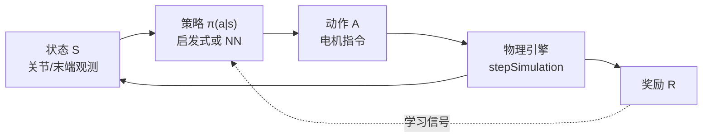

# 具身 RL 最小闭环（Embodied RL Minimal Closed Loop）

在具身智能里，**最小闭环**指：智能体与仿真（或真机）环境之间，每一步都能完成 **观测 → 决策 → 执行 → 物理推进 → 奖励反馈** 的完整回合，且各变量与 [MDP](../formalizations/mdp.md) 五元组一一对应。

## 一句话定义

先让「环境会动、奖励会算、动作能写进去」跑通，再谈 PPO 调参——否则 RL 只是在空转梯度。

## 英文缩写速查

| 缩写 | 英文全称 | 简要说明 |
|------|----------|----------|
| MDP | Markov Decision Process | $S,A,P,R,\gamma$ 五元组形式化 |
| POMDP | Partially Observable MDP | 真机部署时观测不完整的标准建模 |
| RL | Reinforcement Learning | 通过闭环交互优化策略 |
| PPO | Proximal Policy Optimization | 具身 loco 最常用的 on-policy 算法 |
| SAC | Soft Actor-Critic | 精细连续控制常用的最大熵 off-policy 算法 |
| HER | Hindsight Experience Replay | 稀疏奖励操作任务常用技巧 |

## 强化学习的三个核心特质（直觉）

从「岔路口试左右」的比喻可提炼：

1. **无标准答案标注** — 只有环境反馈，智能体自主迭代（与监督学习相对）。
2. **延迟因果** — 当前动作的效果可能多步后才体现在奖励上。
3. **探索与利用** — 既要试新路，又要利用已知好路；PPO 的 Clip、SAC 的熵正则都在约束「别一次改太猛」。

**策略** $\pi(a|s)$ 即「路牌」：输入状态，输出动作；工程上多为神经网络，用 PPO/SAC 等更新参数。

## 五元组与仿真循环的映射

以 [PyBullet](../entities/pybullet.md) KUKA 臂 **定点到达** 教学任务为例：

| MDP 要素 | 仿真实现 |
|----------|----------|
| $S$ | `getLinkState` 得末端位置、关节角 |
| $A$ | `setJointMotorControl2` 速度/位置/力矩指令 |
| $R$ | 如 $R=-\|p_{ee}-p_{target}\|$（越近越高） |
| $P$ | `stepSimulation()` 后 Bullet 积分重力与碰撞 |
| $\gamma$ | 训练算法侧对多步回报加权（手写 demo 可单步） |

进阶时把 $\pi$ 从手写规则换成 **PPO/SAC 输出的神经网络**，其余闭环结构不变。

## 离散 vs 连续动作

| 类型 | 例子 | 具身相关性 |
|------|------|------------|
| 离散 | 围棋落子、网格移动 | 教学用；真机 loco 较少 |
| 连续 | 关节力矩、目标位置偏移 | **具身主流** — 状态维高、动作维高 |

## PPO 与 SAC 的具身分工（速查）

| 算法 | 何时优先 | 原因 |
|------|----------|------|
| **PPO** | 四足/人形行走、大规模并行仿真 | on-policy 与 Isaac 类环境契合；Clip 保稳定 |
| **SAC** | 灵巧手、精细抓取、摩擦/位姿扰动大 | 最大熵探索更充分、样本复用 |

详见 [PPO vs SAC](../comparisons/ppo-vs-sac.md)。稀疏奖励操作可叠 [HER](../methods/her.md)。

## 推荐最小实验路径

1. **PyBullet 手写闭环** — 验证 $S,A,R,P$ 接口（见 [PyBullet](../entities/pybullet.md)）。
2. **Gymnasium 玩具环境** — CartPole 等跑通 PPO API。
3. **Isaac Lab 人形** — 并行环境与 domain randomization（见 [运动控制路线 L5.2](../../roadmap/motion-control.md#l52-rl-在人形运动控制里的应用)）。

真机训练前必须在仿真完成闭环；试错成本与设备安全是硬约束。

## 部署时的 POMDP

标准 MDP 假设 $s$ 完全可观测。真机通常只有 IMU、编码器、噪声视觉 → 建模为 [POMDP](../formalizations/pomdp.md)：用历史观测、RNN 或 Transformer 编码隐状态，再输出动作。

## 关联趋势（扩展阅读）

- [仿真物理保真度链路选型指南](../queries/simulation-physics-fidelity.md) — 本页所述物理/仿真要素在保真度链路（建模 ① → 数值 ② → 接触 ③ → 随机化 ④）中的定位
- **LLM + RL**：语义规划 + 底层 RL 执行。
- **多任务统一策略**：单网络覆盖 loco / 操作。
- **内在奖励探索**：[Intrinsic reward 预训练](../overview/bfm-category-03-intrinsic-reward-pretraining.md) — 无手工奖励时的自驱动探索。

## 关联页面

- [MDP](../formalizations/mdp.md) · [POMDP](../formalizations/pomdp.md)
- [Reinforcement Learning](../methods/reinforcement-learning.md)
- [主路线：运动控制 L5](../../roadmap/motion-control.md#l5-强化学习与模仿学习)
- [深蓝《具身智能基础》专栏地图](../overview/shenlan-embodied-ai-fundamentals-series.md)

## 参考来源

- [深蓝具身智能：跑通具身控制最小闭环](../../sources/blogs/wechat_shenlan_rl_embodied_minimal_closed_loop.md) — <https://mp.weixin.qq.com/s/hHkQqLfIOTn0CoAZNuLWJA>
