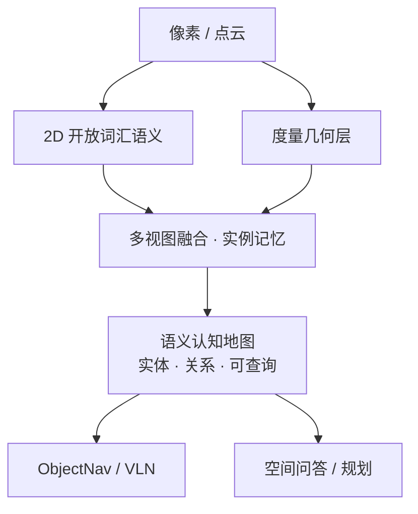

# 具身语义认知地图（Embodied Semantic Cognitive Map）

**具身语义认知地图** 指机器人在探索过程中维护的、同时包含 **度量几何** 与 **语言可寻址语义实体** 的空间记忆：不仅知道哪里可走，还知道「沙发 / 冰箱 / 楼梯」等实体及其不确定度，供导航、问答与任务规划查询。

## 一句话定义

**一张既能用来走路、又能用自然语言问「东西在哪」的活地图——几何骨架 + 开放词汇实体层。**

## 英文缩写速查

| 缩写 | 英文全称 | 简要说明 |
|------|----------|----------|
| Semantic Map | Semantic Map | 带类别/实体标注的空间地图 |
| OV | Open-Vocabulary | 开放词汇，不限封闭类表 |
| ObjectNav | Object-Goal Navigation | 按物体目标导航 |
| TSDF | Truncated Signed Distance Function | 稠密几何融合常见载体 |
| VLM | Vision-Language Model | 提供开放语义嵌入或标签 |
| Habitat | Habitat Simulator | 室内语义感知与导航常用仿真 |

## 为什么重要

- **课程 Day2 主线：** 「构建具身语义认知地图」与 Habitat 室内语义感知项目直接对应，需要独立概念节点。
- **连接感知与语言：** 纯占据栅格无法服务 VLN/ObjectNav；纯图像记忆又缺度量与可通行。
- **工程分岔清晰：** 在线对象级（[FindAnything](../entities/findanything.md)、[OVO](../entities/ovo-semantic-mapping.md)）vs 稠密语义 vs TravExplorer 式可通行+实例记忆。

## 核心原理

从像素到可查询实体，通常四步：

1. **几何：** LiDAR/深度 → 占据或 TSDF / 网格。
2. **2D 语义：** 检测/分割/VLM（[SAM 3](../entities/paper-sam3.md) 等）得实例。
3. **提升与融合：** 投影到 3D 并做多视图融合（Gap 见 [2D→3D](./2d-to-3d-semantic-lifting-gap.md)）。
4. **认知接口：** 实体 ID、开放词汇标签、不确定度、可供语言检索的索引。

## 工程实践

| 项 | 建议 |
|----|------|
| 仿真入门 | [Habitat](../entities/habitat-sim.md) 加载 HM3D/MP3D，先做语义分割可视化再接导航 |
| 真机 | 几何用 LIO 稳了再叠语义；运动重影优先查同步 |
| 查询 API | 至少支持「类别 → 位姿假说列表」与「前沿探索价值」 |
| 与 TravExplorer | 概率实例图 + 空间价值图是认知地图的轻量实现变体 |

## 局限与风险

- **语义漂移：** 开放词汇标签冲突、家具移动导致过期实体。
- **算力：** 稠密语义体素在 Orin 上易爆内存；优先对象级子地图。
- **过度拟人：** 「认知」在此指可查询语义记忆，不是完整世界模型推理。

## 关联页面

- [视觉–语言特征融合](./vision-language-feature-fusion.md)
- [具身感知六种空间表征](./embodied-perception-six-spatial-representations.md)
- [零样本目标导航](../tasks/zero-shot-object-navigation.md)
- [TravExplorer](../entities/paper-travexplorer.md)
- [四足×VLN 实战营总览](../overview/quadruped-vln-embodied-workshop.md)

## 参考来源

- [四足×VLN 实战营课程大纲](../../sources/courses/quadruped_vln_embodied_workshop_2day.md)

## 推荐继续阅读

- [GO2 三维语义建图 SAM 流水线](../queries/go2-3d-semantic-mapping-sam-pipeline.md)
