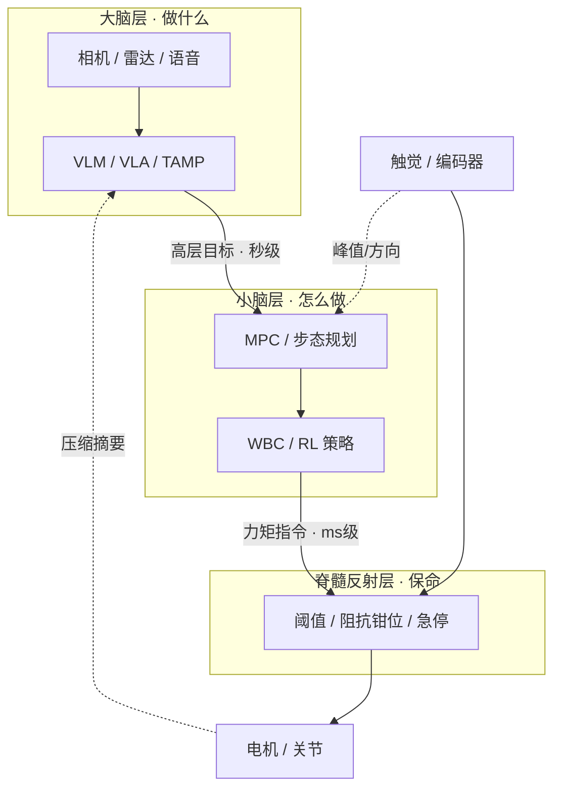

# 具身机器人三层控制架构（大脑 / 小脑 / 脊髓）

**具身三层控制架构**借用生物神经分层，把整机控制栈按 **时延与算力预算** 拆成：**大脑层**回答「做什么」（VLM/VLA、TAMP、行为树），**小脑层**回答「怎么做」（MPC、WBC、高频 RL 策略），**脊髓反射层**回答「如何保命」（阈值比较、阻抗钳位、急停）。层界在工程上常重叠，但分层便于测试、安全认证与故障范围界定。

## 一句话定义

用 **秒级规划 → 百 Hz 协调 → 亚毫秒反射** 的时间尺度分工，把大模型推理、确定性全身控制与硬件级安全回路解耦到不同算力与可靠性域。

## 英文缩写速查

| 缩写 | 英文全称 | 简要说明 |
|------|----------|----------|
| VLA | Vision-Language-Action | 视觉-语言-动作多模态策略，常居大脑层 |
| MPC | Model Predictive Control | 模型预测控制，滚动优化质心/落脚点 |
| WBC | Whole-Body Control | 全身控制，QP 分配关节力矩满足多任务 |
| TAMP | Task and Motion Planning | 任务与运动联合规划 |
| ZMP | Zero Moment Point | 零力矩点，步态稳定性约束 |
| SNN | Spiking Neural Network | 脉冲神经网络，可用于低功耗反射执行 |

## 为什么重要

- **延迟矛盾：** 语义规划需要大算力与百 ms 级推理，跌倒/碰撞保护却要求亚 ms 响应——单一大模型无法覆盖全频段。
- **选型坐标：** 读论文或产品白皮书时，先问「这段逻辑属于哪一层、允许多大延迟、失败时谁兜底」。
- **安全与认证：** 反射层确定性行为可单独验证；大脑层错误不应指望下层「纠偏」任务语义。

## 核心原理

### 三层职责对照

| 层 | 核心问题 | 典型方法 | 更新频率 | 输出形态 |
|----|----------|----------|----------|----------|
| 大脑 | 做什么 | LLM→VLM→VLA、TAMP、MCTS+世界模型 | 0.1～几 Hz | 任务步骤、高层运动目标、技能调用 |
| 小脑 | 怎么做 | MPC、WBC、EKF 状态估计、仿真 RL 策略 | 100 Hz～1 kHz | 关节位置/速度/力矩指令 |
| 脊髓 | 保命 | 阈值、阻抗饱和、急停、传感器表决 | kHz～MHz 等效 | 力矩钳位、刚度切换、本地撤退 |

### 流程总览

### 层间数据流

- **向下翻译：** 自然语言任务 → 轨迹/步态参数 → 可监视的力矩上下界。
- **向上压缩：** 反射层不上传原始触觉流，只传峰值、方向等摘要，减轻大脑负担。
- **接口稳定性：** 改一层算法时，若接口（目标类型、频率、安全包络）不变，其余层可独立演进。

### 时延与算力预算

| 层 | 延迟容忍 | 算力侧重 | 典型硬件 |
|----|----------|----------|----------|
| 大脑 | ~100 ms～s | 大模型推理（数百～数千 TOPS） | GPU / 机载 AI SoC / 云端回传 |
| 小脑 | ~1～10 ms | 滚动 QP、状态估计 | 实时 CPU、FPGA、Jetson + RTOS |
| 反射 | 亚 ms | 近零通用算力 | MCU、CPLD/FPGA、模拟安全链 |

### 故障降级（文内工程惯例）

- 大脑失效：小脑维持站立或保守行走；反射层始终有效。
- 小脑异常：大脑停止下发新任务，转入安全姿态/急停。
- 层间 **看门狗** 互相监视，异常时逐级降级而非单点崩溃。

## 工程实践

| 主题 | 实践要点 |
|------|----------|
| 大脑部署 | 机载 vs 云端：厂房弱网时云端秒级延迟不可接受；量化/蒸馏/规划缓存是体验关键 |
| 小脑调参 | MPC 的 \(Q,R\) 与 WBC 任务优先级决定「跟得紧」还是「动作松」；RL 策略需与 PD 底层频率匹配 |
| 反射阈值 | 仿真+实物标定并留裕量；过紧误伤正常动作，过松失去保护 |
| 学习策略出口 | 策略网络输出 **必须** 经反射层饱和/截断后再到电机 |
| 跨层实例 | [NeuroVLA](../entities/paper-neurovla.md)：Qwen-VL 皮层 + 自适应小脑 + LIF 脉冲脊髓（<20 ms 碰撞撤退） |

与 [MPC-WBC 集成](./mpc-wbc-integration.md) 的关系：该页详述 **小脑层内部** MPC→WBC 分工；本页把其嵌入 **三层栈** 并补上大脑与反射边界。

## 局限与风险

- **层界模糊：** 部分 VLA 已输出动作 chunk，部分 MPC 承担短期规划——分层是 **预算组织工具**，非物理定律。
- **算力闲置：** 按各层峰值配算力，整机利用率常偏低。
- **大脑单点语义错误：** 下层无法纠正「拿错物体」类错误，只能保证运动可执行与安全。
- **融合趋势：** 「大小脑一体化 SoC」「视触同源」可能压缩层数，但 **反射底线** 在可预见期内仍需独立验证。
- **形态差异：** 软体、飞行等平台需重新定义「小脑/反射」载体。

## 关联页面

- [MPC 与 WBC 集成](./mpc-wbc-integration.md) — 小脑层主流组合
- [全身控制（WBC）](./whole-body-control.md) — 低层 QP 与任务堆叠
- [VLA](../methods/vla.md) — 大脑层端到端策略
- [人形策略网络架构](./humanoid-policy-network-architecture.md) — 高层大模型与低层小 MLP 共存
- [Locomotion](../tasks/locomotion.md) — 任务层评价与能力需求
- [NeuroVLA](../entities/paper-neurovla.md) — 生物启发三层 VLA 实例

## 参考来源

- [具身机器人控制三层架构（深蓝具身智能）](../../sources/blogs/wechat_shenlan_embodied_three_layer_control_2026-09-16.md)

## 推荐继续阅读

- [A Brain-inspired Embodied Intelligence for Fluid and Fast Reflexive Robotics Control](https://arxiv.org/abs/2601.14628) — NeuroVLA 论文（皮层-小脑-脊髓系统实现）
- [深蓝具身智能 · 机器人控制算法八大体系](https://mp.weixin.qq.com/s/Kp12BMBiC7YiIiDPi_P8-g) — 控制算法族谱（与本架构正交互补）
