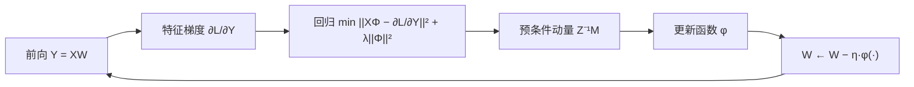

# Feature-Space Gradient Descent
**特征层面的梯度下降**

## 一句话定义

> 对线性层 $Y=XW$，反向传播给出的是 **参数梯度** $G=X^\top \partial L/\partial Y$；若真正关心的是 **激活/特征** 如何沿 $\partial L/\partial Y$ 变化，则应把更新设计为「通过 $W$ 的增量 $\Phi$ 使 $X\Phi$ 逼近特征梯度」——动量可视为该 **在线回归** 的 EMA 解，并导出 Newton-Muon 等预条件优化器。

## 英文缩写速查

| 缩写 | 英文全称 | 简要说明 |
|------|----------|----------|
| GD | Gradient Descent | 梯度下降；分参数层与特征层两种对象 |
| SGDM | SGD with Momentum | 对 $G$ 做 EMA；可扩展为对 $X^\top X$ 的 EMA 预条件 |
| Precond | Preconditioner | 预条件矩阵，如 $(X^\top X+\lambda I)^{-1}$ |
| EMA | Exponential Moving Average | 在线估计回归统计量 |
| NS | Newton–Schulz iteration | Muon 用 NS 近似正交化，非完整矩阵求逆 |
| LLM | Large Language Model | 特征空间视角主要服务大模型矩阵块训练 |

## 为什么重要

- **解释 Muon 族动机**：标准 Muon 对 momentum 矩阵做正交化；在 **各向同性输入** 或 $\lambda\to\infty$ 时，Newton-Muon 退化为 Muon——把「谱范数 / 各向同性」与 **特征最速下降** 连起来（见 [Muon](../methods/muon.md) 理论表）。
- **动量不只是平滑噪声**：除 Polyak 动量的「惯性」叙事外，可把 $M_t$ 看作 **使 $X M_t \approx \partial L/\partial Y$** 的回归系数估计；与「先 denoise 再正交化」（arXiv:2606.03899）互补。
- **2026 优化器主线**：Newton-Muon、DeltaMomentum、输入侧 Preconditioner 探索共享同一中心思想——**参数是模型的副产品，特征变化更贴近损失**（苏剑林，kexue.fm/11875）。

## 核心原理

### 1. 参数层 vs 特征层

| 对象 | 理想更新 | 可直接执行？ |
|------|----------|--------------|
| 参数 $W$ | $W\leftarrow W-\eta G$，$G=X^\top \partial L/\partial Y$ | 是（标准反向传播） |
| 特征 $Y$ | $Y\leftarrow Y-\eta \partial L/\partial Y$ | 否（$Y$ 由前向决定） |

只能通过 $W\leftarrow W-\eta\Phi$ 间接改变 $Y$，使 $Y\leftarrow Y-\eta X\Phi$。

### 2. 在线回归形式

$$
\min_\Phi \frac{1}{2}\|X\Phi - \partial L/\partial Y\|_F^2 + \frac{\lambda}{2}\|\Phi\|_F^2
\quad\Rightarrow\quad
\Phi^*=(X^\top X+\lambda I)^{-1}G
$$

对 $X^\top X$ 与 $G$ 分别 EMA，得预条件动量更新 $W\leftarrow W-\eta Z_t^{-1}M_t$（$Z_t$ 估计 $X^\top X+\lambda I$）。

### 3. 流程总览

常见 $\phi$：

| $\phi$ | 名称 | 要点 |
|--------|------|------|
| 恒等 | 预条件 SGDM | $W\leftarrow W-\eta Z^{-1}M$ |
| `msign` | Newton-Muon | 在预条件动量上正交化符号更新 |
| 内层 GD | DeltaMomentum | 迭代更新 $\Phi$，免 $Z^{-1}$ 求逆 |

### 4. 与线性注意力的类比

作者指出：动量从 Vanilla EMA → 回归闭式解（MesaNet 式 $Z^{-1}M$）→ Delta 规则内层更新（DeltaMomentum），与线性注意力 **Vanilla → MesaNet → DeltaNet/GDN** 的演变结构相似——两者可互相借鉴分析语言。

## 工程实践

| 场景 | 建议 |
|------|------|
| 理解 Muon / Newton-Muon | 先读特征层视角，再读 arXiv:2604.01472 与 [Muon 方法页](../methods/muon.md) |
| 尝试 Newton-Muon | 官方 [zhehangdu/Newton-Muon](https://github.com/zhehangdu/Newton-Muon)；Speedrun 报告优于 Muon |
| 尝试 DeltaMomentum | arXiv:2608.19491；注意 $X$ 归一化与内层 $\gamma$；无求逆但需额外状态 |
| 实现预条件 SGDM | 前向需缓存或在线估计 $X^\top X$；**优化器与模型结构耦合** |
| 机器人 / RL 小网络 | 证据仍集中在 **LLM 矩阵预训练**；小 MLP 策略默认 AdamW 更稳妥 |

## 局限与风险

- **优化器不再黑盒**：必须在前向记录 $X^\top X$（或低秩近似），增加内存、通信与实现复杂度。
- **子空间偏置**：用 **当前 batch 输入** 构造预条件，可能只在输入张成子空间内「校正」梯度，其余方向探索不足；增大 $\lambda$ 可减弱预条件（$\lambda\to\infty$ 回到无预条件）。
- **超参**：$\lambda$、内层 $\gamma$、EMA $\beta$ 需联合调节；闭式解 vs Delta 更新各有实现坑（原文对 DeltaMomentum 部分处理持保留态度）。
- **机器人栈**：本概念目前主要服务 **Transformer 隐藏层** 训练理解，尚未形成 loco-manipulation 策略训练的成熟配方。

## 关联页面

- [SGD Momentum](../methods/sgd-momentum.md) — 经典动量与 EMA 叙事
- [Muon](../methods/muon.md) — 正交化更新与 Newton-Muon 变体
- [Deep Learning Optimizers 对比](../comparisons/deep-learning-optimizers.md)
- [反向传播](../concepts/backpropagation.md) — $G=X^\top \partial L/\partial Y$ 的来源
- [深度学习基础](../concepts/deep-learning-foundations.md)

## 参考来源

- [动量的新理解：逼近特征层面的梯度下降（kexue.fm/11875）](../../sources/blogs/kexue_fm_momentum_feature_gradient_descent_11875.md)
- [Muon Optimizer 论文与理论文献摘录](../../sources/papers/muon_optimizer_primary_refs.md)
- [科学空间（kexue.fm）站点索引](../../sources/sites/kexue-fm-scientific-spaces.md)

## 推荐继续阅读

- [苏剑林，动量的新理解（2026-08-23）](https://kexue.fm/archives/11875)
- [苏剑林，为什么我们偏爱各向同性？](https://kexue.fm/archives/11549)
- [The Newton-Muon Optimizer (arXiv:2604.01472)](https://arxiv.org/abs/2604.01472)
- [DeltaMomentum (arXiv:2608.19491)](https://arxiv.org/abs/2608.19491)
