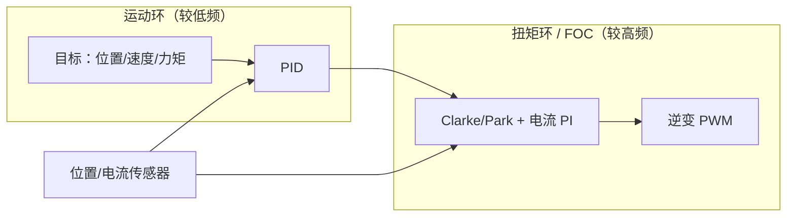

# 磁场定向控制（Field Oriented Control, FOC）

**FOC** 是一种在 **三相交流电机**（BLDC、PMSM）与部分 **步进电机** 上实现高效力矩控制的方法：用坐标变换把定子电流分解为与转子磁链对齐的 \(d\) 轴与正交的 \(q\) 轴，在旋转坐标系里用 PI 等控制器调节，再逆变换回三相 PWM。

## 一句话定义

在已知（或估计）**电角度** \(\theta_{el}\) 的前提下，令 \(i_q\) 主要产生力矩、\(i_d\) 维持磁链（永磁电机常取 \(i_d \approx 0\)），从而 **每安培力矩接近常数**、换相平滑。

> **逐步推导**：Clarke/Park 矩阵、dq 电压–转矩方程、电流环 PI 与逆变换的完整推导见 [FOC 逐步推导](../formalizations/field-oriented-control-derivation.md)。

## 英文缩写速查

| 缩写 | 英文全称 | 简要说明 |
|------|----------|----------|
| Sim2Real | Simulation to Real | 把仿真中学到的策略迁移落地真机的工程主线 |
| FOC | Field-Oriented Control | 无刷电机的磁场定向控制 |
| BLDC | Brushless DC Motor | 无刷直流电机 |
| PMSM | Permanent Magnet Synchronous Motor | 永磁同步电机 |
| PWM | Pulse-Width Modulation | 脉宽调制，驱动电机与功率器件 |
| CAN | Controller Area Network | 电机/关节常用的现场总线通信协议 |
| EtherCAT | Ethernet for Control Automation Technology | 高实时性工业以太网总线 |

## 为什么重要

- **腿足/人形关节驱动器底软** 普遍在逆变器内跑 FOC 电流环，上层 CAN/EtherCAT 只下发速度/力矩/阻抗目标（见 [电机驱动器底软通信协议总览](../overview/motor-drive-firmware-bus-protocols.md)）。
- **Sim2Real** 中仿真常把执行器简化为理想力矩源；真机 FOC 环延迟、饱和与电流限幅会造成跟踪误差（见 [Sim2Real 差距削减](../queries/sim2real-gap-reduction.md)）。
- **DIY 与原型**：开源栈（如 [SimpleFOC](../entities/simplefoc.md)）让研究者在 MCU 上复现 FOC，用于云台、小型 BLDC、步进关节，而不必采购完整工业伺服。

## 核心结构/机制

### 1) 物理直觉：90° 力矩条件

定子磁场与转子永磁磁场保持约 **90°** 时，洛伦兹力 \(\propto \sin\theta\) 取最大，力矩近似 \(\tau \approx K_t i_q\)。直流电机的换向器机械实现这一关系；FOC 用电子换相实现同样效果。

### 2) 坐标变换链

| 步骤 | 变换 | 作用 |
|------|------|------|
| 测量 | 转子位置 \(\theta_{el}\) | 编码器、磁编、霍尔或开环积分 |
| Clarke | \(abc \rightarrow \alpha\beta\) | 三相 → 两相正交静止量 |
| Park | \(\alpha\beta \rightarrow dq\) | 静止 → **与转子同步旋转** 的直流量 |
| 控制 | \(i_d, i_q\) PI | 在 dq 帧设定力矩电流 |
| 逆 Park / 逆 Clarke | \(dq \rightarrow abc\) | 得到相电压指令 |
| 调制 | SinePWM / SVPWM | 驱动三相逆变 |

### 3) 典型双环架构

- **运动环**：规划 \(i_q^*\) 或电压目标（Hz 至 kHz 级，视实现而定）。
- **扭矩环**：FOC 电流/电压调制，常见 **1–10 kHz**（MCU 与 PWM 能力约束）。

### 4) 开环 vs 闭环

| | 闭环 FOC | 开环 |
|---|----------|------|
| 传感器 | 需要 \(\theta_{el}\)（编码器/磁编/霍尔） | 可无位置反馈 |
| 效率/发热 | 负载匹配好，待机电流小 | 易过热、堵转无检测 |
| 适用 | 伺服、机器人关节 | 风扇类、极简演示 |

## 常见误区或局限

- **误区：「会 FOC = 会整机多轴实时」** — 多轴 kHz 同步还需总线、DC 同步、主站调度；FOC 只是驱动器内部一环。
- **误区：「FOC 只用于 BLDC」** — 两相步进可在 \(\alpha\beta\) 帧直接 Park；hybrid stepper 有时用三相驱动接法。
- **局限：参数与对齐** — 极对数、相电阻/电感、传感器零位与电流采样相序错误会导致振动、发热或失控；需 `align` 流程。
- **局限：功率段** — 教学向开源库侧重 **数安培级**；百安培级需 Odrive/VESC/工业伺服等不同硬件与散热设计。

## 与其他页面的关系

- [FOC 逐步推导](../formalizations/field-oriented-control-derivation.md) — Clarke/Park、\(\tau = K_t i_q\)、电流环与 PWM 的公式链
- [电机设计流程（规格 → 仿真 → 样机 → 控制）](../overview/motor-design-workflow.md) — FOC 验证处于全流程第 7 步，依赖 \(L_d, L_q, K_t\) 与台架 [TI 曲线](./motor-torque-current-curve.md)
- [电机驱动器底软通信协议总览](../overview/motor-drive-firmware-bus-protocols.md) — L3 力矩/速度指令如何穿过 CANopen 或私有帧到达 FOC
- [SimpleFOC](../entities/simplefoc.md) — 跨 MCU 的开源 FOC 实现与社区硬件
- [CAN 总线](./can-bus-protocol.md) — 常见关节指令物理层

## 参考来源

- [sources/repos/simplefoc_arduino_foc.md](../../sources/repos/simplefoc_arduino_foc.md)
- [sources/sites/simplefoc_documentation.md](../../sources/sites/simplefoc_documentation.md)
- [SimpleFOC — Coordinate Transformations in FOC](https://docs.simplefoc.com/foc_theory)（外部理论页）

## 关联页面

- [FOC 逐步推导](../formalizations/field-oriented-control-derivation.md)
- [电机驱动器底软通信协议总览](../overview/motor-drive-firmware-bus-protocols.md)
- [SimpleFOC](../entities/simplefoc.md)
- [控制环路延迟建模](../formalizations/control-loop-latency-modeling.md)

## 推荐继续阅读

- [SimpleFOC Motion control 文档](https://docs.simplefoc.com/motion_control)
- CiA 402 力矩模式与对象字典（工业伺服标准，见底软总览页外链）
