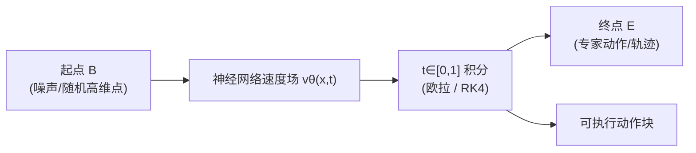

# 流匹配与具身策略（Flow Matching for Embodied Policy）

> **Query 产物级别：** 本页由 [深蓝具身智能专栏第 14 篇](https://mp.weixin.qq.com/s/Reqadr6Jpp6a1CP9TlCTUw) 编译，并与 [概率流形式化](../formalizations/probability-flow.md) 对齐；**不替代**单篇论文实体页。

## 一句话定义

**流匹配把「生成一条动作或轨迹」写成在高维状态空间里学习速度场 \(v_\theta(x,t)\)，再在 \(t\in[0,1]\) 上积分——输出的是瞬时速度规则，累积后才得到可执行的离散动作块。**

## 英文缩写速查

| 缩写 | 英文全称 | 简要说明 |
|------|----------|----------|
| FM | Flow Matching | 直接回归速度场的生成式训练 |
| ODE | Ordinary Differential Equation | 确定性积分；部署时常用欧拉/ RK4 离散化 |
| VLA | Vision-Language-Action | 视觉-语言-动作策略；动作头常用 FM |
| DP | Diffusion Policy | 扩散式动作生成对照基线 |
| CFG | Classifier-Free Guidance | 条件生成（专栏对比「条件流匹配」） |

## 为什么重要

- **动作「顿一下」的工程解释：** 离散分步采样/去噪会在步间积累误差；FM 强调 **连续速度场 + 少步积分**，与 VLA 低延迟叙事一致（见 [VLA](../methods/vla.md) 中 flow 系条目）。
- **与 Diffusion 的关系：** 专栏口径——扩散可视为 **带随机扰动、路径受限** 的 FM 特例；数学统一见 [Probability Flow](../formalizations/probability-flow.md) 与 [MIT 6.S184](../overview/mit-flow-matching-diffusion-2026.md)。
- **具身输入–输出分工（专栏）：** 输入 = **设备状态 + 环境观测** + **目标状态分布**；网络输出 = **速度场**，须经积分才得轨迹/动作块——不是一步出关节角。

## 核心机制（专栏「小纸船」模型）

### 训练（线性插值监督，一种常见写法）

对一对 \((B,E)\)，采样 \(t_n\in[0,1]\)，中间点 \(s_n=(1-t_n)B+t_n E\)；用相邻采样差分作为 **标签速度**，以 \(s_n\) 为特征监督 \(v_\theta\)——专栏强调这是 **确定性向量标签**，与扩散 **加噪随机步** 对比。

### 与 Diffusion 的对照轴

| 轴 | 流匹配（专栏口径） | 扩散 |
|----|-------------------|------|
| 每步指引 | 确定速度向量 | 常含随机噪声 |
| 路径 | 可灵活匹配两分布 | 常固定噪声↔数据线性路径 |
| 部署积分 | 少步即可（曲率小假设） | 多步去噪，易「磕磕绊绊」 |
| 理论位置 | 通用框架 | FM 框架下的特例 |

## 具身智能中的实例（已有 wiki 节点）

| 系统 | 角色 | 本库入口 |
|------|------|----------|
| π₀ / π₀.5 | VLM + **flow matching 动作专家** | [π₀ 方法](../methods/π0-policy.md)、[π₀.7](../methods/pi07-policy.md) |
| GR00T N1 | DiT **flow-matching** 动作头（System 1） | [GR00T N1 实体](../entities/paper-hrl-stack-34-gr00t_n1.md) |
| SmolVLA | 0.45B，**Action Expert 用 FM** | 底座 [2506.01844](https://arxiv.org/abs/2506.01844)；[ROS2SmolVLA](../entities/paper-ros2smolvla.md) 部署例 |

更多 flow VLA 索引见 [VLA 方法页](../methods/vla.md)「π₀ / SmolVLA / Green-VLA …」段；**World Action Model** 侧的 joint flow 见 [Rolling-WAM](../entities/paper-rolling-wam.md) 等，与「动作头 FM」问题域不同。

## 工程与算力（专栏）

- **四环节：** 中间状态采样 → 速度场拟合 → 误差统计 → 参数优化；结构随状态维度而变，要求 **速度场平滑** 以利积分。
- **硬件：** 算法不绑定设备；低维任务 CPU 可训可推；高维多机协同依赖 **GPU 并行**；压缩模型可上嵌入式。

## 常见误区

- 把 **速度场输出** 当成可直接下发的关节指令（缺积分步）。
- 将专栏「FM 取代 Diffusion」读成 **所有机器人栈已切换**——实际多为 **动作头/短 horizon 生成**，感知与其它模块仍多样。
- 忽略 **条件流匹配**（语言/子任务/控制模态）与 π₀.7 **steering** 的关系（见 [π₀.7 方法页](../methods/pi07-policy.md)）。

## 关联页面

- [Probability Flow（形式化）](../formalizations/probability-flow.md)
- [Diffusion Policy](../methods/diffusion-policy.md)
- [MIT Flow Matching & Diffusion 2026](../overview/mit-flow-matching-diffusion-2026.md)
- [VLA](../methods/vla.md)

## 参考来源

- [专栏第 14 篇归档](../../sources/blogs/wechat_shenlan_flow_matching_embodied_column14_2026-09-26.md)
- [probability-flow 形式化](../formalizations/probability-flow.md)（数学侧）

## 推荐继续阅读

- [π₀ (Pi-zero) 策略模型](../methods/π0-policy.md)
- [GR00T N1](../entities/paper-hrl-stack-34-gr00t_n1.md)
- [arXiv:2506.01844 SmolVLA](https://arxiv.org/abs/2506.01844)
