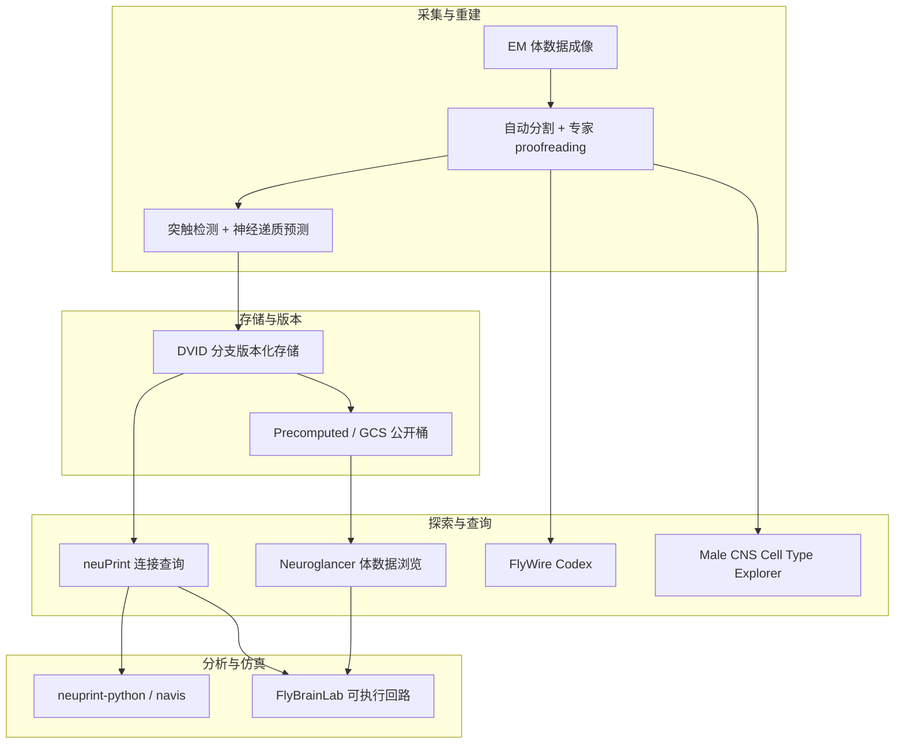

# 果蝇连接组工具栈（Fly Connectomics Stack）

**果蝇连接组工具栈** 指围绕 *Drosophila* 突触分辨率连接组（以 **FlyWire 雌性全脑** 与 **Male CNS 雄性全 CNS** 为代表）形成的 **数据—存储—查询—可视化—仿真** 分层生态。对具身智能与生物启发控制研究者，它提供了 **可验证的完整神经布线 ground truth**，可作为 **结构约束下的回路建模、行为假说检验与跨性别比较** 的参考基础设施。

## 英文缩写速查

| 缩写 | 英文全称 | 简要说明 |
|------|----------|----------|
| CNS | Central Nervous System | 中枢神经系统（脑 + 腹神经索） |
| EM | Electron Microscopy | 电子显微镜，连接组成像基础 |
| VNC | Ventral Nerve Cord | 腹神经索，类比脊髓 |
| ROI | Region of Interest | 神经纤维网室等感兴趣区域 |
| API | Application Programming Interface | 应用程序编程接口 |

## 为什么重要

- **首个完整成虫布线图：** FlyWire（雌脑）与 Male CNS（雄全 CNS）把「昆虫脑有多少神经元、如何连接」从统计估计推进到 **逐突触可查**。
- **结构—功能闭环：** 连接组回答「谁连谁」；[FlyBrainLab](../entities/flybrainlab.md) 等工具把布线编译为 **可仿真回路**，支撑行为机制假说。
- **跨性别比较：** Male CNS 与 FlyWire 共注册，可系统研究 **4.8% 中枢脑二态细胞** 如何经连接传播影响全脑。
- **对机器人启示：** 完整布线 + 可查询图数据库，为 **生物启发架构、稀疏连接、感觉-运动通路分层** 提供可复现参照（非直接可部署控制器）。

## 流程总览

## 分层选型

| 层 | 代表工具 | 典型任务 |
|----|----------|----------|
| **数据集** | [FlyWire](../entities/flywire.md)、[Male CNS](../entities/male-cns-connectome.md) | 取 ground-truth 连接图、细胞类型、跨性别比较 |
| **存储** | [DVID](../entities/dvid.md) | 自托管 TB 级体数据 + labelmap + 注释版本管理 |
| **可视化** | [Neuroglancer](../entities/neuroglancer.md) | 交互查看 EM/分割/mesh/skeleton |
| **图查询** | [neuPrint](../entities/neuprint.md) + neuprint-python | 邻接、路径、类型过滤 |
| **功能仿真** | [FlyBrainLab](../entities/flybrainlab.md) | 从布线构建 GPU 可执行回路 |

## 工程实践

1. **快速浏览：** 打开 Male CNS [Neuroglancer 预置场景](https://neuroglancer-demo.appspot.com/#!gs://flyem-male-cns/v1.0/male-cns-v1.0.json) 或 FlyWire Codex。
2. **连接查询：** neuPrint 注册账号 → `pip install neuprint-python` → `Client(..., dataset='male-cns:v1.0')`。
3. **批量下载：** Male CNS [download 页](https://male-cns.janelia.org/download/) 提供 Feather 连接表与 `gs://flyem-male-cns/` 体数据；用 `cloud-volume` / `pyarrow` 读取。
4. **自托管大体积：** FlyEM 内部栈以 DVID 为中心；Neuroglancer 可直接挂 DVID 或 precomputed。
5. **结构→仿真：** FlyBrainLab Docker 或完整 GPU 安装，从 neuPrint 导出回路元素。

## 局限与风险

- **物种与尺度：** 果蝇脑约 10⁵ 量级神经元，与哺乳动物或机器人控制栈 **不可直接类比**；应作为 **结构参照** 而非现成策略。
- **性别与版本：** FlyWire（雌脑）与 Male CNS（雄 CNS）注释体系不同步时需查各项目 **release notes**。
- **服务依赖：** neuPrint 为 Janelia 托管 SaaS，大规模离线分析应优先 **Feather/GCS 下载**。
- **仿真鸿沟：** FlyBrainLab 公共后端 **不支持 GPU 回路执行**；行为验证需完整本地部署。

## 关联页面

- [Male CNS Connectome](../entities/male-cns-connectome.md) — 雄性全 CNS 数据集
- [FlyWire](../entities/flywire.md) — 雌性全脑连接组
- [仿真评测基础设施](./simulation-evaluation-infrastructure.md) — 机器人侧仿真/基准对照

## 参考来源

- [Male CNS Connectome 项目站](../../sources/sites/male-cns-connectome.md)
- [FlyWire 官网](../../sources/sites/flywire.md)
- [neuPrint 服务](../../sources/sites/neuprint.md)
- [Neuroglancer 仓库](../../sources/repos/neuroglancer.md)
- [DVID 仓库](../../sources/repos/dvid.md)

## 推荐继续阅读

- [Male CNS 项目站 Getting Started](https://www.janelia.org/project-team/flyem/male-cns-connectome)
- [FlyWire Nature 2024 旗舰论文集](https://flywire.ai/)
