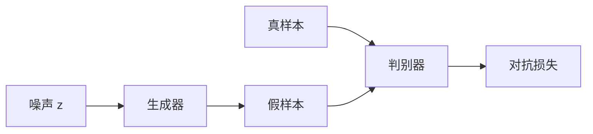

# GAN（Generative Adversarial Network，生成对抗网络）

**GAN**：生成器 \(G(z)\) 从噪声造样本，判别器 \(D(x)\) 区分真假；二者交替训练，使生成分布逼近数据分布。

## 一句话定义

不写似然，而是训练一个对手来告诉生成器「还差在哪」。

## 英文缩写速查

| 缩写 | 英文全称 | 简要说明 |
|------|----------|----------|
| GAN | Generative Adversarial Network | 生成器–判别器对抗 |
| JS | Jensen–Shannon divergence | 理想最优判别下的隐式目标 |
| AMP | Adversarial Motion Prior | 把对抗用在运动分布而非像素 |
| CycleGAN | Cycle-Consistent GAN | 无配对图像域迁移 |
| Sim2Real | Simulation to Real | GAN 常见于外观迁移 |

## 为什么重要

- [Goodfellow et al., 2014](../../sources/papers/goodfellow_gan_arxiv_1406_2661.md) 证明对抗训练可以学生成模型。
- 后续高保真图像曾长期由 GAN 主导，直到扩散以稳定监督取而代之。
- 机器人遗产是 **域适应** 与 **AMP 风格先验**，不是「用 GAN 直接出关节角」。

## 核心原理

\[
\min_G\max_D\ \mathbb{E}_{x}[\log D(x)]+\mathbb{E}_{z}[\log(1-D(G(z)))]
\]

\(D\) 最优时，目标与 JS 散度相关。实践中 \(D\) 过强会导致 \(G\) 梯度消失；过弱则 \(G\) 瞎骗。模式崩溃表现为只覆盖少数模式。

## 工程实践

| 场景 | 倾向 |
|------|------|
| 仿真→真实外观 | CycleGAN 族，先看是否破坏几何 |
| 运动风格 | [AMP](../methods/amp-reward.md) 判别器，而不是图像 GAN |
| 策略动作头 | **不要**默认 GAN；用 BC / 扩散 / flow |
| 调试 | 同时看多样性与真实性，单看判别器准确率会误导 |

## 局限与风险

- 训练动态无平稳损失，复现成本高。
- 模式崩溃对多模态动作是致命的——这也是 [Diffusion Policy](../methods/diffusion-policy.md) 兴起的原因之一。
- Sim2Real 外观 GAN 可能改掉任务相关纹理（接触、阴影）。

## 关联页面

- [Autoencoder / VAE](./autoencoder.md)
- [扩散模型](./diffusion-model.md)
- [AMP 奖励](../methods/amp-reward.md)
- [Sim2Real](./sim2real.md)
- [AI 架构地图](../overview/ai-architecture-map.md)

## 参考来源

- [GAN（arXiv:1406.2661）](../../sources/papers/goodfellow_gan_arxiv_1406_2661.md)
- [AI 架构地图一手论文簇](../../sources/papers/ai_architecture_foundations.md)

## 推荐继续阅读

- [Goodfellow 2016 NIPS Tutorial on GANs](https://arxiv.org/abs/1701.00160)
