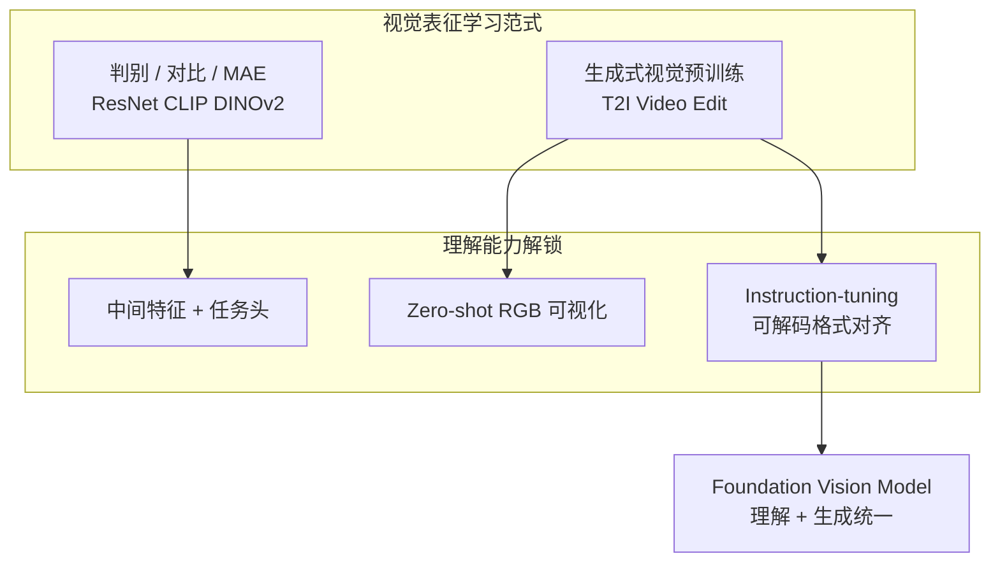

# 生成式视觉预训练（Generative Vision Pretraining）

## 一句话定义

**生成式视觉预训练**是以 **合成视觉内容**（图像、编辑、视频帧等）为训练目标的表征学习范式；与 ImageNet 分类、对比学习、MAE 等 **非生成** 路线不同，它假设 **「能按语义与几何约束生成世界」** 本身就蕴含 **分割、深度、关系推理** 等理解能力——经 **instruction-tuning 或格式对齐** 即可外化为可评测的视觉任务输出。

## 英文缩写速查

| 缩写 | 英文全称 | 简要说明 |
|------|----------|----------|
| FVM | Foundation Vision Model | 统一理解与生成的视觉基础模型 |
| LLM | Large Language Model | 大语言模型；NLP 中生成预训练的成功类比 |
| IT | Instruction-Tuning | 指令微调，对齐任务输出格式 |
| ZS | Zero-Shot Transfer | 未在目标域训练集上微调的迁移评测 |
| T2I | Text-to-Image | 文本到图像生成，常见生成预训练任务 |
| ViT | Vision Transformer | 视觉 Transformer，可与生成架构共用 |

## 为什么重要

- **范式对照 NLP：** [Vision Banana](../entities/vision-banana.md) 将 **图像生成训练** 类比 **LLM pretraining**，**instruction-tuning** 类比 Chat 对齐——若成立，CV 的主干将从「判别预训练 + 任务头」转向 **「生成基座 + prompt 接口」**。
- **统一理解与生成：** 同一权重既可 **text-to-image / editing**，又可 **分割 / depth / normal**（仅改 prompt），降低多模型维护成本；对机器人 **感知–仿真–数据增广** 闭环有潜在一体性（生成模型亦用于 [ExoActor](../methods/exoactor.md) 等 **embodiment transfer**）。
- **挑战主流表征学习：** 长期 SOTA 来自 **监督判别、对比、自监督重建** 等；本文显示 **生成式路线** 可在 **zero-shot transfer** 上 **击败 SAM 3、Depth Anything 3** 等专家——值得纳入 [视觉骨干](./vision-backbones.md) 与 [视觉表征作为策略输入](./visual-representation-for-policy.md) 的选型讨论。

## 三条技术谱系（相对 Vision Banana 的定位）

| 谱系 | 做法 | 优点 | 局限 |
|------|------|------|------|
| **A. 特征抽取** | 从扩散/U-Net/ViT 中间层抽特征做下游微调 | 利用生成模型语义 | 需任务专用头；难统一多任务 |
| **B. Zero-shot 可视化** | 不微调，直接 prompt 生成「像分割/深度图」的 RGB | 即开即用 | 格式不稳定，难定量 benchmark |
| **C. 生成基座 + instruction-tuning（Vision Banana）** | 低比例混入 **可解码 RGB 格式** 的视觉任务数据 | **单权重多任务** + **保留生成** + **SOTA ZS** | 依赖 prompt 遵循与后处理解码；部分步骤需 MLLM |

## 核心机制：视觉任务即图像生成

Vision Banana 的关键设计是把任务输出 **参数化为 RGB 图像**：

1. **Prompt** 指定语义（类–色映射、指代表达、深度 colormap 等）。
2. **生成模型** 输出严格格式的 RGB 可视化。
3. **后处理** 聚类 / colormap 反演 / 向量解码 → mask、metric depth、surface normal。

这与 NLP 中 **「所有任务都是 text completion」** 同构：**所有视觉任务都是 image generation**——接口统一，权重共享。

## 常见误区或局限

- **误区：「生成模型天生理解一切。」** 需 **格式对齐** 才能定量评测；raw zero-shot 生成常 **不达标**。
- **误区：「可以立刻替换机器人栈里所有 CNN。」** 延迟、批量推理、机载算力与 **实时控制环** 尚未在论文中验证；与 **冻结 ResNet/DINOv2 骨干** 的工程路径仍并存。
- **局限：** 深度/法线经 **RGB 编码** 有量化误差；开放词汇分割依赖 **颜色聚类**，对细粒度或同色实例敏感。
- **局限：** 复杂 **推理分割 / presence 判断** 仍外包 **MLLM**（Gemini），非纯视觉端到端。

## 与其他页面的关系

- [Vision Banana](../entities/vision-banana.md) — 当前最强实证：NBP 基座 + instruction-tuning
- [视觉骨干](./vision-backbones.md) — 判别式预训练传统主线
- [视觉表征作为策略输入](./visual-representation-for-policy.md) — 机器人策略如何接入上游感知
- [目标检测](../methods/object-detection.md) — 2D 感知任务谱系中的物体级输出
- [VLA](../methods/vla.md) — 语言条件机器人；与 **语言 prompt 驱动分割** 有接口相似性
- [生成式世界模型](../methods/generative-world-models.md) — 同属「生成式预训练」大族，但侧重 **视频/动作条件未来** 而非静态理解

## 参考来源

- [Image Generators are Generalist Vision Learners（arXiv:2604.20329）](../../sources/papers/vision_banana_arxiv_2604_20329.md)
- [Vision Banana 项目页](../../sources/sites/vision-banana-project.md)

## 推荐继续阅读

- Gabeur et al., *Image Generators are Generalist Vision Learners*, [arXiv:2604.20329](https://arxiv.org/abs/2604.20329)
- Brown et al., *Language Models are Few-Shot Learners* — LLM 预训练 + prompt 范式的 NLP 先例
- Radford et al., *Learning Transferable Visual Models From Natural Language Supervision*（CLIP）— 对比学习表征路线对照
