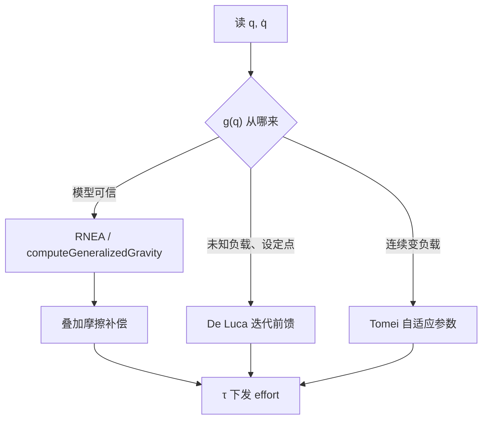
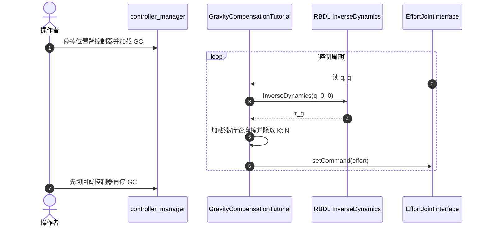

# Gravity Compensation（重力补偿）

**重力补偿**：在控制力矩里抵消重力广义力 $g(q)$，使关节伺服不再用高增益硬扛自重。它是 [RNEA](../formalizations/articulated-body-algorithms.md) 的**控制用法**，不是另一种动力学算法。

## 一句话定义

静止时机器人该输出的力矩就是 $g(q)$；模型准就用 RNEA 算，模型不准就在设定点上学习或自适应估计这一项。

## 英文缩写速查

| 缩写 | 英文全称 | 简要说明 |
|------|----------|----------|
| GC | Gravity Compensation | 重力补偿；常写成 $\tau_g=g(q)$ |
| RNEA | Recursive Newton–Euler Algorithm | $g(q)=\mathrm{RNEA}(q,0,0)$ 的 $O(n)$ 计算 |
| PD | Proportional–Derivative | 与 $g(q)$ 并联的调节律（Takegaki 1981） |
| FF | Feedforward | 前馈通道；重力走这里而不是积分项 |
| SysID | System Identification | $g(q)$ 精度取决于惯性参数，不取决于公式 |
| RBDL | Rigid Body Dynamics Library | PAL 教程用来算 $g(q)$ 的库 |
| SEA | Series Elastic Actuator | PAL 文档：SEA 臂的 $K_t$ 与减速比在底层已计入 |

## 为什么重要

- **PD 能变软**：没有 $g(q)$ 时，肩关节必须用很大 $K_p$ 才能停住，示教发硬、碰撞危险。补上重力后增益可以降到「跟误差」而不是「扛重量」。
- **WBC / CTC 的第一项验收**：悬空输出 $\tau=g(q)$ 应静止；站立时驱动关节 $\tau\approx g(q)$（忽略摩擦）。过不了这一关，后面的 QP 都在错的偏置上优化。
- **示教与重力补偿模式**：协作臂（TIAGo、Franka）把人拖动当成产品功能，底层就是 effort 接口上的 $g(q)$ + 一点摩擦。

## 核心原理

固定基开链：

$$
M(q)\ddot q + C(q,\dot q)\dot q + g(q)=\tau
$$

$\ddot q=\dot q=0$ 时 $\tau=g(q)$。计算上不要展开拉格朗日：

$$
g(q)=\mathrm{RNEA}(q,0,0)
$$

Pinocchio 提供更快的专用入口 `computeGeneralizedGravity`；带工具/外力时用 `computeStaticTorque`，即 $g(q)-J^\top f_{\mathrm{ext}}$。

### 算法族

| 路线 | 控制律 | 需要什么 | 何时用 |
|------|--------|----------|--------|
| 纯重力（示教） | $\tau=g(q)$ | 准的惯性 + 摩擦 | kinesthetic teaching |
| PD + $g(q)$ | $\tau=K_p e+K_d\dot e+g(q)$ | 在线模型 | 跟踪/调节，模型可信 |
| PD + $g(q_d)$ | $\tau=K_p e+K_d\dot e+g(q_d)$ | 设定点处的 $g$ | $K_p$ 压过 $\|\partial g/\partial q\|$ 时全局稳定，实现更简单 |
| 迭代学习（De Luca 1993） | 每轮 PD + 常值 $\hat u$；稳态后 $\hat u\leftarrow\hat u+K_p e_\infty$ | 几乎不要模型 | 未知负载、只做设定点 |
| 自适应 PD（Tomei 1991） | PD + $\hat\theta$ 在线更新 | 重力线性回归 + 惯量界 | 负载时变、要连续自适应 |
| 重力 + 摩擦 | $\tau=g(q)+\hat\tau_f(\dot q)$ | 另加摩擦表 | 真机示教；见 PAL 教程 |

**不要把 $g(q)$ 和完整 CTC 混为一谈。** [计算力矩](../methods/computed-torque-control.md) 还要补 $M\ddot q_d+C\dot q$；重力补偿只处理静力学偏置。积分项（PID 的 I）可以消稳态重力误差，但没有 De Luca/Tomei 那种全局证明，大行程还容易 windup。

### 浮动基

未驱动基座行没有电机：$S^\top\tau$ 盖不住整段 $g(q)$。悬空时基座自由落体；站立时接触力与关节力矩一起平衡重力。验收仍是「驱动关节的重力项量级对不对」，不是「六维基座也输出 $g$」。

## 工程实践

### 实现步骤（模型基，对照 Pinocchio / PAL）

1. URDF 惯性来自 CAD 或 [SysID](./system-identification.md)，不要用下载来的默认质量。
2. 控制环：`g = pin.computeGeneralizedGravity(model, data, q)`（或 Dynibo `gravity()`，或 RBDL `InverseDynamics(q,0,0)`）。
3. 工具质量：`computeStaticTorque(model, data, q, fext)`，不要把工具重力漏掉或加两次。
4. 需要示教手感时再叠 [摩擦补偿](./friction-compensation.md)；PAL 教程是 $b\dot q$ + 带速度死区的库仑项，再除以 $K_t N$ 变成电流指令。
5. **机体内补偿不要再加一遍。** Franka / 部分 iiwa 固件已经在力矩环里补重力；上层再加 $g(q)$ 会往天上抬。

开源入口：[PAL 教程仓](../../sources/repos/gravity-compensation-controller-tutorial.md)（TIAGo 7 轴，**许可未声明**；生产 `pal_controllers/GravityCompensationController` **未开源**）。通用计算用 [Pinocchio](../entities/pinocchio.md) 或 [Dynibo](../entities/dynibo.md)。

### 调试指标

| 检查 | 通过标准 |
|------|----------|
| 悬空静止 | $\tau=g(q)$，各关节几乎不动（WBC Phase 1） |
| 量级 | 肩/髋重力矩与 $m g \ell\sin\theta$ 同量级，不是差 10 倍 |
| 构型扫描 | 水平 vs 竖直，$g(q)$ 应明显变；常值补偿做不到 |
| 拖动示教 | 人推得动、松手不加速下坠 |
| 切模式 | 停 GC 前必须有位置/阻抗接管，否则手臂落下（PAL README） |

## 局限与风险

1. **公式对、参数错** — RNEA 不会救错误质量；先 SysID 或至少称末端负载。
2. **重复补偿** — 固件已补 $g(q)$ 时软件再加一次，表现为「飘」而不是「坠」。
3. **把 I 项当重力** — 大范围运动积分饱和；设定点未知负载优先 De Luca 迭代，而不是加大 $K_i$。
4. **Gazebo 电流接口** — PAL 教程写明仿真要把 $K_t$ 与减速比设为 1，否则 effort 对不上物理力矩。
5. **浮动基误用** — 对未驱动基座下发 $g(q)$ 没有执行器；接触不足时补关节重力也站不住。
6. **许可** — PAL 教程可编译但许可证为 TODO，不能当生产依赖的法律基线。

## 关联页面

- [Friction Compensation](./friction-compensation.md) — 真机示教几乎总是 $g(q)+\hat\tau_f$
- [Articulated Body Algorithms](../formalizations/articulated-body-algorithms.md) — $g(q)$ 怎么算
- [Computed Torque Control](../methods/computed-torque-control.md) / [Inverse Dynamics Control](../methods/inverse-dynamics-control.md) — 重力只是前馈的一项
- [PID Control](../methods/pid-control.md) — PD + 重力前馈
- [System Identification](./system-identification.md) / [连杆与转子惯量](./robot-link-and-rotor-inertia.md) — 参数从哪来
- [关节执行器参数辨识](../methods/joint-actuator-parameter-identification.md) — 估 $I_a$/摩擦时不要把转子惯量写进 link 质量（会带偏 $g(q)$）
- [Pinocchio](../entities/pinocchio.md) / [Dynibo](../entities/dynibo.md) / [Pinocchio 快速上手](../queries/pinocchio-quick-start.md)
- [WBC 实现指南](../queries/wbc-implementation-guide.md) — 悬空 $\tau=g(q)$ 验收
- [迭代学习重力补偿（De Luca 1993）](../entities/paper-learning-gravity-compensation.md)
- [Floating Base Dynamics](./floating-base-dynamics.md)
- [Impedance Control](./impedance-control.md) — 柔顺环同样要先扣掉重力
- [Franka Research 3](../entities/franka-research-3.md) — 典型「机体内补偿」协作臂
- [仿真物理保真度链路选型指南](../queries/simulation-physics-fidelity.md) — $g(q)$ 属于第 ② 层刚体动力学在控制侧的用法
- [接触力旋量闭环知识链](../queries/contact-wrench-closed-loop.md) — 示教/阻抗前先扣重力，避免弹簧扛自重

## 参考来源

- [重力补偿论文簇](../../sources/papers/gravity_compensation.md)
- [De Luca & Panzieri 1993 归档](../../sources/papers/de_luca_learning_gravity_compensation_1993.md)
- [PAL 教程仓](../../sources/repos/gravity-compensation-controller-tutorial.md)
- [PAL OS 文档站](../../sources/sites/pal-robotics-gravity-compensation.md)
- [Pinocchio](../../sources/repos/pinocchio.md) / [Dynibo](../../sources/repos/dynibo.md)

## 推荐继续阅读

- De Luca & Panzieri, *Learning gravity compensation in robots*, IJACSP 1993（开放 PDF：<https://www.diag.uniroma1.it/~labrob/pub/papers/IJACSP93.pdf>）
- Pinocchio `computeGeneralizedGravity` / `computeStaticTorque`：<https://github.com/stack-of-tasks/pinocchio>
- PAL 教程 README：<https://github.com/pal-robotics/gravity_compensation_controller_tutorial>
