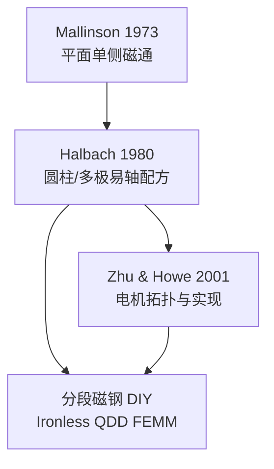

# Halbach Array（哈尔巴赫阵列）

## 一句话定义

**Halbach Array** 是一类 **磁化方向沿空间逐步旋转** 的永磁排布：目标侧（平面的一侧，或圆柱孔径内）磁场增强，另一侧（或材料外）削弱乃至理想为零——平面一手见 [Mallinson 1973](../entities/paper-mallinson-one-sided-fluxes.md)，圆柱/多极配方奠基见 [Halbach 1980](../entities/paper-halbach-permanent-multipole-magnets.md)，电机工程综述见 [Zhu & Howe 2001](../entities/paper-zhu-howe-halbach-pm-machines-review.md)。

## 英文缩写速查

| 缩写 | 英文全称 | 简要说明 |
|------|----------|----------|
| Halbach | Halbach Array | 旋转磁化永磁阵列（俗称；圆柱配方由 Halbach 系统化） |
| REC | Rare Earth Cobalt | 稀土钴永磁；Halbach 1980 的材料语境 |
| PM | Permanent Magnet | 永磁体 |
| FEMM | Finite Element Method Magnetics | 开源 2D 电磁有限元；对照分段 Halbach 常用 |
| PMSM | Permanent Magnet Synchronous Motor | 永磁同步电机；Halbach 转子常见载体 |
| OA | Open Access | 开放获取；Halbach 1980 有 eScholarship PDF |

## 为什么重要

- **无铁芯 / 弱背铁关节：** DIY 与开源 QDD（如 [Ironless](../entities/ironless-qdd-actuator.md)）用 Halbach 把磁通压向气隙，补偿塑料转子缺铁背。
- **场形可控：** 理想连续磁化可做到孔径外场为零（Halbach 1980）；电机侧追求更正弦的气隙 \(B\)、更低齿槽与更薄转子轭。
- **必须读一手边界：** 「冰箱贴式」90° 步进分段 ≠ 理想连续磁化；[Zhu & Howe](../entities/paper-zhu-howe-halbach-pm-machines-review.md) 明确烧结分段是 **compromise**。

## 核心原理

### 平面：单侧磁通（Mallinson）

常幅旋转磁化矢量：一侧场同相相加，另一侧反相相消。离散工程上常把磁钢按 **0° / 90° / 180° / 270°** 步进拼接，逼近该旋转。

### 圆柱：易轴配方（Halbach）

- **易轴旋转定理：** 全体易轴同转 \(+\phi\) → 材料外磁场方向转 \(-\phi\)、幅度不变（无软磁、二维 REC）。
- **理想连续 \(2N\) 极：** 圆环内按角度配方取向，孔径内保留目标多极，**材料外场理想为零**。
- **分段可造：** \(M\) 块扇区，块间易轴前进 \((N+1)2\pi/M\)；谐波落在 \(n=N+kM\)。四极孔径场叙事约 **1.2–1.4 T**（当时 REC）。

### 电机：实现与拓扑（Zhu & Howe）

烧结分段逼近 vs 粘结环冲磁；径向/轴向、有槽/无槽、旋转/直线/球形；应用含伺服、飞轮、被动磁轴承。

## 工程实践

| 场景 | 做法 |
|------|------|
| 读理论 | 先 Mallinson 建立单侧直觉 → Halbach 1980 §4 连续/分段 → Zhu & Howe 看电机实现代价 |
| 学 FEM | 打开 [Ironless](../entities/ironless-qdd-actuator.md) `FEMM/`：Halbach×有/无铁 四象限对照 |
| DIY 装配 | 磁力计辨极；严格按步进角粘贴；气隙与磁钢公差优先于「再加一块磁钢」 |
| 选型预期 | 分段样机 \(K_t\)/纹波按 **实测或 FEM**，勿抄连续 Halbach 解析上界 |

## 局限与风险

- **名字混淆：** 「Halbach」常统称平面单侧与圆柱多极；引用时写清几何与一手文献。
- **分段≠理想：** 多余谐波、装配角误差、局部退磁风险；Zhu & Howe 已定性。
- **材料与温度：** 稀土矫顽力与工作点决定能否「硬拼」；高温退磁需单独校核。
- **成本与惯量：** 磁钢块数翻倍相对常规径向磁化；相对铁背则惯量往往更低（Ironless 叙事）。

## 关联页面

- [Mallinson 1973](../entities/paper-mallinson-one-sided-fluxes.md) · [Halbach 1980](../entities/paper-halbach-permanent-multipole-magnets.md) · [Zhu & Howe 2001](../entities/paper-zhu-howe-halbach-pm-machines-review.md)
- [Ironless QDD](../entities/ironless-qdd-actuator.md) · [PCB Motor](../entities/pcb-motor.md)
- [开源力矩电机电磁设计完整度对比](../comparisons/open-source-torque-motor-em-design.md)
- [电机设计流程](../overview/motor-design-workflow.md)
- [执行器驱动链选型闭环](../queries/actuator-drive-chain-selection-loop.md)

## 参考来源

- [sources/papers/mallinson_one_sided_fluxes_1973.md](../../sources/papers/mallinson_one_sided_fluxes_1973.md)
- [sources/papers/halbach_permanent_multipole_magnets_1980.md](../../sources/papers/halbach_permanent_multipole_magnets_1980.md)
- [sources/papers/zhu_howe_halbach_pm_machines_review_2001.md](../../sources/papers/zhu_howe_halbach_pm_machines_review_2001.md)

## 推荐继续阅读

- Halbach 1980 OA PDF：<https://escholarship.org/content/qt20b829tr/qt20b829tr.pdf>
- DOI Mallinson：<https://doi.org/10.1109/TMAG.1973.1067714>
- DOI Zhu & Howe：<https://doi.org/10.1049/ip-epa:20010479>
- Ironless 项目长文（分段 Halbach 样机）：<https://cadenkraft.com/ironless-cycloidal-planetary-actuator/>
