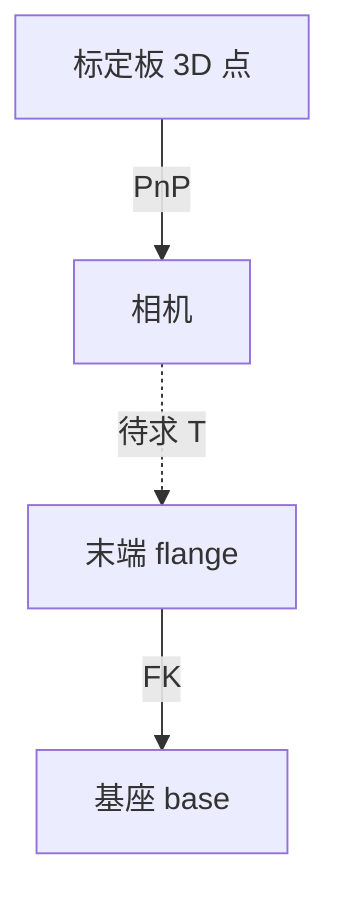

# 手眼标定（Hand-Eye Calibration）

## 一句话定义

**手眼标定**估计 **相机坐标系** 与 **机器人法兰/工具坐标系**（或基座系）之间的固定刚体变换，使像素/点云测量能进入 **末端或基座** 下的米制几何，供抓取、对准与多视融合。

## 英文缩写速查

| 缩写 | 英文全称 | 简要说明 |
|------|----------|----------|
| Eye-in-hand | Camera on robot | 相机随腕运动；常见腕部 D405 |
| Eye-to-hand | Fixed camera | 相机固定于架/顶视 |
| FK | Forward Kinematics | 关节角 → 末端位姿 |
| AX=XB | Hand-eye matrix equation | Tsai–Lenz 类方法的核心形式 |
| OpenCV | Open Source Computer Vision Library | `calib3d` 手眼 API |

## 为什么重要

- **检测对、外参错 = 抓取偏：** [感知后处理](./perception-coordinate-postprocessing.md) 依赖 \(T_{\text{cam}}^{\text{tool}}\)；腕部 [RealSense D405](../entities/intel-realsense.md) 在 [ALOHA 2](../entities/aloha-2.md) 上随臂运动，必须标定或精确 CAD+验证。
- **仿真对齐：** Menagerie ALOHA 2 给出 **D405 内参**；真机 **外参** 不对齐仍会导致 Sim2Real 视觉 gap。
- **多视融合：** [抓取位姿估计](../methods/grasp-pose-estimation.md) 的多相机点云融合前提是所有相机在同一工具/基座系下。

## 核心原理

### 两种常见安装

| 模式 | 未知外参 | 采集方式 |
|------|----------|----------|
| Eye-in-hand | \(T_{\text{cam}}^{\text{gripper}}\) | 移动臂，相机看 **固定** 标定板 |
| Eye-to-hand | \(T_{\text{cam}}^{\text{base}}\) | 固定相机，板可固定在末端或世界 |

每组样本需要：**机器人报告位姿**（FK 或示教器）+ **视觉估计板相对相机位姿**（PnP，已知板几何）。

### Tsai–Lenz（1989）与 OpenCV

- 经典论文将多组运动约束化为 **\(A X = X B\)**，先解旋转再解平移（见 [Tsai–Lenz 摘录](../../sources/papers/tsai_lenz_hand_eye_calibration_1989.md)）。
- OpenCV [`calibrateHandEye`](https://docs.opencv.org/4.x/d9/d0c/group__calib3d.html) 支持 **TSAI / PARK / HORAUD / ANDREFF / DANIILIDIS** 等方法枚举。
- 标定板 **固定在机器人世界/基座** 时用 [`calibrateRobotWorldHandEye`](https://docs.opencv.org/4.x/d9/d0c/group__calib3d.html) 联合估计 **相机–末端** 与 **基座–世界** 关系（见 [OpenCV 归档](../../sources/sites/opencv-calib3d-hand-eye.md)）。

## 工程实践

1. **先内参：** 出厂或 `calibrateCamera`；D405 见 [规格归档](../../sources/sites/realsense-d405-product.md)。
2. **姿态序列：** ≥10–15 组，**大角度旋转** 覆盖多轴；避免纯平移或共面退化。
3. **时间同步：** 图像戳与关节/FK 戳对齐（ALOHA 多相机更关键）。
4. **验证：** 将板角点重投影到图像；或在基座系下用针尖/已知点测距（厘米级为常见目标）。
5. **工具链：** Python `cv2.calibrateHandEye`；也可在 ROS `easy_handeye` 等包中调用同类算法；非线性 refinement 可接 [Levenberg–Marquardt](../methods/levenberg-marquardt.md)。

## 局限与风险

- **FK 误差与 backlash** 会直接进外参；低成本臂需多采几组或只信视觉相对测量。
- **板固定假设：** Eye-in-hand 时板必须 **相对世界不动**；振动桌面会毁标定。
- **方法选择：** Tsai 闭式快但对噪声敏感；残差大应换方法或加 BA。
- **误区：** 只标内参、写死 URDF 外参从不复测——换支架/D405 线缆应力后需重标。

## 关联页面

- [感知后处理与坐标变换](./perception-coordinate-postprocessing.md)
- [三维坐标变换](../formalizations/3d-coordinate-transforms-vision-robotics.md)
- [ALOHA 2 四相机工位](../entities/aloha-2.md)
- [Intel RealSense](../entities/intel-realsense.md)

## 参考来源

- [OpenCV calib3d 手眼 API 归档](../../sources/sites/opencv-calib3d-hand-eye.md)
- [Tsai & Lenz 1989 论文摘录](../../sources/papers/tsai_lenz_hand_eye_calibration_1989.md)

## 推荐继续阅读

- OpenCV 文档：<https://docs.opencv.org/4.x/d9/d0c/group__calib3d.html>
- Tsai–Lenz DOI：<https://doi.org/10.1109/70.34770>
