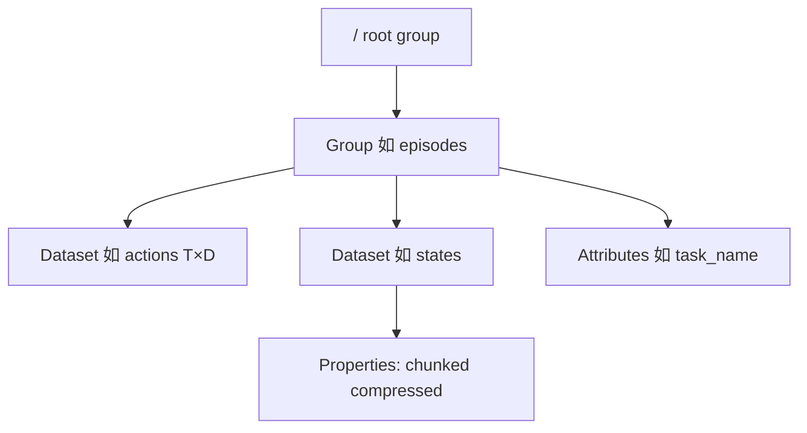

# HDF5 文件格式

## 一句话定义

**HDF5**（Hierarchical Data Format version 5）是 **The HDF Group** 定义的 **二进制文件格式与逻辑数据模型**：用 **Group** 组织树状命名空间、用 **Dataset** 存多维数组及 metadata，并可选 **chunk、压缩、compound datatype、可扩展维度**；Python 生态多通过 **h5py** 访问，是机器人里 **episode 级仿真/采集中间容器** 的常见选择（常与外挂 MP4 或组内图像数组并用）。

## 英文缩写速查

| 缩写 | 英文全称 | 简要说明 |
|------|----------|----------|
| HDF5 | Hierarchical Data Format 5 | 本页文件格式与 API 族 |
| DDL | Data Description Language | `h5dump` 输出的结构描述 |
| API | Application Programming Interface | C `H5*` / Python h5py |
| I/O | Input/Output | 全量或 dataspace subset 读写 |
| IL | Imitation Learning | 示范数据常落 HDF5 再转训练格式 |
| MP4 | MPEG-4 Part 14 | 与 HDF5 并列存视频的常见外挂 |

## 为什么重要

- **仿真与 IL 栈事实容器：** [Isaac GR00T](../entities/isaac-gr00t.md) / [Isaac Teleop](../entities/isaac-teleop.md) 仿真 teleop 常录 **HDF5**，再 **`convert_hdf5_to_lerobot.py`**；MimicGen、robomimic、EgoDex 等也以 HDF5 存轨迹与观测。
- **灵活 schema：** **Compound datatype** 可表达「表格式」多字段帧；**Attributes** 挂 episode/task 元数据 — 但 **无统一机器人 schema**，跨项目需读 README 或 `h5dump`。
- **与日志格式分工：** HDF5 偏 **结构化数组 + 训练友好**；**MCAP** 偏 **多 topic 时间序列日志**（见 [对比页](../comparisons/hdf5-mcap-lerobot-data-formats.md)）。

## 核心原理

### 逻辑模型（官方 Introduction）

| 对象 | 作用 |
|------|------|
| **Group** | 目录式容器；路径如 `/foo/zoo` |
| **Dataset** | 原始数据 + datatype/dataspace/properties |
| **Datatype** | 标量、数组或 **compound**（嵌套表） |
| **Dataspace** | 维度；可 **unlimited** 扩展 |
| **Properties** | 如 **chunk + compression** |
| **Attributes** | 对象上的小 metadata |

### 编程习惯（官方）

**Open → Access → Close**；Python：`h5py.File(..., 'w'|'r+')` → `create_dataset` / `create_group` → 切片读写 `dataset[...]`。

### 机器人中的典型用法（非 HDF5 标准，工程惯例）

- **每 episode 一个 `.hdf5`** 或单文件多 group  
- **数组键**：`actions`、`observations/...`、`robot_joint_pos` 等 **项目自定义**  
- **视频**：组内 uint8 数组 **或**  sidecar **MP4**（LeRobot v3 则统一 MP4 shard）

## 工程实践

### 开源与工具（2026-09-24）

- **库：** [HDFGroup/hdf5](https://github.com/HDFGroup/hdf5)；Python **`pip install h5py`**  
- **inspect：** `h5dump -H file.h5`、**HDFView**  
- **转 LeRobot：** 跟项目 YAML 字段映射（如 GR00T `g1_static_apple_config.yaml`），勿假设键名通用

### 选型提示

| 场景 | 倾向 |
|------|------|
| Isaac Sim / Lab 仿真 teleop 中间产物 | HDF5 → 再转 LeRobot |
| 长期多传感器 **topic 流**、Foxglove 复盘 | **MCAP** |
| Hub 共享 IL 训练集 | **LeRobotDataset v3** |

## 局限与风险

- **无统一 schema：** 与 LeRobot **meta/info.json** 或 MCAP **Channel/Schema** 不同，跨库复用需 **转换脚本**  
- **大文件随机读：** 未 chunk 的 contiguous dataset 扩缩效率差；训练管线应确认 **chunk/compress** 策略  
- **并发写：** 多进程写同一 HDF5 需规划；v3 LeRobot 用 **finalize()** 关 Parquet writer，HDF5 需应用层约定  
- **不是日志索引容器：** 按 **log time + topic** 大规模索引不如 MCAP Summary/Chunk Index

## 关联页面

- [HDF5 vs MCAP vs LeRobot 数据集格式](../comparisons/hdf5-mcap-lerobot-data-formats.md)
- [MCAP](../entities/mcap-log-format.md)
- [LeRobotDataset v3.0](./lerobot-dataset-v3.md)
- [Isaac GR00T](../entities/isaac-gr00t.md)
- [遥操作（Teleoperation）](../tasks/teleoperation.md)

## 参考来源

- [sources/sites/hdf-group-hdf5-intro.md](../../sources/sites/hdf-group-hdf5-intro.md)

## 推荐继续阅读

- [Introduction to HDF5（HDF Group）](https://support.hdfgroup.org/documentation/hdf5/latest/_intro_h_d_f5.html)
- [h5py 文档](https://docs.h5py.org/)
