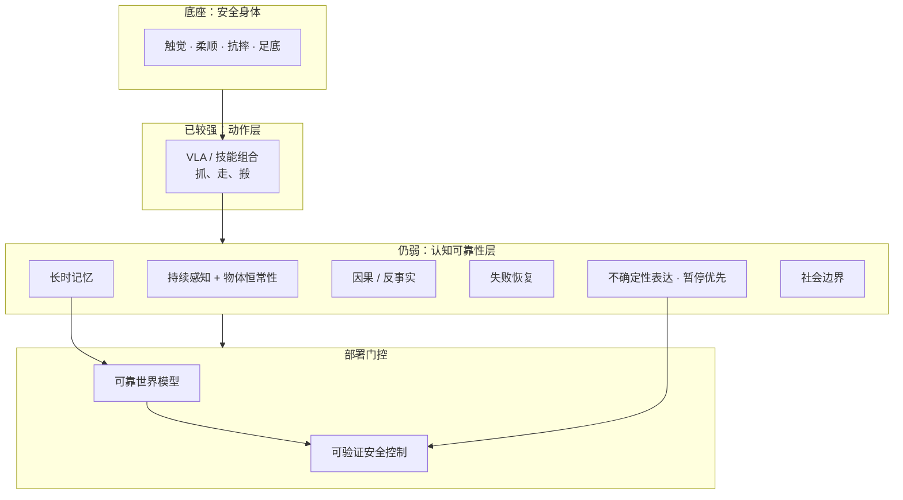

# 人形认知可靠性鸿沟（抓杯 vs 过马路）

**人形认知可靠性鸿沟**指：当前 [VLA](../methods/vla.md) 与技能组合已让机器人 increasingly 会「抓杯子」（目标识别 + 手眼协调），但距离「过马路」式 **有限监督下的环境理解、规则遵守、风险判断与不确定时停下** 仍差一整层认知与可靠性工程。外形像人 ≠ 理解世界；**会抓住目标** 是能力，**知道何时不能伸手/不能迈步** 才接近可用自主。

## 英文缩写速查

| 缩写 | 英文全称 | 简要说明 |
|------|----------|----------|
| VLA | Vision-Language-Action | 视觉+语言+状态 → 电机控制的具身策略 |
| WM | World Model | 预测动作后果、支持规划与评测的模型 |
| HOI | Human-Object Interaction | 人-物交互与操作语境 |
| OOD | Out-of-Distribution | 训练分布外场景，须触发保守策略 |
| HRI | Human-Robot Interaction | 人机交互与社会边界 |
| Sim2Real | Simulation to Real | 仿真能力迁移真机的工程主线 |

## 为什么重要？

- **Demo 错位：** 短视频里流畅抓取 ≠ 家庭/养老场景 **连续数周** 可靠工作。
- **风险不对称：** 把塑料杯递给成人 vs 把热咖啡递给幼儿 — 动作形式相似，**责任完全不同**；缺「情境中的意义」比缺像素更致命。
- **规则不保证世界：** 司机分心、遮挡、他人误判 — 机器人须假设 **世界不会因我学会规则就配合运行**。
- **compound 可靠性：** 100 步各 99% 成功率 → 整体仅 **~36.6%**；要整体 90% 需每步 **~99.9%**（见下文公式）。

## 核心原理

### 抓 vs 过马路（能力分层）

| 层级 | 儿童类比 | 机器人现状（2026 策展读法） |
|------|----------|------------------------------|
| **动作** | ~1 岁抓杯 | VLA 目标检测 + 抓取、locomotion 演示增多 |
| **认知** | ~7 岁有限监督过马路 | 持续感知、常识、长时记忆、因果、社会边界 — **仍为主要缺口** |

VLA 进展样例（科普层，以官方为准）：[Gemini Robotics](../entities/gemini-robotics.md)、[Helix](../entities/helix-25.md)（慢 VLM + 快控制）、[Isaac GR00T](../entities/isaac-gr00t.md)、[π0.7](../methods/pi07-policy.md) 技能组合 — 趋势是从 **动作库** 到 **技能模型**，非已到「七岁状态」。

### 「七岁状态」八种能力（比喻，非认证标准）

文内用 **有限监督下理解环境、遵守规则、处理变化、不确定时停下** 作比喻，至少需：

| # | 能力 | 要点 |
|---|------|------|
| 1 | **持续感知** | 稳定 3D 模型与追踪，非每隔数秒重新「看一眼」 |
| 2 | **部分可观测 / 物体恒常性** | 遮挡后仍记住人、物、任务进展 |
| 3 | **长期记忆** | 环境习惯、人物偏好、可复用经验（非录像堆叠） |
| 4 | **因果 / 反事实** | 行动前比较「现在做 vs 等十秒」等后果 |
| 5 | **失败恢复** | 重抓、换策略、求助 — 见 [balance-recovery](../tasks/balance-recovery.md) 与身体栈「安全/失败恢复」层 |
| 6 | **风险与不确定性表达** | 看不清、意图不明、超训练范围 → **暂停并请求确认** |
| 7 | **社会意图与边界** | 「收拾一下」「把这个给我」的歧义与社会规则 |
| 8 | **稳定身体与硬件** | 触觉、柔顺、足底、抗摔；有人/家具/宠物环境的安全工程 |

> **与 [人形八大能力技术地图](../overview/humanoid-eight-capabilities-technology-map.md) 的区别：** 该页（魔方 AI）按 **感知/抓取/WBC/平衡 + VLA/WM + 数据/仿真** 分 **产业全栈**；本页八种能力按 **认知可靠性 / 部署信任** 划分 — **互补，勿混为一谈**。

### 五层缺口 + 三支柱

**五层缺口：** ① 真实世界机器人数据 ② 长时任务数据 ③ 语言→动作中间表示与完成标准 ④ 安全评估体系（误抓/碰撞/恢复/最坏情况） ⑤ 硬件–软件–责任边界（日志、权限、急停）。

**七岁状态三支柱（须同时满足）：**

1. **长时记忆**
2. **可靠世界模型** — 见 [WAM](../concepts/world-action-models.md)、[仿真评测基础设施](simulation-evaluation-infrastructure.md)
3. **可验证安全控制** — 「暂停优先」优于盲目追求完成率

缺任一支柱 → 「动作漂亮、判断不稳」的 **大孩子** 式系统。

### Compound reliability

设任务含 $n$ 个独立步骤，每步成功率 $p$，则一次完整成功概率：

$$P_{\text{task}} = p^n$$

| $n$ | $p$ | $P_{\text{task}}$ |
|-----|-----|-------------------|
| 100 | 0.99 | **~36.6%** |
| 100 | 0.999 | **~90.5%** |

家庭任务还有变房间、变物体、变成员与开放目标 — **下一阶段竞争焦点** 是从演示成功推进到 **连续数周稳定工作**。

## 流程总览

## 工程实践

### 场景扩展路径（文内归纳）

1. **工厂 / 仓库 / 实验室** — 半结构化，人员旁站
2. **酒店 / 养老 / 部分家庭** — 递送、收拾、简单清洁；**远程监控 + 人工接管**
3. **语言 + 示范快速学技能** — 跨房间/物品迁移，理解目标与检查完成
4. **家庭通用** — 陌生环境、长期上下文、习惯、主动避险、复杂时求助

### 八项工程工作（策展清单）

1. 真实生活多模态数据 — **含犹豫、失败、碰撞风险、人工接管**
2. 具身记忆 — 知道 **哪些记忆值得相信**
3. 后果预测 [世界模型](../methods/generative-world-models.md)
4. 高层推理 ↔ 低层控制 **稳定闭环**（如 Helix 式分层）
5. **暂停优先** — 遮挡、异常、陌生物、意图不清时停下（可结合 [BT 编排 VLA](behavior-tree-vla-orchestration.md)）
6. 仿真–真实 [数据飞轮](data-flywheel.md)
7. **长时任务评测** — 一天 / 一周 / 一月可靠性，非单次放杯
8. 隐私、权限、责任 — 本地处理、隔离、授权、审计

### 评测指标扩展

除任务成功率外，宜统计：**误抓率、碰撞率、误操作率、恢复时间、OOD 最坏情况** — 与 [仿真评测基础设施](simulation-evaluation-infrastructure.md) 及 [LIBERO-Recover](../entities/paper-libero-recover.md) 等 **非理想初态 / 恢复** 基准同向。

## 局限与风险

- **「七岁状态」是比喻**，非儿童心理模型，更不能替代功能安全认证。
- **厂商 Demo 不可外推** — Gemini / Helix / GR00T / π0.7 能力边界以官方测试条件为准。
- **堆参数不自动补认知** — 缺数据、缺评测、缺责任链，模型再大仍可能「自信但错」。
- **外形诱导错觉** — 人形 + 自然语言易让人 **过度信任**；产品须显式暴露不确定性。

## 关联页面

- [人形八大能力技术地图](../overview/humanoid-eight-capabilities-technology-map.md) — 全栈鸟瞰（不同「八种能力」框架）
- [人形 RL 身体系统栈](../overview/humanoid-rl-motion-control-body-system-stack.md) — 身体 API 先于 VLA 大规模调用
- [具身大模型分类学选型闭环知识链](../queries/embodied-fm-taxonomy-loop.md) — 本页的 compound reliability 说明为什么 ③ VLA 层单点成功率再高也不等于长时自主；三支柱里的记忆与世界模型正对应该闭环 ⑤ WM 层的「虚拟校验器」定位
- [VLA 方法页](../methods/vla.md)
- [Data Flywheel](data-flywheel.md)
- [Humanoid Robot](../entities/humanoid-robot.md)

## 参考来源

- [黄先生coin：人形机器人距离「像个孩子一样聪明」还缺什么？（微信公众号）](../../sources/blogs/wechat_huang_coin_humanoid_seven_year_gap_2026-09-20.md)

## 推荐继续阅读

- [Figure · Helix 2.5 官方新闻](https://www.figure.ai/news/helix-2-5-zero-shot-30-home-generalization) — 分层控制与家庭零样本叙事（以官网为准）
- [Physical Intelligence · π0.7 博客](https://www.pi.website/blog/pi07) — 技能组合泛化
- [DeepMind · Gemini Robotics](https://deepmind.google/discover/blog/gemini-robotics/) — 多形态 VLA 产品路线
