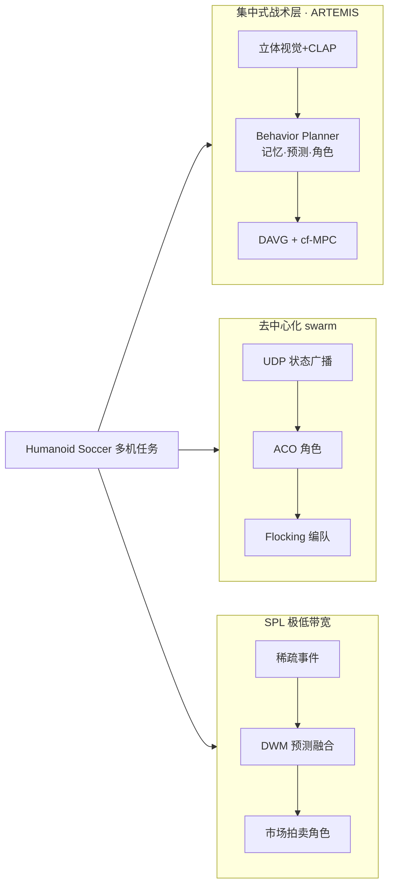

# 人形多机协调（Humanoid Multi-Robot Coordination）

**人形多机协调**（常被口语称为「群控」）指 **多台人形机器人在共享动态环境**（典型为 RoboCup 足球）中，协同完成 **角色分配、站位/编队、传球与防守** 等战术，而不仅是单机 locomotion 或射门技能。与无人机 swarm 不同，人形群控必须同时处理 **双足平衡、有限机载视觉、对抗碰撞** 与 **严格通信配额**。

## 一句话定义

**在每人只能局部看场、带宽有限、随时可能摔倒的前提下，让整支人形球队仍然像一支队那样换位、站位和进攻——而不是六台独立的追球机器。**

## 英文缩写速查

| 缩写 | 英文全称 | 简要说明 |
|------|----------|----------|
| ACO | Ant Colony Optimization | 蚁群优化；用于去中心化足球角色分配 |
| DWM | Distributed World Model | SPL 路线中各机融合得到的分布式世界表示 |
| DTA | Distributed Task Assignment | 基于效用矩阵的分布式角色/任务拍卖 |
| MARL | Multi-Agent Reinforcement Learning | 多智能体强化学习；可学协作但常需大量仿真 |
| SPL | Standard Platform League | RoboCup NAO 人形联赛；通信规则极严 |
| UDP | User Datagram Protocol | 轻量状态广播；swarm 足球框架常用载体 |

## 为什么重要

- **RoboCup 2050 目标是整队人形，不是单机炫技：** 规则要求多机对抗；近年冠军系统（如 ARTEMIS）与 swarm 研究都表明 **战术层** 与 **单机 RL 射门** 同样关键。
- **通信正在变难，不是变简单：** SPL 2019–2023 队均 WiFi 包量 **大幅下降**、上场人数增加而单包缩小至 **128 B**——群控算法必须 **事件驱动、预测补全、本地一致决策**。
- **双足放大了编队难度：** 轮式 swarm 可瞬时改向；人形 **separation** 不足会碰撞摔倒，**cohesion** 过紧会堵死传球线路—— flocking 类方法需 **角色加权** 才适用于足球。
- **与单机技能栈解耦：** [PAiD](../methods/paid-framework.md)、[RoboNaldo](../entities/paper-robonaldo-humanoid-soccer-shooting.md) 等解决 **怎么踢**；群控解决 **谁去踢、谁防守、站哪里**。

## 三条代表性一手路线（2023–2025）

| 路线 | 代表一手资料 | 决策拓扑 | 通信假设 | 验证形态 |
|------|--------------|----------|----------|----------|
| **集中式行为管理** | [ARTEMIS arXiv:2512.09431](../../sources/papers/artemis_humanoid_soccer_team_coordination_arxiv_2512_09431.md) | 每机 **behavior planner** 维护赛况记忆、预测、角色与射门；DAVG+cf-MPC 避障 | 队友/对手主要靠 **立体视觉检测** | **Adult-Size 真机国际赛冠军** |
| **Swarm ACO + flocking** | [Sensors 2025](../../sources/papers/humanoid_soccer_swarm_intelligence_sensors_2025.md) | **全去中心化** 信息素角色 + Reynolds 编队 | **周期性 UDP** 位置/角色/健康；RLE+退避 | Webots 4v4；进球 **+25–40%** vs 集中式仿真基线 |
| **市场拍卖 + Voronoi（SPL）** | [arXiv:2401.15026](../../sources/papers/robocup_spl_limited_communication_coordination_arxiv_2401_15026.md) | **DWM** 预测补全 + **UEM 拍卖**；Voronoi 修正站位 | **极低带宽事件**（非周期全状态） | **NAO 真机 RoboCup** + SimRobot |

## 核心结构（工程分解）

1. **世界/队友模型：** 球、对手、队友位姿；通信中断时用 **预测模型**（Kalman、GMM、里程计）维持可玩性。
2. **角色分配：** 门将/后卫/中场/前锋或任务队列；从 **规则表** → **拍卖/效用** → **ACO 信息素** → **MARL 策略** 光谱递增。
3. **编队/站位：** 进攻展开 vs 防守收缩；flocking 三规则或 Voronoi 区域划分。
4. **与低层接口：** 高层输出 **目标位姿、踢球触发、凝视方向**；底层仍是 [locomotion](../tasks/locomotion.md) / WBC / RL 行走与踢球技能。
5. **故障与丢包：** 掉员、丢包、感知盲区时的 **fallback**（本地估计、角色重分配、保守站位）。

## 常见误区

- **把「群控」当成单机 policy 复制 N 份：** 没有角色与站位机制会出现 **扎堆追球、空门无人**。
- **忽视通信规则：** 仿真里无限带宽训练的协调策略 **不能直接** 上 SPL 真机。
- **把娱乐编队等同于足球群控：** 舞台 **毫秒级编舞同步**（如多机舞蹈）通常是 **预录时间轴 + 分布式时钟**；足球需要 **在线战术响应** 与对抗建模。
- **认为去中心化一定优于集中式：** ARTEMIS 证明在 Adult-Size **真机赛** 中，**强感知 + 集中战术 + 避障导航** 仍可达冠军；swarm 论文目前以 **仿真优势** 为主，需看部署场景。

## 与其他页面的关系

- [人形群控展演纵深路线](../../roadmap/depth-humanoid-swarm-performance.md) — 合作展演侧（群舞同步 → 编队走位 → 群体特技）的学习路径；本页的「预录时间轴 vs 在线战术」分界是其 Stage 0 入口
- [Humanoid Soccer](../tasks/humanoid-soccer.md) — 综合任务；群控是其中「多机协作」子问题
- [Swarm Intelligence 人形足球论文](../entities/paper-humanoid-soccer-swarm-intelligence.md) — 去中心化 swarm 实体页
- [ARTEMIS 人形足球系统](../entities/paper-notebook-a-hierarchical-model-based-system-for-high-perfo.md) — 集中式战术层实体页
- [MARL](../methods/marl.md) — 学习式多体协调
- [Booster RoboCup Demo](../entities/booster-robocup-demo.md) — 工程化分层状态机 + 技能库范例

## 参考来源

- [humanoid_soccer_swarm_intelligence_sensors_2025.md](../../sources/papers/humanoid_soccer_swarm_intelligence_sensors_2025.md)
- [robocup_spl_limited_communication_coordination_arxiv_2401_15026.md](../../sources/papers/robocup_spl_limited_communication_coordination_arxiv_2401_15026.md)
- [artemis_humanoid_soccer_team_coordination_arxiv_2512_09431.md](../../sources/papers/artemis_humanoid_soccer_team_coordination_arxiv_2512_09431.md)

## 推荐继续阅读

- Nadiri, F., & Rad, A. B. (2025). *Swarm Intelligence for Collaborative Play in Humanoid Soccer Teams*. Sensors. <https://doi.org/10.3390/s25113496>
- Wang, Q., et al. (2025). *A Hierarchical, Model-Based System for High-Performance Humanoid Soccer*. arXiv:2512.09431.
- Affinita, D., et al. (2023). *Multi-Agent Coordination … Limited Communication*. arXiv:2401.15026.
