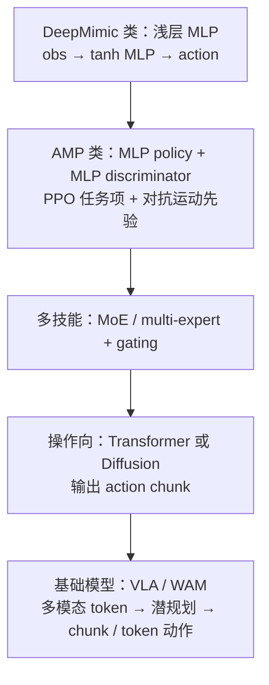
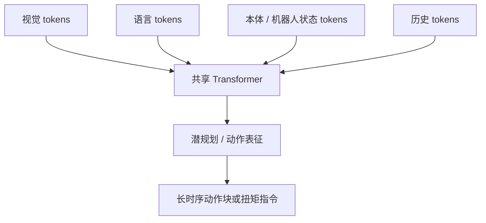

# 人形与腿式策略的网络架构（Policy Network Architecture）

**人形与腿式策略的网络架构**：在模仿学习、对抗式运动先验与强化学习论文的 Method 里，作者通常会写明 **策略网有几层、每层多少隐藏单元、判别器或 critic 是否共享骨干、是否用 Transformer / MoE / 扩散**，以及 **观测维、动作维、历史堆叠长度、latent 维度** 等；近年再叠加 **VLA（视觉–语言–动作）** 与 **世界模型 / WAM（世界–动作联合建模）**，回路从「单步扭矩映射」演进到「多模态 token + 长时序动作块」。

## 一句话定义

把「状态（或多模态观测）→ 动作（或动作序列）」这一映射在工程上具体化：**选什么函数族、多宽多深、是否显式建世界或语言条件**。

## 为什么重要

- 读论文时，**架构段落**直接决定复现实验的计算量、延迟与可并行度。
- 人形与腿式运动技能里，**SOTA 行为往往不来自“无限加深网络”**，而来自奖励、参考运动、课程、域随机化、观测与 sim2real；架构是必要但常非瓶颈。
- 区分 **低层高频扭矩策略**（常见小 MLP）与 **高层语义或 chunk 策略**（Transformer、扩散、VLA）有助于系统设计，而不是把整条栈都塞进一个巨型模型。

## 论文 Method 里常见的结构披露项

- Policy：**MLP 层数**、**每层 hidden size**、激活（`tanh` / `ReLU` / `ELU` 等）。
- Actor / critic：**是否共享编码器**、价值头是否更深或更浅。
- 对抗式模仿：**判别器**层宽深与输入（当前状态、下一状态、运动特征等）。
- 序列与多模态：**历史帧堆叠长度**、**Transformer 上下文长度**、**图像/语言 tokenizer**。
- 生成式策略：**扩散步数**、**UNet / Transformer 去噪骨干**、**一次预测多步 action chunk** 的 horizon。
- 基础模型路线：**离散 action token** 或 **连续 flow / 扩散动作头**；与 VLM 骨干的衔接方式。

## 架构演化总览（主干）

## 各时代的典型骨架（归纳）

### 1. 浅层 MLP 时代（DeepMimic 等）

- **思想**：mocap 参考 + RL（如 PPO）与模仿项组合。
- **常见形态**：2–3 层 MLP，**512–1024** 隐藏单元，`tanh` 激活；管线可概括为 **obs → MLP → action**。

### 2. AMP（对抗式运动先验）

- **Policy**：例如 **1024 → 512** 的 MLP 族配置在文献中较常见（具体以论文表格为准）。
- **Discriminator**：独立 MLP，输入常含 **当前状态、下一状态、运动特征**，用于「像不像数据集里的运动」；**PPO** 仍负责任务回报项。
- 仓库内工程入口可参考 [AMP 与 mjlab](../entities/amp-mjlab.md)、[AMP 奖励 shaping](../methods/amp-reward.md)。

### 3. Multi-expert / MoE

- **问题**：多步态、多技能切换与混合 locomotion。
- **结构**：多个 expert policy + **gating network** 决定权重或离散选中某一 expert；早于当前「大 Transformer」浪潮，但仍是 **技能分解** 的可读基线。

### 4. Transformer 与 Diffusion Policy

- **动机**：纯 MLP 对 **长 horizon、多模态操作、语言条件** 表达力有限。
- **Diffusion Policy**：图像或历史特征经 **Transformer 或 UNet** 去噪，输出 **整段 action trajectory / chunk**，在双手操作等任务上影响大。详见 [Diffusion Policy](../methods/diffusion-policy.md)。

### 5. VLA、世界模型与 WAM

- **VLA**：图像 + 语言 + 本体 +（可选）历史 → **Transformer** → 动作 token 或连续头；代表线包括 RT-1 / RT-2、OpenVLA 等，综述入口见 [VLA](../methods/vla.md)。
- **World model**：显式学 **\(s_t, a_t) \rightarrow s_{t+1}\)** 或潜空间动力学；经典脉络含 World Models、Dreamer 系列，概念衔接见 [Latent Imagination](./latent-imagination.md)、[Generative World Models](../methods/generative-world-models.md)。
- **WAM / 视频–动作世界模型**：在「预测未来世界」与「生成动作」之间做 **联合建模**（例如视频 token + 动作条件 → 未来视频 token），与纯反应式 VLA 的侧重点不同；见 [World Action Models](./world-action-models.md)。

### 6. 大规模仿真里仍常见的「小网」低层策略

在 Isaac Gym / MuJoCo 等并行训练实践中，**Actor/Critic 用 2–3 层 MLP、512 级隐藏单元、ELU** 仍极其常见：吞吐高、PPO 稳定、推理延迟低、sim2real 调参路径成熟。许多论文的 **高层模块** 可以很新，**底层力矩或关节目标策略** 仍可能是 MLP。

## 多模态基础策略阶段的数据流（示意）

## 常见误区

- **「模型越大，人形运动越强」**：真机最强策略经常是 **宽度 256–512、深度 2–3 的 MLP**；瓶颈更常在 **观测、延迟、执行器、奖励与迁移**，而非参数量本身。
- **「一篇论文的网络＝整条产品栈」**：论文展示的可能是 **单一频率层**；实际系统常是 **分层：慢语义 / 快跟踪**（参见 [VLA](../methods/vla.md) 与低层跟踪器互链）。

## 关联页面

- [Imitation Learning](../methods/imitation-learning.md)
- [Reinforcement Learning](../methods/reinforcement-learning.md)
- [VLA](../methods/vla.md)
- [World Action Models](./world-action-models.md)
- [Foundation Policy](./foundation-policy.md)
- [Diffusion Policy](../methods/diffusion-policy.md)

## 参考来源

- [人形策略网络架构 FAQ 摘录（维护者整理）](../../sources/personal/humanoid-policy-network-architecture-faq.md)

## 推荐继续阅读（外部）

- [DeepMimic: Example-Guided Deep Reinforcement Learning of Physics-Based Character Skills](https://xbpeng.github.io/projects/DeepMimic/index.html)（项目页）
- [AMP: Adversarial Motion Priors for Stylized Physics-Based Character Control](https://xbpeng.github.io/projects/AMP/index.html)（项目页）
- [RT-1: Robotics Transformer for Real-World Control at Scale](https://arxiv.org/abs/2302.08892)
- [RT-2: Vision-Language-Action Models Transfer Web Knowledge to Robotic Control](https://arxiv.org/abs/2307.15818)
- [DreamerV3: Mastering Diverse Domains through World Models](https://arxiv.org/abs/2301.04104)
