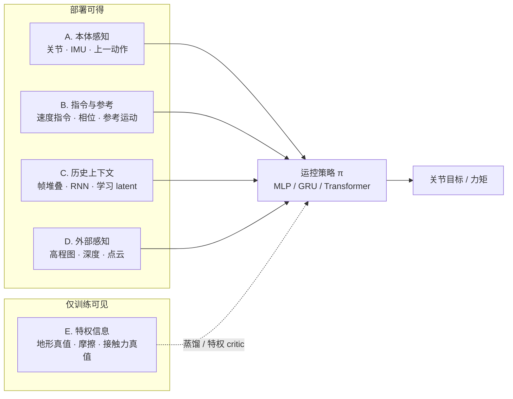

# 人形机器人运控策略的观测输入（Humanoid Policy Observation Inputs）

**人形机器人运控策略的观测输入**：主流人形/腿式运动控制策略（RL、IL、运动跟踪系）吃进网络或控制律的那一组量的总称；按「部署时能否拿到」可切成五类——本体感知、指令与参考、历史上下文、外部感知、特权信息（仅训练）。

## 一句话定义

策略不是在「看世界」，而是在吃一张精心设计过的输入清单：哪些量、多少维、从哪个传感器或估计器来、以多少 Hz 更新——这张清单往往比网络结构本身更决定 sim2real 成败。

## 英文缩写速查

| 缩写 | 英文全称 | 简要说明 |
|------|----------|----------|
| IMU | Inertial Measurement Unit | 惯性测量单元，提供基座角速度与重力方向 |
| EKF | Extended Kalman Filter | 扩展卡尔曼滤波，融合 IMU 与腿里程计估计基座速度 |
| RMA | Rapid Motor Adaptation | 从历史本体–动作在线回归环境 latent 的自适应框架 |
| CENet | Context Estimation Network | DreamWaQ 中估计隐式地形/动力学上下文的网络 |
| AMP | Adversarial Motion Prior | 对抗运动先验，跟踪系策略观测含参考相位与相对量 |
| VIO | Visual-Inertial Odometry | 视觉-惯性里程计，外部感知定位链路 |
| MoCap | Motion Capture | 动作捕捉，跟踪系策略参考运动的主要来源 |
| DAgger | Dataset Aggregation | 特权教师向可部署学生蒸馏的迭代模仿算法 |
| PPO | Proximal Policy Optimization | 人形/足式运控最常用的 on-policy 训练算法 |
| WBC | Whole-Body Control | 经典运控栈，其「观测」即状态估计器的输出 |
| GRU | Gated Recurrent Unit | 轻量门控循环单元，常见的历史压缩器 |
| DoF | Degree of Freedom | 关节自由度数，决定本体向量维度 n |

## 为什么重要

- **复现论文的第一张表**：Method 节的 observation 表决定你需要哪些传感器、估计器与管线；网络部分反而常是照抄小 MLP 就能跑（见 [人形与腿式策略的网络架构](./humanoid-policy-network-architecture.md)）。
- **sim2real 的主战场**：动力学 gap 有域随机化兜底，**观测 gap**（仿真直读的量在真机拿不到、拿不准、拿不及时）才是真机翻车的常见根因（见 [State Estimation](./state-estimation.md) 的观测 gap 讨论）。
- **信息取舍是设计题**：观测给少了欠观测（对地形、滑移、电机退化变盲），给多了放大噪声、拖慢训练、引入延迟；本页把主流选择归纳成可对号的五类，避免每次从零拍脑袋。

## 核心原理：五大类总览

按「部署时能否获得」这一刀切下去，主流人形运控策略的输入空间可分成五类：

| 类别 | 典型内容 | 部署可得性 | 获取主线 |
|------|----------|-----------|----------|
| A. 本体感知 | 关节 q/dq、IMU（角速度、重力投影）、上一动作、足底接触 | 全部可得（基座线速度除外） | 传感器直读 + 滤波/估计 |
| B. 指令与参考 | 速度指令、步态相位、参考运动相对量、目标点/航向 | 由系统给定 | 上层规划 / 遥操作 / 重定向离线生成 |
| C. 历史上下文 | H 帧堆叠、RNN 隐状态、学习 latent（ẑ、belief） | 在线累积 | 缓冲队列 / 在线估计器（RMA、CENet） |
| D. 外部感知 | 高程图、深度图、scandots/点云、RGB | 依赖板载传感器与算力 | 感知管线 + 编码器压缩 |
| E. 特权信息 | 地形真值、摩擦/质量、接触真值、基座线速度真值 | 部署不可得 | 仿真器状态直读（训练专用） |

关键一刀：**部署策略 = A+B+C+D 的可获取子集；E 只在训练侧出现**（teacher 观测或特权 critic），再通过蒸馏（DAgger）或隐式估计（RMA / CENet）把信息「搬运」进 C 类 latent 随策略部署。机制详见 [Privileged Training](./privileged-training.md)。

## A. 本体感知（Proprioception）

| 量 | 典型维度 | 真机如何获得 | 仿真如何获得 | 备注 |
|----|---------|-------------|-------------|------|
| 关节位置 q | n（DoF） | 关节编码器直读 | 状态直读 | 常给相对默认站姿的偏移 |
| 关节速度 dq | n | 编码器差分 + 低通滤波 | 状态直读 | 噪声大，滤波器须与训练时一致 |
| 基座角速度 | 3 | IMU 陀螺仪 | 状态直读 | 高频低延迟，几乎必备 |
| 重力投影向量 | 3 | IMU 加速度计解算重力方向 | 由姿态真值计算 | **替代欧拉角**：yaw 全局不可观测且会漂 |
| 基座线速度 | 3 | **不可直接测**：EKF 融合 IMU + 腿里程计，或学习估计，或干脆不给 | 状态直读 | 最常见的「仿真给了真机没有」陷阱 |
| 上一动作 a_{t-1} | n | 策略输出回放 | 同左 | 零成本但显著提升动作平滑性 |
| 足底接触/力 | 1–4（或 6 维/足） | F/T 传感器、相电流反推（见 [接触估计](./contact-estimation.md)）、步态相位推断 | 接触求解器直读 | 无足底传感器的人形靠估计 |
| 电机温度/电流 | n | 驱动器回读 | actuator 模型模拟 | 仅部分工作使用（保护与健康监测） |

获取链路一句话：A 类 = **编码器与 IMU 直读 → 滤波（互补 / EKF）→ 与训练完全一致的归一化与噪声模型**；其中基座线速度是唯一的「估计题」，交给 [State Estimation](./state-estimation.md) 或学习估计器。

## B. 指令与参考（Command / Reference）

策略要知道「现在该干什么」，这类输入由系统给定而非感知：

| 量 | 典型形式 | 如何获得 | 代表工作 |
|----|---------|---------|---------|
| 速度指令 | (vx, vy, ω_yaw) 3 维 | 遥控器 / 上层导航 / 训练时随机采样 | legged_gym / Isaac Lab 系全部 |
| 步态相位/时钟 | sin/cos(2πφ) 2 维 | 固定周期发生器，或接触估计在线修正 | 周期奖励系（gait clock） |
| 参考运动 | 相位 φ + 参考相对量（关节角、关键点） | MoCap/视频 → [动作重定向](./motion-retargeting.md) 离线生成 | DeepMimic、[AMP](../methods/amp-reward.md)、[BeyondMimic](../methods/beyondmimic.md)、[SONIC](../methods/sonic-motion-tracking.md) |
| 目标点/航向 | 局部坐标目标 (x, y) 或航向角 | 上层规划器 / waypoint 接口 | [Extreme Parkour](../entities/extreme-parkour.md) 的 oracle 航向（后被蒸馏为深度自预测 yaw） |
| 技能/模式选择 | 独热或离散 latent | 人为切换或高层调度 | multi-skill / MoE 系 |

跟踪系策略特别注意：参考运动**不以原始形式进网络**，观测里编码的是「当前状态相对参考的误差量」（相对关节角、关键点相对位置、相位差），见 [BeyondMimic](../methods/beyondmimic.md) 的观测构造（本体感知 + 参考相对量 + 历史堆叠）。

## C. 历史与时序上下文（History / Temporal）

单帧本体感知是**部分可观测**的（看不到地形、接触滑移、电机退化），历史是穷人版状态估计：

| 形式 | 典型配置 | 如何获得 | 代表工作 |
|------|---------|---------|---------|
| 帧堆叠 | H = 5–50 帧 obs 拼接 | 循环缓冲队列 | 多数 MLP 策略（含 BeyondMimic 历史堆叠） |
| RNN/GRU 隐状态 | 32–256 维 hidden | 在线递推 | Extreme Parkour Student（ConvNet–GRU） |
| 学习 latent | 8–64 维 ẑ / belief | 在线估计器回归仿真特权 latent | [RMA](../entities/paper-rma-rapid-motor-adaptation.md)（φ@10 Hz + π@100 Hz 异步）、[DreamWaQ](../methods/dreamwaq.md) CENet |

获取链路：训练时用 E 类特权信息**监督** latent（MSE 回归或对比学习，如 PvP 的 proprioceptive–privileged 对比表征），部署时估计器只看 A 类历史、与主策略**异步低频**运行——这是「把特权信息搬进可部署 latent」的标准搬运工。多速率对齐见 [控制与推理频率解耦](./control-inference-frequency-decoupling.md)。

## D. 外部感知（Exteroception）

| 模态 | 典型形式 | 真机如何获得 | 代表工作 |
|------|---------|-------------|---------|
| 高程图 | 2.5D 栅格（11×11 ~ 64×64） | 激光雷达/深度相机 → elevation mapping 管线 | ETH 系感知行走 |
| 深度图 | 单/多视角 depth image | 深度相机 → CNN/Transformer 编码 | [RPL](../entities/paper-rpl-robust-humanoid-perceptive-locomotion.md)（多视角深度学生）、LadderMan |
| scandots/点云 | 稀疏采样点 | 激光雷达采样（常作为仿真特权） | Extreme Parkour Teacher |
| 地形 latent | 64–256 维向量 | 深度/高程经编码器压缩，**通常不是可读高度图** | 见 [地形 Latent 表征](./terrain-latent-representation.md) |
| RGB/语义 | 图像或语义特征 | 相机 + 骨干网络 | VLA / 导航高层（低频接入） |

工程要点：感知链路低频（10–30 Hz）且带几十毫秒延迟，与 50–100 Hz 的策略频率必须**解耦与时间戳对齐**；盲走策略（无 D 类）在结构化工况仍是强基线，不要默认堆视觉。

## E. 特权信息（Privileged，训练专用）

| 量 | 训练中的角色 | 部署搬运方式 |
|----|-------------|-------------|
| 地形高度/未来地形真值 | Teacher 观测 | 蒸馏进 D 类学生（DAgger） |
| 摩擦系数、质量、电机强度 | RMA 17 维 extrinsics → z | 历史回归 ẑ（C 类 latent） |
| 接触真值/接触力 | 特权 critic 输入 | 非对称 Actor-Critic，critic 不部署 |
| 基座线速度真值 | critic 或 teacher 观测 | 真机由 EKF / 学习估计替代 |
| 全局位姿（GPS-like） | 训练与评估 | 部署用 VIO / 估计替代或剔除 |

统一获取方式：**仿真器状态直读**——这正是它「特权」的原因；类型清单与代表算法详见 [Privileged Training](./privileged-training.md)。

## 工程实践

**最小可用观测（legged_gym / Isaac Lab 系入门基线，总维度 3+3+3+3n）：**

| 变量 | 维度 | 来源 |
|------|------|------|
| 基座角速度 | 3 | IMU（滤波） |
| 重力投影向量 | 3 | IMU 解算 |
| 速度指令 | 3 | 上层给定 |
| 关节位置偏移 | n | 编码器 |
| 关节速度 | n | 编码器差分 + 低通 |
| 上一动作 | n | 策略回放 |

设计 checklist：

1. **可获得性先行**：每个量先问「真机 50–100 Hz 能稳定拿到吗」，拿不到就降级到 E 类（训练用）或 C 类（估计）。
2. **避开 yaw**：全局朝向不可观测且漂移，用重力投影 + 机体系指令表达。
3. **滤波器一致性**：真机 dq 的低通截止频率要与训练时的观测噪声/滤波模型一致，否则等于换了输入分布。
4. **观测噪声随机化**：训练时给 IMU/编码器/深度注入噪声与延迟，属于 [Domain Randomization](./domain-randomization.md) 的观测侧。
5. **频率对齐**：感知 10–30 Hz、策略 50–100 Hz、PD 250–1000 Hz，各层时间戳对齐见 [控制与推理频率解耦](./control-inference-frequency-decoupling.md)。
6. **归一化统计冻结**：obs 的 mean/std 用训练集统计，部署时严禁在线重估。

## 局限与风险（常见误区）

- **「观测越多越好」**：多余通道放大噪声、拖慢收敛，还给策略更多记住仿真作弊模式的机会；帧堆叠过长同样如此。
- **把基座线速度当真值喂**：仿真直读训练 + 真机估计部署 = 分布断裂；要么训练就用估计值，要么部署时补齐同源估计器。
- **忽视延迟**：视觉 30 Hz + 数十毫秒延迟直接进 obs，相当于让策略看着「过去的世界」做高频决策；要么频率解耦，要么训练时注入同分布延迟。
- **历史的双刃剑**：历史/RNN 补偿了部分可观测，但也可能让策略过拟合仿真特有的动力学模式，迁移时反而变脆。
- **真机第一坑不是网络**：部署失败先查 obs 管线（坐标系、符号、量纲、滤波、时间戳），再怀疑策略本身；排查顺序见 [RL 策略调试手册](../queries/robot-policy-debug-playbook.md)。

## 关联页面

- [State Estimation](./state-estimation.md) — A 类中基座速度/接触等「不可直测量」的经典估计链路
- [Privileged Training（特权信息训练）](./privileged-training.md) — E 类的训练机制与蒸馏搬运
- [地形 Latent 表征](./terrain-latent-representation.md) — D 类深度编码向量的真实形态
- [接触估计](./contact-estimation.md) — 无足底传感器时接触/力的获取方式
- [人形与腿式策略的网络架构](./humanoid-policy-network-architecture.md) — 观测向量下游的网络形态
- [控制与推理频率解耦](./control-inference-frequency-decoupling.md) — 多速率观测的时间对齐
- [Domain Randomization](./domain-randomization.md) — 观测噪声与延迟的随机化
- [人形机器人 RL 策略训练 Checklist](../queries/humanoid-rl-cookbook.md) — Stage 2 Observation 设计的操作版
- [Humanoid Locomotion](../tasks/humanoid-locomotion.md) — 任务层入口

## 参考来源

- [人形运控策略观测输入分类 FAQ 摘录（维护者整理）](../../sources/personal/humanoid-loco-policy-observation-inputs-faq.md)
- [sources/papers/privileged_training.md](../../sources/papers/privileged_training.md) — 特权信息类型与 Teacher–Student（Kumar RMA 2021 / Lee Science Robotics 2020）
- [sources/papers/state_estimation.md](../../sources/papers/state_estimation.md) — 基座/接触状态估计一手文献（Bloesch 2013 / Hartley InEKF 2020）
- [感知 Locomotion 表征与蒸馏本质 FAQ（维护者整理）](../../sources/personal/perceptive_locomotion_representation_essence.md) — 深度 → terrain latent 的信息流与蒸馏本质

## 推荐继续阅读

- [RMA 项目页](https://ashish-kmr.github.io/rma-legged-robots/) — 历史 → latent 在线估计的范式原文（RSS 2021）
- [legged_gym（ETH RSL）](https://github.com/leggedrobotics/legged_gym) — 最小观测集的开源基准实现
- [Isaac Lab 文档](https://isaac-sim.github.io/IsaacLab/) — 观测项（observation terms）配置化管理的工程范式
- [ANYbotics elevation_mapping](https://github.com/ANYbotics/elevation_mapping) — 高程图感知管线的经典开源实现
