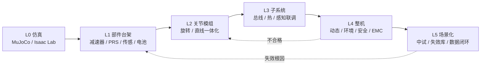

# 人形机器人测试流程（L0–L5 六级递进）

## 一句话定义

**人形机器人测试流程**是把 ~30+ 自由度、机械–电气–控制–AI 四域耦合的双足整机，按 **L0 仿真 → L1 部件台架 → L2 关节模组 → L3 子系统 → L4 整机 → L5 场景化与可靠性验收** 六级递进验证的工程体系；核心原则是 **测试左移**（问题在前级暴露成本更低）与 **研发测试 / 验收测试分离**（冻结版本与固定判据才可追溯）。

## 英文缩写速查

| 缩写 | 英文全称 | 简要说明 |
|------|----------|----------|
| MTBF | Mean Time Between Failures | 平均无故障运行时间，可靠性验收核心指标 |
| EMC | Electromagnetic Compatibility | 电磁兼容；发射与抗扰度按 IEC 61000 等考核 |
| IP | Ingress Protection | 防护等级；整机防尘防水实测 |
| IMU | Inertial Measurement Unit | 惯性测量单元；子系统标定与时间同步对象 |
| PRS | Planetary Roller Screw | 行星滚柱丝杠；直线关节 L1 台架对象 |
| DoF | Degrees of Freedom | 自由度；人形整机普遍 30+ |

## 为什么重要

- **演示观感 ≠ 工程成熟度**：整机密集发布期，采购方与研发团队能对照的少数硬依据之一是 **测试报告与失效模式库**，而非单次视频。
- **与固定基座工业机器人不可照搬**：双足欠约束动态平衡、落地冲击与 AI 策略版本漂移，使试验大纲设计与失效量化显著更难。
- **与关节模组开发互补**：[自研关节模组流程](./joint-module-self-development-workflow.md) 给出 L2 视角的四层测试矩阵；本页补齐 **L0/L3–L5 整机与子系统** 及标准对标框架。
- **量产与 practitioner 入口**：L5 中试长跑与数据闭环直接支撑 [人形量产工程](./humanoid-mass-production-engineering.md)；测试/可靠性是 [practitioner 入场路线](../roadmaps/humanoid-practitioner-entry-roadmap.md) 的高价值切口之一。

## 核心原理

### 四类测试难点

| 难点 | 机制 | 对大纲的影响 |
|------|------|--------------|
| **自由度规模** | 每关节背隙/刚度/温升进入整机闭环 | 单点缺陷被系统放大，L1/L2 数据须可复现 |
| **动态平衡** | 持续近跌倒边界 | 须覆盖推扰、踩空、落地冲击、载荷突变 |
| **AI 不确定性** | 端到端输出不可枚举 | 按软件版本做回归与失效统计 |
| **标准滞后** | 产品月迭代 vs 标准年制定 | 安全对标强制标准；性能先企业规范 |

### 流程总览：六级递进

**测试左移成本账：** 整机阶段更换一个关节模组的代价，可能是台架阶段的 **数十倍**。

### 各级要点

| 级别 | 典型对象 | 核心考核 |
|------|----------|----------|
| **L0** | 虚拟样机 | 动力学校核、控制预验证、[域随机化](./domain-randomization.md) 训练 |
| **L1** | 减速器、PRS、电机、编码器、力传感、电池 | 背隙、刚度、效率、寿命、倍率/安全 |
| **L2** | 一体化关节模组 | 峰值/持续扭矩、扭矩密度、齿槽转矩、带宽、耐久 |
| **L3** | 多关节、通信、热、感知–控制 | 总线抖动、联动包络、85/85、传感器标定/同步 |
| **L4** | 整机 | 行走/楼梯/越障/抗扰、环境、电气安全、EMC、功能安全 |
| **L5** | 中试与真实场景 | 长跑、任务成功率、失效模式库、版本数据闭环 |

## 工程实践

### L1–L2：部件与模组台架

- **谐波减速器（肩肘腕）：** 背隙（高精度 ≤20 角秒级）、扭转刚度、传动误差、效率（约 69%–96%）、疲劳寿命；**腿部高频冲击勿沿用上半身谐波选型**——寿命可降至数千小时级（见 [膝侧谐波局限](./humanoid-knee-harmonic-drive-limits.md)）。
- **腿部/直线：** 高刚性行星/摆线，或 [行星滚柱丝杠](./planetary-roller-screw-humanoid-leg-actuation.md)（线接触，寿命可达同规格滚珠丝杠约 15×）。
- **轴承寿命：** \(L_{10} = (C/P)^\varepsilon\)（球轴承 ε=3，滚子 ε=10/3）。
- **一体化关节：** 峰值/持续扭矩、峰值密度（公开头部产品约 189 N·m/kg）、齿槽转矩（先进 ≤ 额定 5‰）、定位/重复定位、正弦扫频带宽；堵转温升 ΔT = T稳态 − T环境。
- **台架设备：** [测功机](./motor-dynamometer.md) + 转矩转速传感器、负载电机、编码器、功率分析仪与专用工装；CR-3-05TS:2025 等认证把齿槽转矩、扭矩密度等八维纳入第三方框架。
- **灵巧手：** 指尖力、~0.01 N 力分辨率、~1 kHz 采样；腱绳 vs 连杆耐久大纲分设。
- **电池：** 循环/倍率/低温/安全（GB 31241-2022、UN 38.3）；**续航须定义行走/待机/作业占空比**，否则不可比。

### L3：子系统——单点合格 ≠ 系统合格

- **通信与控制：** 满负载、满吞吐下测关节总线 **同步抖动**（直接关联步态稳定）。
- **多关节联动：** 上肢运动包络、臂段干涉与线缆缠绕。
- **热管理：** 满载温升谱，重点髋/膝与驱动器舱。
- **感知：** IMU、力矩、相机、LiDAR 标定精度与时间同步。
- **环境应力前置：** 85/85（85 ℃、85% RH）宜在子系统阶段介入，成本低于整机再暴露。

### L4：整机动态、环境、安全与智能

| 域 | 内容 | 参照 |
|----|------|------|
| **动态性能** | 稳态行走、上下楼梯、越障、负载、抗推扰、急停 | GB/T 12642-2013 框架 + 双足扩展；悬吊保护架 + 测步跑台 |
| **环境/可靠性** | 高低温、湿热、振动冲击、IP、盐雾 | IEC 60068-2、MIL-STD-810H；MTBF 与威布尔分布 |
| **电气/EMC** | 绝缘、耐压、泄漏、接地（模组初测、整机复核） | GB/T 17799.2、IEC 61000-6 |
| **功能安全** | 碰撞力限、柔顺、急停、人机距离 | ISO 10218-1/-2:2025、ISO 13482:2014 |
| **智能/交互** | 定位、动态避障、任务成功率 | sim2real 后 **按软件版本回归**；成功率 + 失效根因统计 |

**可靠性陷阱：** 双足 **落地冲击 >> 稳态行走**；大纲若只按稳态设计会 **系统性高估寿命**。

公开极端工况参照（非冻结规格）：「天工」134 级室外台阶；北京亦庄人形机器人半程马拉松（21 km 连续行走）——许多问题仅在真实场景暴露。

### L5：场景化与数据闭环

- 全尺寸 **中试验证平台** 长跑（文内引用北京 ~9700 m² 平台）。
- 统一试验数据管理：台架 → 整机 **失效模式库**（根因分类）支撑可靠性增长。
- **研发测试**（允许探索性破坏）与 **验收测试**（冻结版本、固定判据）**必须分离**，混用则数据失去追溯价值。

### 标准对标（四层 + 务实策略）

| 层级 | 代表 |
|------|------|
| **国际** | ISO 10218、ISO 13482、ISO 18646、IEC 60068-2、IEC 61000 |
| **国标** | GB 11291.1、GB/T 12642、GB/T 38124、GB 31241 |
| **团标/认证** | T/CEEIA 558—2021、T/CAMETA 001067—2025、CR-3-05TS:2025 |
| **顶层设计** | 《人形机器人与具身智能标准体系（2026版）》；产业标准体系建设指南（2026 版征求意见，目标 2028 ≥100 项）；《人形机器人试验方法》国标编制中 |

**务实读法：** 标准在补课、产品等不及标准——**安全类**对标强制/准强制；**性能类**先固化企业规范，再随国标/行标对齐。

### 五条工程细节

1. **台架边界条件：** 工装刚度、温升环境/气流/安装姿态须与实机一致。
2. **加速寿命：** 机械与电子失效机理不同，加速因子须分部件解读并留保守余量。
3. **冲击进大纲：** 谐波类传动选型验证 **必须含冲击谱**。
4. **数据留痕：** 失效模式库从 L1 起积累，勿只在 L4 才开始记录。
5. **研发 vs 验收：** 探索性破坏与冻结版本验收分开执行与归档。

## 局限与风险

- 本文为 **Zane Hub 第三方工程归纳**，标准版本与限值以最新发布文本与目标机型大纲为准。
- 公开验证事件（台阶、半马）为 **能力展示参照**，通常 **未报告** 重复次数、成功率分布与感知失效统计——不宜直接当验收判据。
- 未覆盖具体厂商内控规范与 CR 认证实操细则；第三方认证与 CR-3-05TS 等以发证机构最新条款为准。
- L0 仿真与 L4/L5 真机之间仍存在 sim2real 鸿沟；AI 策略测试需与 [域随机化](./domain-randomization.md) 与版本管理流程配套，本页不展开训练细节。

## 关联页面

- [自研关节模组开发流程](./joint-module-self-development-workflow.md) — L2 四层测试矩阵与五件套验收
- [电机测功机](./motor-dynamometer.md) — L1/L2 台架核心设备与 TN 对账
- [人形量产工程能力](./humanoid-mass-production-engineering.md) — L5 中试、良率与 PPAP 语境
- [膝/腿主承力链为何通常避开谐波](./humanoid-knee-harmonic-drive-limits.md) — L1 冲击工况与谐波寿命
- [Humanoid Practitioner Entry Roadmap](../roadmaps/humanoid-practitioner-entry-roadmap.md) — 测试/可靠性工程师切口
- [Locomotion 任务页](../tasks/locomotion.md) — L4 动态性能试验对象

## 参考来源

- [人形机器人测试流程有哪些？（Zane Zhang / Zane Hub 公众号）](../../sources/blogs/wechat_zanehub_humanoid_testing_workflow_2026-09-19.md)

## 推荐继续阅读

- GB/T 12642-2013《工业机器人 性能规范及其试验方法》— 位姿准确度/重复性框架（双足 L4 动态测试常在此基础上扩展）
- [IEC 60068-2 环境试验系列](https://webstore.iec.ch/en/products/iec-60068-2) — 高低温、湿热、振动冲击试验方法族
