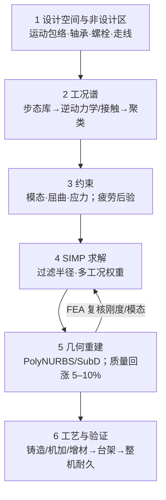

# 人形结构拓扑优化工具链（工况谱 → 优化 → 重建 → 验证）

## 一句话定义

**拓扑优化工具链**是在给定设计空间与载荷约束下，用 **SIMP 等密度法** 重分配结构材料、再经 **CAD 重建与工艺收口** 得到可装机零件的一整条 CAE 流程；对人形机器人而言，它服务的是 **腿段与躯干的质量–惯量–执行器–电池闭环**，而不是桌面上的「减重百分比 KPI」。

## 英文缩写速查

| 缩写 | 英文全称 | 简要说明 |
|------|----------|----------|
| TO | Topology Optimization | 拓扑优化，在固定设计域内求材料分布 |
| SIMP | Solid Isotropic Microstructure with Penalization | 密度惩罚插值，商用 TO 事实标准 |
| FEA | Finite Element Analysis | 有限元分析，刚度/应力/模态求解 |
| MMA | Method of Moving Asymptotes | 移动渐近线法，常用 TO 优化器 |
| TPMS | Triply Periodic Minimal Surface | 三周期极小曲面，增材点阵常用 |
| GD | Generative Design | 生成式设计，CAD/云端探索性优化 |
| CAD | Computer-Aided Design | 可编辑三维零件模型 |

## 为什么重要

- **减重是人形的先决条件，不是锦上添花。** 公开整机重量从 G1 ~35 kg 到全尺寸 ~70 kg 量级；Walker、Optimus 等代际迭代都在压质量。腿每增 1 kg，摆动惯量与峰值关节扭矩上升，驱动器与电池跟着加重——与 [负载与质量螺旋](../overview/humanoid-actuator-102-load-and-mass-spiral.md) 同一逻辑。
- **载荷环境比工业臂苛刻。** 落地冲击可达体重数倍、步态累计循环可达 **10⁷** 高周疲劳、一阶模态须与伺服带宽错开（见 [结构模态分析](./robot-structural-modal-analysis.md)）。非设计区（轴承、螺栓、走线、维护空间）多，优化结果极易「密度云漂亮、装不上或过不了疲劳」。
- **工具链差距在输入输出，不在求解器 logo。** 文内强调：一半以上工时花在 **工况谱** 与 **验证闭环**；拓扑优化只回答「材料该去哪」，敢不敢装机取决于重建后 FEA 与试验。

## 数学骨架（SIMP 为主）

常见刚度最大化表述：

$$
\min_X C(X)=U^T K(X) U \quad \text{s.t.}\ V(X)\le V^*,\ K(X)U=F,\ 0<X_{\min}\le X_e\le 1
$$

单元刚度 $E(X_e)=E_0 X_e^p$（$p\approx 3$）惩罚中间密度；伴随法求敏度，MMA/OC 更新；**过滤半径** 同时控制灵敏度扩散与 **最小特征尺寸**（可制造性的第一道阀）。

方法对照：**SIMP**（商用成熟、制造约束易嵌入）· **水平集**（边界清晰、多工况鲁棒性仍在追）· **BESO**（逐单元删增、骨架直观）。

## 商用工具链选型（工程读法）

| 工具链 | 强项 | 边界 |
|--------|------|------|
| **OptiStruct / Inspire**（西门子，2025 年完成收购 Altair） | 铸造/挤压/对称/最小尺寸等制造约束；多工况与模态；Inspire→**PolyNURBS** 降低上手成本 | 许可与流程规范成本 |
| **Tosca + Abaqus**（达索） | **接触、螺栓预紧、大变形** 下 TO；与 CATIA/3DEXPERIENCE 数据链短 | 非线性建模门槛 |
| **Ansys Mechanical / Discovery**（新思科技） | 已有 Ansys 材料库与模板时 **边际成本最低** | 制造约束深度因模块而异 |
| **nTop** | **隐式/场驱动** 建模、杆系点阵与 **TPMS**；与 OptiStruct/Ansys 双向接口 | 增材与点阵重度用户 ROI 高 |
| **Creo GD / Fusion 360** 等 | CAD 端快速生成式设计、中小团队迭代 | 多工况与疲劳闭环需自建 |

国产 CAE 是否进主流程，建议用 **同一组考题** 横向验证：制造约束完备性、多工况/模态稳定性、几何重建链路——标准与国外工具一致，不单独降档。

## 开源与自研

- **教学/原型：** Sigmund 99/88 行代码 → **topy**；FEniCS + dolfin-adjoint；**TopOpt.jl** + MMA；CalculiX + Gmsh 自接优化器。
- **自研价值**  rarely 是省许可费（人年折算常不划算），而是 **嵌入整机设计系统**：步态库自动灌载荷、批量出图、齿轮箱油腔/橡胶铰/丝杠位等 **专用约束**。上线前须 **MBB 梁、L 形梁（应力奇异考题）** 与商用结果交叉对比。
- **隐性成本：** 工况管理、网格自动化、结果校验、多人协作——开源栈须当 **长期路线** 而非单项目权宜。

## 六步工程流程

### 1）设计空间与非设计区

由 **关节极限与干涉** 倒推可优化域；轴承孔、螺栓搭子、扳手空间、走线与维护通道划 **非设计区**。遗漏扳手空间 → 优化结果无法装配；非设计区边界过紧 → 载荷「抄近路」穿过本该避让区域。

### 2）工况从哪里来（最易犯错）

**不宜** 只取几个静力工况。人形结构载荷来自 **整机动力学**：行走/楼梯/抗扰/跑跳步态库 → 多体逆动力学得关节扭矩与安装点反力时间历程；落地冲击单独做接触工况；对上千时刻 **聚类** 得代表与包络工况。未覆盖工况（如跌倒）靠 **设计裕度** 兜底。此步常占 **>50% 工时**。

### 3）约束设置

除柔顺度/刚度目标外，至少：**模态约束**（一阶 $f_1$ 高于目标，避免与伺服带宽耦合）、**屈曲**（薄壁）、**应力约束**。疲劳一般 **不做在线 TO 约束**（研究前沿）；优化后用 Goodman + S-N **后验校核**：

$$
\sigma_a/\sigma_{-1} + \sigma_m/\sigma_u \le 1/n
$$

### 4）求解数值陷阱

| 现象 | 处置 |
|------|------|
| 应力奇异（点载/锐角） | 内角圆角、松弛应力约束 |
| 棋盘格/网格依赖 | 过滤半径绑定最小特征尺寸；加密网格复核 |
| 灰色密度 0.3–0.7 | 提高惩罚指数与迭代；勿直接当减材依据 |
| 冲击工况绑架目标 | 降权或改约束式多工况表述 |

### 5）几何重建

密度云 **不是零件**。等值面 → PolyNURBS/SubD → 恢复拔模、圆角、公差；重建质量常 **回涨 5%–10%**，**必须用重建几何再跑 FEA**，不能沿用优化云图刚度。

### 6）工艺与验证

- **铸造：** 拔模、壁厚、热节（OptiStruct 铸造约束可前置规避）
- **机加：** 让刀与装夹
- **增材：** 自支撑 ~45°、最小壁厚（LPBF 铝/钛 ~0.4 mm 量级）、排粉孔；**打印态表面粗糙度** 可大幅折减疲劳强度，各向异性须单独标定许用值

验证顺序：**静力与模态台架 → 疲劳谱 → 整机耐久**。公开案例：天工 Ultra 胸部/腰/四肢拓扑重构支撑长距离奔跑；Atlas CFRP 关节支架相对铝合金 **减重 ~45%**、弯曲模量 ~230 GPa（跳跃冲击量级）——形状由 TO 给出，**材料与工艺定上限，试验定敢不敢装**。

## 点阵与 TPMS（增材第二层）

**杆系点阵** 比刚度高、建模简单，适合非承载壳体填腔与吸能；**TPMS（如 Gyroid）** 曲率连续、应力集中小，适合承载/散热一体。常用 **「宏观拓扑定骨架 + 点阵填腔」**；代价是疲劳分散性大、CT 检测贵、去粉与表面光整工作量大——关键承载路径上点阵前应先做 **试样级疲劳统计**（Autodesk 下肢公开案例含小型疲劳试验机）。

## 常见误区

1. 把 TO 当成一个软件按钮，跳过 **工况谱** 与 **非设计区** → 结果不可制造或不敢装机。
2. 拿优化软件内云图刚度当最终性能，跳过 **重建后 FEA**。
3. 忽视 **模态约束** → 与 [结构模态](./robot-structural-modal-analysis.md) / 控制带宽冲突。
4. 增材件直接用体材料 S-N 曲线，忽略 **打印态疲劳折减**。

## 关联页面

- [整机机械布局设计](./humanoid-mechanical-layout-design.md) — 质量分布与非设计区上游
- [结构模态分析](./robot-structural-modal-analysis.md) — TO 模态约束与伺服分离
- [Humanoid Hardware 101 · 机身与材料](../overview/humanoid-hardware-101-chassis-materials.md) — 材料与传力路径
- [人形下肢动力学衍生式设计](../entities/paper-humanoid-leg-generative-design-dynamics.md) — 学术侧 Ti6Al4V 增材 leg 案例
- [自研关节模组流程](./joint-module-self-development-workflow.md) — 执行器与结构接口

## 参考来源

- [wechat_zanehub_humanoid_topo_opt_toolchain_2026-09-26.md](../../sources/blogs/wechat_zanehub_humanoid_topo_opt_toolchain_2026-09-26.md) — Zane Hub 公众号编译
- [wechat_zanehub_robot_structural_modal_analysis.md](../../sources/blogs/wechat_zanehub_robot_structural_modal_analysis.md) — 模态与带宽语境
- 原文：<https://mp.weixin.qq.com/s/B5s18iMOA6bcUKRxVeWGOw>

## 推荐继续阅读

- [Humanoid Hardware 101 技术地图](../overview/humanoid-hardware-101-technology-map.md)
- [整机硬件设计纵深路线](../../roadmap/depth-humanoid-hardware-design.md)
