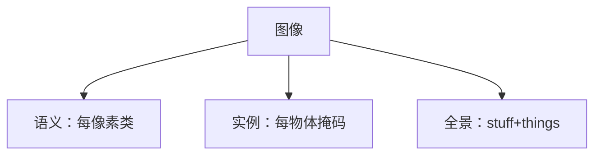

# 图像分割任务分类（语义 / 实例 / 全景）

## 一句话定义

**语义分割**给每个像素一个类别；**实例分割**还要区分同类别不同物体；**全景分割**统一可数 things 与不可数 stuff，输出整图一致的像素–段表示。

## 英文缩写速查

| 缩写 | 英文全称 | 简要说明 |
|------|----------|----------|
| SemSeg | Semantic Segmentation | 像素级类别，不区分个体 |
| InstSeg | Instance Segmentation | 实例掩码+类别 |
| Panoptic | Panoptic Segmentation | things+stuff 统一 |
| mIoU | mean Intersection over Union | 语义分割主指标 |
| PQ | Panoptic Quality | 全景分割主指标 |

## 为什么重要

- 课程 4.1.1：先分清任务再选 FCN/Mask R-CNN/SETR/SAM。
- 机器人语义地图、抓取掩码、可行驶区域对应不同任务级别。

## 核心原理

| 任务 | 输出 | 典型指标 | 代表方法 |
|------|------|----------|----------|
| 语义 | 类图 | mIoU | FCN、SegFormer |
| 实例 | 每实例 mask | mask AP | Mask R-CNN |
| 全景 | 段 id+类 | PQ | PanopticFPN、SEEM |

## 工程实践

| 项 | 建议 |
|----|------|
| 标注 | 勿把实例数据当纯语义训完就部署抓取 |
| 机器人 | 可行驶/地形→语义；拣选→实例；场景理解→全景/开放词 |
| 基础模型 | [SAM](../entities/paper-segment-anything.md) 偏交互/类别无关；需另接语义 |

## 局限与风险

开放词汇与视频分割正在改写边界（SAM2/SEEM）；指标高不等于闭环可用，需与标定和时序融合一起验收。

## 关联页面

- [FCN](../methods/fcn-semantic-segmentation.md)
- [Mask R-CNN](../methods/mask-rcnn.md)
- [SEEM](../entities/seem.md)
- [Transformer CV 课程策展](../entities/transformer-cv-curriculum.md)
- [机器人视觉感知栈选型闭环知识链](../queries/robot-perception-stack-selection-loop.md) — 语义/实例/全景之分决定②层选什么头、③层能提升到什么粒度

## 参考来源

- [Transformer 视觉应用课程大纲](../../sources/courses/transformer_cv_applications_syllabus.md)

## 推荐继续阅读

- [Kirillov et al. Panoptic Segmentation (CVPR 2019)](https://arxiv.org/abs/1801.00868)
