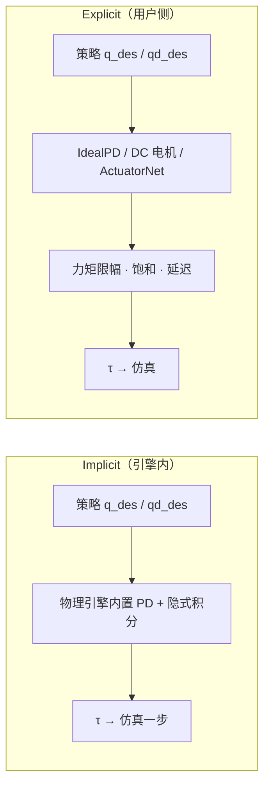

# Implicit / Explicit 执行器建模

在机器人强化学习里，**implicit** 与 **explicit** 通常指 **仿真执行器（actuator）模型** 如何把策略的高层指令变成关节力矩，而不是指「策略隐式学电机」或「显式地形表示」等其它语境下的同名概念。

## 一句话定义

> **Implicit**：物理引擎在积分循环 **内部** 完成 PD 并施加力矩；**Explicit**：用户代码 **先** 算期望力矩（再限幅等），再作为 actuation effort 写入仿真。

## 英文缩写速查

| 缩写 | 英文全称 | 简要说明 |
|------|----------|----------|
| PD | Proportional–Derivative | 位置/速度目标常经 PD 转为关节力矩 |
| RL | Reinforcement Learning | 策略多输出关节目标，底层仍依赖执行器模型 |
| Sim2Real | Simulation to Real | implicit↔explicit 切换可导致策略不迁移 |
| PhysX | NVIDIA PhysX | Isaac Lab 默认物理后端，提供 implicit actuator |
| MuJoCo | Multi-Joint dynamics with Contact | mjlab built-in actuator 走引擎隐式积分 |
| SEA | Series Elastic Actuator | explicit 模型可建模串联弹性等非理想特性 |
| DC | Direct Current | 显式 `DcMotorActuator` 含速度–扭矩曲线与反电动势 |

## 为什么重要

腿足与人形 RL 的常见控制栈是：

```text
RL 策略 → 关节目标（位置/速度/力矩）→ 执行器模型 → τ → 物理仿真
```

同一套策略输出，若仿真里用 **implicit** 还是 **explicit** 执行器，会改变：

1. **有效关节带宽与接触冲量** — PD 是否在积分器内隐式处理阻尼
2. **训练收敛** — explicit 在大步长或高增益下更易数值振荡
3. **Sim2Real** — Isaac Lab 文档明确：**implicit 上训练的策略，换到同一机器人的 explicit 模型不一定直接可用**

因此这是「仿真电机有多真实」与「训练是否好训」之间的核心开关，与 [Armature 建模](./armature-modeling.md)、[Actuator Network](../methods/actuator-network.md)、[关节摩擦](./joint-friction-models.md) 同属执行器对齐链路。

## 核心机制

### Implicit（隐式执行器）

- **谁算力矩**：物理引擎（Isaac Lab 的 `ImplicitActuator` / PhysX；mjlab 的 `BuiltinPositionActuator` 等）。
- **行为**：用户设置 desired position/velocity 及 stiffness/damping；引擎在 **连续时间积分** 中内部计算 efforts。PhysX 还对期望力矩加数值阻尼，抑制振荡。
- **优点**：大步长时通常比显式 PD 更稳定；实现简单，早期算法验证快。
- **局限**：偏「理想电机」；真机的饱和、摩擦、延迟、反电动势等需另建模。

### Explicit（显式执行器）

- **谁算力矩**：用户实现的驱动模型。
- **典型两步**（Isaac Lab）：
  1. 用 PD 或更复杂模型算期望 $\tau$
  2. 按齿轮比、峰值/连续力矩等 **clip** 后写入仿真
- **常见类型**：
  - `IdealPDActuator` — 理想 PD + 力矩限幅
  - `DcMotorActuator` — 速度相关扭矩上限、反电动势
  - `LearnedMlpActuator` / [Actuator Network](../methods/actuator-network.md) — 数据驱动拟合真机非线性
- **优点**：可表达饱和、摩擦、延迟、SEA 等，更贴近真机。
- **局限**：积分器无法完全吸收「外部算力」的速度导数项，**数值鲁棒性通常弱于 implicit**；常需调大 `armature` 或减小步长。

### 与 RL 动作语义的关系

[SCA 2017 动作空间对比](../entities/paper-deeprl-locomotion-action-space-sca2017.md) 表明：locomotion 里 **目标关节角 + 局部 PD 反馈** 往往比直出扭矩更易学。implicit/explicit 讨论的是 **仿真里这层 PD 由引擎算还是用户算**，不改变「策略输出的是 setpoint 还是 torque」这一上层语义选择。Kp/Kd 与分频见 [Legged / Humanoid RL 中 Kp/Kd 设置](../queries/legged-humanoid-rl-pd-gain-setting.md)。

## 流程总览



## 栈内命名对照

| 框架 | 隐式（≈ implicit） | 显式（≈ explicit） |
|------|-------------------|-------------------|
| Isaac Lab | `ImplicitActuator` | `IdealPDActuator`, `DcMotorActuator`, `LearnedMlpActuator` |
| mjlab | `BuiltinPositionActuator` 等 built-in | `IdealPdActuator`, `DcMotorActuator`, `LearnedMlpActuator` |
| MuJoCo 原生 | `<position>` / 原生 actuator + `implicitfast` | 用户算 τ 再经 `<motor>` passthrough |

## 工程选型

| 场景 | 建议 |
|------|------|
| 早期验证 reward / 算法 | 常用 **implicit**，收敛快 |
| 准备上真机、对齐电机包络 | 逐步切 **explicit**（DC 电机、摩擦、限幅）或 [Actuator Network](../methods/actuator-network.md) |
| implicit 能训、explicit 不收敛 | 增大 `armature`、减小仿真步长、对齐 Kp/Kd，或对增益做域随机化 |
| 量化仿真–真机执行器 gap | [SAGE](../entities/sage-sim2real-actuator-gap-estimator.md)、[BAM](../entities/bam-better-actuator-models.md) 等 |

## 常见误区

1. **≠「隐式学习 vs 显式学习」** — 本概念特指 **仿真执行器建模**；论文里另有 implicit-explicit 表征、隐式地形等用法，需看上下文。
2. **≠「策略出力矩就是 explicit」** — 即便动作空间是扭矩，仍可能走 implicit 或 explicit 执行器路径，取决于仿真配置。
3. **Implicit 不等于真机行为** — 真机有电流环、总线延迟与饱和；零样本 Sim2Real 往往要在 explicit 或数据驱动执行器上再对齐。

## 关联页面

- [物理保真度 ↔ Sim2Real Gap](./physics-fidelity-sim2real-gap.md) — 本页是其保真度链路中「执行器层」的具体开关
- [Sim2Real](./sim2real.md) — 执行器对齐是高保真迁移子链路
- [Armature 建模](./armature-modeling.md) — explicit 不稳定时常用的稳定性旋钮
- [Actuator Network](../methods/actuator-network.md) — explicit 路线的数据驱动进阶
- [关节摩擦模型](./joint-friction-models.md) — 常与 explicit 解析模型一并标定
- [Isaac Lab](../entities/isaac-lab.md) — 默认训练栈与执行器 API 入口

## 参考来源

- [Isaac Lab / mjlab Implicit vs Explicit Actuator 一手资料索引](../../sources/courses/isaac_lab_implicit_explicit_actuators.md)
- [Isaac Lab — Actuators](https://isaac-sim.github.io/IsaacLab/main/source/overview/core-concepts/actuators.html)
- [mjlab — Actuators](https://mujocolab.github.io/mjlab/main/source/actuators.html)

## 推荐继续阅读

- [Isaac Lab `isaaclab.actuators` API](https://isaac-sim.github.io/IsaacLab/main/source/api/lab/isaaclab.actuators.html)
- [Learning Locomotion Skills Using DeepRL: Does the Choice of Action Space Matter?](https://arxiv.org/abs/1611.01055) — PD 目标空间为何常用
