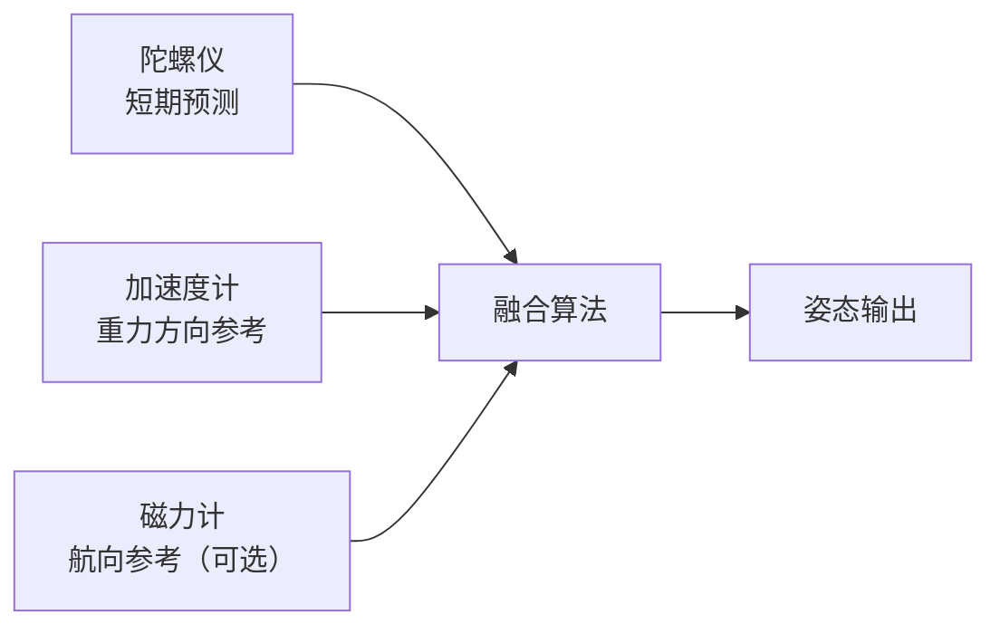

# IMU：原理、算法与摄像头驱动协同

> 知识编译自 [飞一样的成长 · 图解 IMU（2026-09-05）](https://mp.weixin.qq.com/s/gbA1Crm94uG_5hqWati4Kw)；原文为面向嵌入式 Linux 的工程教程，本页提炼可交叉引用的概念骨架。

## 一句话定义

**IMU（惯性测量单元）** 通过三轴加速度计与三轴陀螺仪直接测量机身的比力与角速度；要把抖动数值变成可用姿态、并与相机帧对齐做防抖或 VIO，还需要 **标定、融合算法、时间/坐标统一** 以及 **V4L2/IIO 驱动链** 的完整约定。

## 英文缩写速查

| 缩写 | 英文全称 | 简要说明 |
|------|----------|----------|
| IMU | Inertial Measurement Unit | 三轴加速度计 + 三轴陀螺仪（可选磁力计） |
| AHRS | Attitude and Heading Reference System | 融合惯性与其他参考得到姿态与航向 |
| INS | Inertial Navigation System | 在 AHRS 基础上传播速度与位置 |
| MEMS | Micro-Electro-Mechanical Systems | 芯片内微机械敏感结构 |
| VIO | Visual-Inertial Odometry | 视觉–惯性联合估计相对运动 |
| EIS | Electronic Image Stabilization | 基于数字图像变换的陀螺防抖 |
| ODR | Output Data Rate | IMU 数字样本输出频率 |
| FIFO | First-In First-Out | 片上按采样顺序缓存样本的队列 |
| V4L2 | Video4Linux2 | Linux 视频采集框架 |
| IIO | Industrial I/O | Linux 工业/传感器输入输出框架 |

## 为什么重要

- **相机 alone 难区分**「相机转」与「物体动」；IMU 提供高频、与曝光无关的旋转线索，是 EIS、VIO、滚动快门校正的上游。
- **六轴输出不是位姿**：把测量当姿态会直接踩坑；零偏、温漂、混叠与错误时间戳会在积分中 **指数级放大**。
- **驱动与算法必须同语系**：寄存器配置、FIFO 批量到达、曝光元数据、安装外参与滤波器约定不一致时，后端调参往往无效。

## 核心原理

### 测量层：六轴究竟是什么

| 器件 | 输出 | 直接回答的问题 | 常见误区 |
|------|------|----------------|----------|
| 加速度计 | 比力 \(a_x,a_y,a_z\) | 各轴承受多大非重力作用 | 静止时模长 ≈ **1 g**，不是 0 |
| 陀螺仪 | 角速度 \(\omega_x,\omega_y,\omega_z\) | 各轴转多快 | 输出是 **速率**，不是已转角度 |
| 磁力计（可选） | 磁场 \(m_x,m_y,m_z\) | 当地磁场方向 | 电机/结构磁干扰时航向参考会恶化 |

**六轴 = 六个测量通道**，不等于已获得六自由度位姿。九轴在六轴上加磁力计，仍不增加三个独立空间自由度。

### MEMS 直觉模型

- **电容式加速度计**：外壳–弹簧–质量块；比力引起相对位移 → 电容变化 → 数字码。
- **振动陀螺仪**：驱动轴振动 + 旋转时科里奥利响应 → 正交通道可解角速度。
- **数字链**：敏感结构 → 模拟前端 → ADC → 数字滤波 → FIFO/中断 → SPI/I²C/I3C。

### 坐标、姿态与单位

- 芯片轴、板级安装轴、相机成像轴 **常不一致**；所有「绕 Z 转」必须声明坐标系。
- 算法三角函数用 **rad/s**；接口可能给 °/s，混用会差约 57.3 倍。
- 姿态可用欧拉角、旋转矩阵 \(R_{WB}\) 或单位四元数 \(q=(w,x,y,z)\)（Hamilton、标量在前）；**公式与库约定必须成套**。

### 采样、带宽、量程与噪声

- **ODR ≠ 带宽**：高 ODR 不保证能测高频振动；采样前缺抗混叠会把高频 **折叠** 到低频。
- **超量程饱和** 后信息丢失，后端滤波无法完整恢复。
- 噪声密度与 RMS 噪声通过等效噪声带宽 B\_ENBW 关联；降带宽减噪往往 **增相位滞后**。

### 误差与标定

| 误差类型 | 表现 | 工程处理 |
|----------|------|----------|
| 零偏 / 温漂 | 静止仍有输出，热机后均值变 | 静态估计、温度模型、在线偏置状态 |
| 比例 / 轴间 | 转 90° 估成 88°、单轴串扰 | 多姿态标定、矩阵补偿 |
| 随机噪声 | 样本抖动 → 随机游走 | 合理带宽、融合、噪声建模 |
| 振动 / 安装应力 | 工况变化后误差变 | 机械设计、抗混叠、实测验证 |

**六面静态标定**（每轴 ±g 朝上）可估单轴偏置与比例；全矩阵与安装关系需更多姿态。标定参数必须绑定 **器件 + 安装 + 坐标系**，不可无条件复制到另一块板。

### 姿态融合算法谱系

| 方法 | 关键思想 | 适用起点 | 主要注意 |
|------|----------|----------|----------|
| 单轴互补 | 陀螺积分 + 加速度倾角回拉 | 教学、受约束单轴 | 不能当通用三维姿态 |
| Mahony | 重力方向叉积误差反馈到 \(\omega\) | 嵌入式三维 AHRS | 符号/坐标/积分饱和 |
| Madgwick | 四元数目标函数梯度下降 | 低算力姿态 | \(\beta\)、归一化、动态拒绝 |
| EKF / ESKF | 状态 + 协方差预测–更新 | 融合相机/GNSS/轮速等 | 模型、噪声、可观测性 |

**低动态时** 加速度模长接近 g 才可作重力参考；线性加速/振动时应 **降权或拒绝** 观测。普通六轴 **缺少外部参考时绝对航向不可观测**；加磁力计仍需硬/软铁标定与磁干扰检测。

### 为什么 IMU 难单独长期定位

扣除重力与偏置后比力可积分得速度/位置，但初值、姿态与噪声误差 **逐级传播**；无外部锚点无法知漂移多远。**VIO** 用视觉特征约束几何，IMU 在帧间高频传播——单目尺度可观测性仍依赖运动与数据质量（见 [VIO 选型](../comparisons/lidar-slam-lio-vio-selection.md)）。

## 工程实践

### Linux 下相机与 IMU 驱动分工

| 组件 | 框架 | 职责 |
|------|------|------|
| 图像 Sensor | V4L2 sub-device | 模式、曝光、增益、开关流 |
| CSI / ISP | 平台驱动 | 像素接收与信号处理 |
| IMU | IIO | 寄存器、中断、FIFO、时间戳 |
| 同步适配层 | 用户态/SDK | 时钟映射、帧–样本窗口、交给 EIS/VIO |

**设备树** 描述接线与 compatible 匹配，**不自动**完成逐帧同步；FSYNC/INT 语义须查芯片手册，不能凭引脚名臆断。

### 时间与元数据

- **FIFO 批量读取 ≠ 同时采样**：须按样本序号/芯片时间戳反推，勿把整批标成读取时刻。
- 相机 buffer 的 **timestamp + clock domain + 事件语义**（SOE/EOF 等）决定如何关联曝光区间。
- 时钟映射 \(t_\mathrm{host} \approx s \cdot t_\mathrm{sensor} + b\) 需处理 **频差 ppm** 与计数器回绕。
- **逐帧匹配** 应选 **时间窗口** 并对边界 **插值** 积分，而非固定「每帧 33 个样本」。

### 曝光与滚动快门

- 曝光寄存器「行数」须用 **pixel rate、HBLANK、VBLANK** 按模式手册换算为时间。
- **滚动快门**：各行曝光时刻不同；精细补偿需按行/分块使用对应时刻旋转，单姿态代表整帧只是近似。
- **EIS**：陀螺轨迹 → 平滑期望运动 → 计算 \(R_\mathrm{rel}\) → ISP/GPU 重采样；需预留裁切、考虑 OIS 与运动模糊。
- 空间上：陀螺经 **旋转外参** 转到相机系；涉及线加速度/平移时考虑 **杆臂** 与 Kalibr 类时空标定。

### 可检查的数据链验收

| 阶段 | 完成判据 |
|------|----------|
| 通信与启动 | ID/模式/ODR/滤波可回读且与手册一致 |
| 连续采集 | 样本数正确、时间连续、无隐藏 FIFO 溢出 |
| 数值标定 | 静态模长合理、已知转角验证通过 |
| 坐标与同步 | 单轴方向正确、负载变化不引入异常时间差 |
| 算法融合 | 静/动态均有参考误差统计 |
| 异常恢复 | 断流/饱和/重配置后状态有效性可见 |

**诊断顺序**：轴向与单位 → 时间语义与窗口覆盖 → 图像模式/内参/补偿方向 → 平滑参数。现象如「仅某方向恶化」「高 CPU 负载变差」「切换分辨率失效」应对照原文分支表排查。

## 局限与风险

- 原文为 **右手系、Z 朝上** 约定与 **嵌入式 Linux** 实例；RTOS/其他 OS 可迁移原则但寄存器与 binding 须重查。
- 教学仿真与 Python 示例 **阈值非通用参数**；强动态场景需残差检测、运动模型或外部观测。
- 消费级六轴 **不能承诺** 任意运动下全轴零偏收敛或长期绝对定位。
- 磁力计、OIS 与 EIS 同时存在时，机身 IMU 与 **实际成像变化** 关系更复杂。

## 关联页面

- [传感器融合（Sensor Fusion）](./sensor-fusion.md)
- [Kalman Filter](../formalizations/kalman-filter.md)
- [EKF](../formalizations/ekf.md)
- [LiDAR / LIO / VIO 选型](../comparisons/lidar-slam-lio-vio-selection.md)
- [Sim2Real 检查清单](../queries/sim2real-checklist.md)
- [具身数据采集四层术语地图](./embodied-data-collection-four-layers-taxonomy.md) — 设备层 IMU/SLAM 在 UMI 等采集方案中的角色

## 参考来源

- [wechat_feiyiyangcheng_imu_principles_algorithms_camera_2026-09-05.md](../../sources/blogs/wechat_feiyiyangcheng_imu_principles_algorithms_camera_2026-09-05.md)
- [图解 IMU 原文（微信公众号）](https://mp.weixin.qq.com/s/gbA1Crm94uG_5hqWati4Kw)

## 推荐继续阅读

- Mahony et al., *Nonlinear Complementary Filters on the Special Orthogonal Group* (2008)
- Madgwick, *An efficient orientation filter for inertial and inertial/magnetic sensor arrays* (2010)
- Solà, *Quaternion kinematics for the error-state Kalman filter*
- ETH [Kalibr](https://github.com/ethz-asl/kalibr) — 相机–IMU 时空标定
- Linux Kernel 文档：V4L2 buffers、IIO triggered buffer、BMI270 devicetree binding
