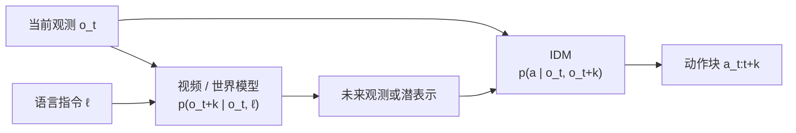

# 逆动力学模型（IDM，Inverse Dynamics Model）

**逆动力学模型（IDM）**：给定当前观测 $o_t$ 与未来观测（或其潜表示）$o_{t+k}$，预测把世界从前者带到后者的动作 $a_{t:t+k}$。在机器人学习里，它是「先预测未来、再反推动作」这条路线的动作解码接口：[世界模型 / 视频生成](../methods/generative-world-models.md) 负责回答「世界会怎么变」，IDM 只回答「这个变化对应什么动作」。

## 一句话定义

> **前向模型学 $p(o_{t+k}\mid o_t, a)$，IDM 学 $p(a \mid o_t, o_{t+k})$：把动作标注的需求从大规模视频上挪开，只留给小得多的「观测变化 → 动作」映射。**

## 英文缩写速查

| 缩写 | 英文全称 | 简要说明 |
|------|----------|----------|
| IDM | Inverse Dynamics Model | 由当前 + 未来观测反推动作 |
| FDM | Forward Dynamics Model | 由当前观测 + 动作预测未来（世界模型的前向半边） |
| GIDM | General Inverse Dynamics Model | DeFI 里在无动作标签视频上自监督预训练的逆动力学模块 |
| WAM | World Action Model | 同时建模未来观测与动作的模型族 |
| IDC | Inverse Dynamics Control | 刚体逆动力学控制（求力矩），与 IDM 同名不同义 |

## 为什么重要

- **动作标签是瓶颈，视频不是。** 互联网与人类视频规模远大于带机器人动作的数据；级联路线让视频模型吃无标签数据学「世界怎么变」，IDM 只需在目标本体的动作数据上学映射（见 [级联架构路线](../overview/world-models-route-01-cascade.md)）。
- **它是世界动作模型分类的一条轴。** [World Action Models](./world-action-models.md) 把「接口」分成 **Joint prediction**（联合出观测与动作）与 **IDM**（先 $p(\mathbf{O}\mid h,\ell)$ 再 $p(\mathbf{A}\mid h,\mathbf{O})$）；读 WAM 论文时先认出动作是不是由 IDM 解出来的。
- **库内高频出现。** 数百个页面在 WAM、视频策略、潜动作语境里提到 IDM，本页是这些指称的统一落点。

## 核心原理

$$
\hat a_{t:t+k} = f_\theta\big(o_t,\ \hat o_{t+k}\big),\qquad \hat o_{t+k} \sim p_\phi(o_{t+k}\mid o_t, \ell)
$$

其中 $p_\phi$ 是语言 $\ell$ 条件的视频 / 世界模型，$\hat o_{t+k}$ 可以是像素帧、也可以是中间潜表示；$f_\theta$ 就是 IDM。按「未来从哪来、IDM 怎么训」，库内实例大致分四种：

| 形态 | 未来表征 | IDM 训练信号 | 代表 |
|------|----------|--------------|------|
| 显式视频计划 + 独立 IDM | 生成的像素视频 | 机器人动作标签 | [UniPi](../entities/paper-rcl-2302-00111-learning-universal-policies-via-text-guided-vide.md) |
| 潜表示条件的 IDM 动作头 | 视频扩散中间特征 / 紧凑潜空间 | 机器人动作标签 | [VPP](../entities/paper-shenlan-wm-02-vpp.md)、[mimic-video](../methods/mimic-video.md)、[GE-Act 2.0](../entities/paper-ge-act-2.md) |
| 自监督潜动作 | 相邻帧 | 无动作标签（学离散 / 连续潜动作，再少量映射到真动作） | [LAPA](../entities/paper-shenlan-wm-03-lapa.md)、[DeFI](../methods/defi-decoupled-dynamics-vla.md) 的 GIDM |
| 前向 / 逆向同一权重 | 掩码视频 | 同一视频模型 + 抽动作 IDM | [Masked Visual Actions](../entities/paper-masked-visual-actions.md) |

「IDM」不一定意味着推理时要先滚完整段视频：[World Action Models](./world-action-models.md) 指出部分 IDM 推理时不显式滚完整未来，[mimic-video](../methods/mimic-video.md) 就只取视频骨干的中间潜表示条件化流匹配动作解码器。[Seer](../entities/paper-rcl-2412-15109-predictive-inverse-dynamics-models-are-scalable.md)（Predictive Inverse Dynamics Models）在 RCL 象限里被归为 **One Model × IDM**，即预测与逆动力学放在同一模型内。

## 工程实践

- **IDM 绑定本体。** 视频侧可以跨本体、吃人类数据，但 IDM 输出的是目标机器人的动作空间，仍需该本体的动作数据；GE-Act 2.0 的 IDM 单独用了约 32k h 操作数据预训练。
- **别让逆向模块成为短板。** [DeFI](../methods/defi-decoupled-dynamics-vla.md) 把前向（GFDM）与逆向（GIDM）分开在不同数据上预训练，并报告弱化逆向模块（如 VPP 式设计）会成为整条链路的瓶颈。
- **预测步长 $k$ 是超参。** $k$ 太短，IDM 近似单步动作回归、视频先验用不上；$k$ 太长，中间可能有多条合法路径，IDM 输出变成平均动作。
- **命名先对齐。** 论文里的「inverse dynamics」若出现在控制 / 力矩语境，说的是 [逆动力学控制](../methods/inverse-dynamics-control.md)（$\tau = M(q)\ddot q + C\dot q + g$），不是本页的学习式 IDM。

## 局限与风险

- **一对多不可辨识：** 同样的视觉变化可由不同动作产生（遮挡、接触力、速度剖面不可见），IDM 只能给条件期望或需要生成式动作头。
- **级联误差传递：** 生成的未来物理不可行时，IDM 会忠实地解出一个同样不可行的动作；[级联架构路线](../overview/world-models-route-01-cascade.md) 把这列为主要权衡。
- **潜动作 ≠ 真动作：** 自监督潜动作要再映射到机器人控制量，映射所需的标注量与本体差异决定了迁移上限。

## 关联页面

- [World Action Models](./world-action-models.md) — Joint prediction vs IDM 接口轴与文献实例
- [生成式世界模型](../methods/generative-world-models.md) — 视频 / 世界模型侧的前向预测
- [级联架构路线](../overview/world-models-route-01-cascade.md) — 先预测未来、再逆动力学解码的项目集合
- [DeFI](../methods/defi-decoupled-dynamics-vla.md) — 前向 / 逆向解耦预训练
- [mimic-video](../methods/mimic-video.md) — 视频潜表示条件的 IDM 式动作解码器
- [逆动力学控制](../methods/inverse-dynamics-control.md) — 同名不同义：刚体动力学求力矩
- [具身大模型分类学选型闭环](../queries/embodied-fm-taxonomy-loop.md) — World-Model 家族在选型闭环中的位置

## 参考来源

- [UniPi（arXiv:2302.00111）](../../sources/papers/rcl_awesome_wam_2302_00111_learning-universal-policies-via-text-gui.md)
- [Predictive Inverse Dynamics Models / Seer（arXiv:2412.15109）](../../sources/papers/rcl_awesome_wam_2412_15109_predictive-inverse-dynamics-models-are-s.md)
- [VPP（arXiv:2412.14803）](../../sources/papers/shenlan_wm_survey_02_vpp.md)
- [LAPA（arXiv:2410.11758）](../../sources/papers/shenlan_wm_survey_03_lapa.md)
- [mimic-video（arXiv:2512.15692）](../../sources/papers/mimic_video_arxiv_2512_15692.md)
- [DeFI（arXiv:2604.16391）](../../sources/papers/defi_arxiv_2604_16391.md)
- [GE-Act 2.0（arXiv:2609.05588）](../../sources/papers/ge_act_2_arxiv_2609_05588.md)
- [Masked Visual Actions（arXiv:2607.19343）](../../sources/papers/masked_visual_actions_arxiv_2607_19343.md)

## 推荐继续阅读

- [UniPi: Learning Universal Policies via Text-Guided Video Generation](https://arxiv.org/abs/2302.00111)
- [Predictive Inverse Dynamics Models are Scalable Learners for Robotic Manipulation](https://arxiv.org/abs/2412.15109)
- [LAPA: Latent Action Pretraining from Videos](https://arxiv.org/abs/2410.11758)
