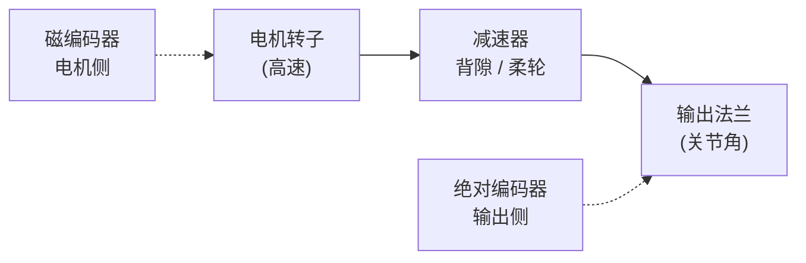

# 关节编码器选型（光电 / 磁 / 电感）

**关节编码器**决定模组 **定位精度上限、速度环带宽与长期可靠性**。选型核心不是「哪种精度更高」，而是 **测什么物理量、装在哪、失效模式能否接受** — 光电数光通量、磁测磁场方向、电感测互感耦合（编译自 [Zane Zhang 公众号文](../../sources/blogs/wechat_zane_zhang_joint_encoder_comparison_2026-09-23.md)）。

## 一句话定义

按 **测量原理与安装位** 匹配关节反馈：电机侧换相、输出侧关节角、双编码器观测量传动误差 — 勿把输出 **位数** 当系统 **精度**。

## 英文缩写速查

| 缩写 | 英文全称 | 简要说明 |
|------|----------|----------|
| FOC | Field-Oriented Control | 磁场定向控制，依赖电角度 |
| ABS | Absolute Encoder | 上电即知绝对角 |
| INC | Incremental Encoder | ABZ 增量脉冲 |
| DOF | Degrees of Freedom | 关节自由度 |
| WBC | Whole-Body Control | 高层控制依赖可信关节状态 |

## 为什么重要

- **Sim2Real 与 WBC：** 错误关节角 → 力矩估计与接触规划系统性偏 — 硬件层误差无法靠 RL 完全学掉。
- **协作/人形常见架构：** **双编码器**（电机侧 + 输出侧）是补偿谐波/RV **背隙与柔轮变形** 的常规方案。
- **参数表陷阱：** 25 位绝对式量化步距 ≈ 0.00001°，但 **系统精度** 仍可能是 ±角分级 — 来自偏心、温漂与安装。

## 三类原理对比

| 类型 | 物理量 | 精度天花板 | 环境 | 典型安装 |
|------|--------|------------|------|----------|
| **光电** | 码盘光路 | 最高（角秒级系统） | 怕尘油水，要密封 | 输出侧绝对式、计量级 |
| **磁（芯片）** | 磁场方向 | 芯片 ±0.8°–1° 级 | 耐污；怕强磁干扰 | 电机侧 FOC |
| **磁（磁环系统）** | 离轴磁场 | 系统 ±0.004° 起 | 需磁路与标定 | 输出侧 |
| **电感** | 互感调制 | 125–360 arcsec 级 | 无光源/永磁温漂 | 大中空输出侧 |

### 分辨率 vs 精度

- **分辨率：** $ \Delta\theta = 360° / 2^n $（n 为位数）— 数字最小步距。
- **精度：** 读数 vs 真值偏差 — 轴承跳动、偏心、气隙、温漂、标定残差。
- **重复精度：** 同点反复到达离散度 — 常优于绝对精度。

## 安装位：电机侧 vs 输出侧

- **电机侧：** FOC 换相 + 速度环；≥500 cpr 增量或 ~11 bit 绝对为常见起点；**看不见** 减速器后误差。
- **输出侧：** 真实关节角；背隙常见 **0.3°–2°** 只在此处可观测。
- **理想刚性换算** $\Delta\theta_{\mathrm{out}} \approx \Delta\theta_{\mathrm{motor}} / N$ **不成立** 于真实传动 — 勿用电机侧高分辨率替代输出反馈。

### 双编码器与力矩估计

$$ \tau_{\mathrm{est}} \approx K_\theta \left( \frac{\theta_{\mathrm{motor}}}{N} - \theta_{\mathrm{output}} \right) $$

- 差值主要反映 **传动扭转变形** — 可作观测，**不能** 替代标定过的关节力矩传感器（非线性刚度、摩擦、滞回）。
- **高电频率延迟：** 大极对 flat BLDC 超压驱动时电频率可达 **kHz 级**；除分辨率外须评估 **DAEC + MCU ωe 超前** — 见 [LunaDrive](../entities/paper-lunadrive.md)（3110 Hz 案例）。

## 工程实践（选型清单）

1. 需求拆成：**绝对精度、重复精度、全温误差、动态误差、安装容差** — 避免单写「≥17 bit」。
2. **磁方案：** 评审电机漏磁、母排、铁磁结构件；在 **最终结构 + 最大电流** 下测。
3. **光电：** 密封、冷凝、振动谱、码盘热漂移。
4. **电感：** 气隙公差、金属件扰动、励磁 EMC。
5. **高减速比关节：** 优先 **输出侧绝对反馈或双编码器**，而非堆电机侧位数。

## 局限与风险

- 文中产品名为 **选型锚点**，非本库实测排名。
- **协作机器人「真绝对值」**  маркeting 需对照是否双绝对链或单圈+电池多圈。
- 力矩估计公式 **未** 含摩擦模型 — 接触 rich 任务仍要 F/T 或电流模型标定。

## 关联页面

- [loco-manipulation](../tasks/loco-manipulation.md)
- [whole-body-control](../concepts/whole-body-control.md)
- [reinforcement-learning](../methods/reinforcement-learning.md)

## 参考来源

- [wechat_zane_zhang_joint_encoder_comparison_2026-09-23.md](../../sources/blogs/wechat_zane_zhang_joint_encoder_comparison_2026-09-23.md)

## 推荐继续阅读

- [Heidenhain ECN/EQN 系列公开参数](https://www.heidenhain.com/)
- [RLS AksIM-2 磁环系统规格](https://www.rls.si/)
