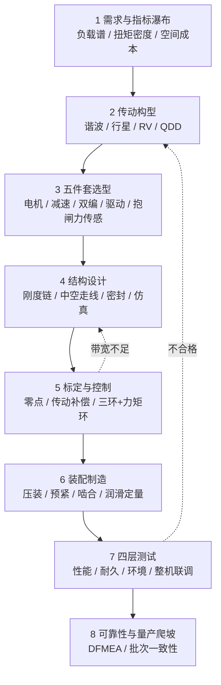

# 自研关节模组开发流程（需求 → 传动 → 五件套 → 验收）

## 一句话定义

**自研关节模组**不是外购电机、减速器、编码器简单拼装，而是从**负载谱与空间/成本约束**出发，经**传动构型选型、五件套集成设计、结构刚度链、标定与控制、装配工艺与四层测试矩阵**，交付可在整机上复现台架指标的**旋转执行器包**；[电机设计](../overview/motor-design-workflow.md) 只覆盖其中电磁–热–FOC 子链，本页补齐减速、传感、制造与验收。

## 英文缩写速查

| 缩写 | 英文全称 | 简要说明 |
|------|----------|----------|
| BOM | Bill of Materials | 物料清单；关节模组常占整机 BOM 40%–50% |
| RMS | Root Mean Square | 均方根；持续工况扭矩用于发热与寿命选型 |
| FOC | Field-Oriented Control | 磁场定向控制，驱动器底层力矩环 |
| EMC | Electromagnetic Compatibility | 电磁兼容；磁编与抱闸/穿线干扰相关 |
| DFMEA | Design Failure Mode and Effects Analysis | 设计阶段失效模式分析 |
| MTBF | Mean Time Between Failures | 平均故障间隔时间，可靠性目标 |

## 为什么重要

- **整机性能上限在关节**：电机、减速器、编码器、驱动器压进圆柱壳后，输出的峰值扭矩、连续扭矩、刚度与热平衡直接封顶 [Locomotion](../tasks/locomotion.md) 与操作任务能力。
- **「峰值扭矩够了」是高频死因**：真实工况是**负载谱**（RMS、峰值、转速曲线、循环次数）；额定按 RMS 选、峰值乘 1.5–2 安全系数，否则联调阶段以温升、寿命与背隙问题加倍返还。
- **与电机子流程的分工**：[电机设计流程](../overview/motor-design-workflow.md) 做到可信的电磁–热–FOC；本页把**减速器性格、双编闭环、抱闸/力传感、装配一致性与整机联调**纳入同一交付物——对应 [力矩电机设计纵深路线](../../roadmap/depth-torque-motor-design.md) Stage 6 与 [整机硬件纵深](../../roadmap/depth-humanoid-hardware-design.md) 的关节输入。

## 核心原理

### 需求定义：三问与指标瀑布

立项前对齐：**扛什么载荷、装在什么空间、以什么成本量产**。实操用**指标瀑布**把整机（自重、负载、臂展、末端速度/精度、连续工作时长）拆到关节：峰值扭矩、额定扭矩、转速、行程、传动精度（背隙）、刚度、重量、外径/轴长、中空内径、电压平台。

**扭矩密度** ρ = T额定 ÷ m（N·m/kg）是模组第一类比指标：传统工业机器人约 50–120 N·m/kg；人形追求更高。峰值扭矩常按连续 2–3 倍预留，用于启停与冲击。

量级直觉（公开口径，需台架校准）：0.8 m 双足（~12 kg）上肢 ~6 N·m、下肢 ~36 N·m；1.7 m 级（~60 kg）上肢 ~60 N·m、下肢 ~200 N·m——**腿比臂高一个数量级**，需求拆解最易低估。

### 传动构型：决定模组「性格」

| 构型 | 机制特点 | 典型关节 | 注意 |
|------|----------|----------|------|
| **谐波** | 柔轮应变波，近零背隙，单级 50–160 | 肩、肘、腕 | 怕持续冲击；寿命受柔轮疲劳限制（行业常标 8000–10000 h 级） |
| **行星** | 多点啮合，抗冲击，效率高，单级 ~20–25 | 腿足启停/落地 | 背隙通常大于谐波；见 [膝侧为何避开谐波](./humanoid-knee-harmonic-drive-limits.md) |
| **RV** | 两级：渐开线 + 摆线，高刚度大负载 | 髋、基座 | 体积与成本偏高 |
| **准直驱（QDD）** | 低减速比 3–10:1，反驱与带宽好 | 腿足动态控制 | 电机热与电流环要求更高 |

原则：**上肢精密选谐波，下肢抗冲击选行星，大负载基座选 RV，奔跑动态选准直驱**；构型错了返工的是整条结构链、线束与控制策略。

### 五件套：电机、减速器、编码器、驱动器 + 抱闸/力传感

1. **无框力矩电机**：定转子直接入壳，换扭矩密度与轴向尺寸；内转子响应快、外转子扭矩大；**连续瓶颈几乎总在散热**。
2. **双编码器**：电机端 + 输出端（人形常见双绝对值 19 bit）；输出端把减速器传动误差纳入闭环。磁编易受抱闸与中空穿线磁场干扰，关键关节可改电感式并做隔磁。
3. **抱闸**：断电锁止，制动力矩常取额定力矩 **1.3–1.5 倍**；需校核反向自锁与冲击载荷。
4. **力矩传感器（可选）**：力控关节加应变/磁弹传感；标定（零点漂移、串扰、温漂）不过关则精度白费。
5. **驱动器**：FOC + [EtherCAT / CANopen](../overview/motor-drive-firmware-bus-protocols.md)；24–48 V 平台；**通信协议须在立项阶段锁死**，否则整机联调可卡数周。

## 流程总览

## 工程实践

### 结构设计要点

- **同轴度与气隙**：无框电机定转子气隙均匀性、轴承预紧、谐波柔轮压装变形——直接决定精度与寿命。
- **刚度链**：传动刚度 + 结构刚度 → 关节谐振频率；闭环带宽上不去时先查刚度是否到顶（参见 [结构模态分析](./robot-structural-modal-analysis.md)）。
- **中空走线**：人形走线需求大，中空内径 20 mm 级以上已常见；避免外挂线束磨损。
- **密封**：户外/粉尘场景 IP54/IP67、润滑脂高低温与流失控制。
- **仿真前置**：静强度、疲劳、模态、热–磁–结构耦合、EMC，在样机加工前过滤可预见失效模式。

### 标定与控制

- 每颗模组出厂：**编码器零位与机械零位对齐**。
- **传动误差与齿隙补偿**：输出端编码器的核心价值。
- **电流–速度–位置三环**；力控加力矩环；多轴同步依赖总线时序（见 [FOC](../concepts/field-oriented-control.md)）。

### 制造与装配

性能一致性**更多来自装配而非纸面设计**：定子压装、轴承预紧、柔轮–刚轮啮合、润滑脂定量加注。头部厂商建设自动化关节产线，把装配–测试–标定–追溯串成一线，用全检降低同型号模组间离散度——与 [人形量产工程](./humanoid-mass-production-engineering.md) 同构。

### 测试验证矩阵（四层）

| 层级 | 内容 |
|------|------|
| **性能** | 扭矩–转速特性、[TN 曲线](./motor-torque-speed-curve.md)、传动误差/背隙、扭转刚度、温升、噪声振动 |
| **耐久** | 分预估/试验/确认三阶段；谐波寿命标称 8000–10000 h；急停数千次级；抱闸每次动作计入寿命账 |
| **环境** | 高低温（常见 -20~55 ℃）、湿热、振动冲击、EMC 传导/辐射 |
| **整机联调** | 通信时序、多轴同步、断电保持、安全功能；台架数据须在整机上复现 |

### 可靠性与量产

- DFMEA / PFMEA 贯穿；明确 MTBF 与使用寿命；关键件降额。
- **量产瓶颈常是批次一致性**：同型号离散度直接决定整机调参工作量与售后成本。

## 局限与风险

- 文中扭矩量级与寿命为**行业通行口径**，不能替代目标机型的台架与供应商曲线。
- 本文聚焦**旋转一体化模组**；[行星滚柱丝杠腿部直线方案](./planetary-roller-screw-humanoid-leg-actuation.md) 走另一套「旋转→直线→连杆」链路，测试与标定接口不同。
- 自研不等于全栈最优：谐波/行星/驱动芯片供应链成熟度、认证与产线 CAPEX 可能使「外购模组 + 整机集成」在早期更划算。

## 关联页面

- [电机设计流程](../overview/motor-design-workflow.md) — 电机子链路（指标→仿真→FOC）
- [Humanoid Hardware 101 · 集成执行器](../overview/humanoid-hardware-101-integrated-actuators.md) — 电动关节模组在整机中的位置
- [Humanoid 执行器 102 技术地图](../overview/humanoid-actuator-102-technology-map.md) — 负载螺旋、热、物种选型
- [膝/腿主承力链为何通常避开谐波](./humanoid-knee-harmonic-drive-limits.md) — 谐波 vs 行星分工
- [电机 TN 曲线](./motor-torque-speed-curve.md) — 性能测试第一张图
- [电机驱动固件与总线协议](../overview/motor-drive-firmware-bus-protocols.md) — EtherCAT/CANopen 立项锁定
- [力矩电机设计纵深路线](../../roadmap/depth-torque-motor-design.md) — 学到「可信关节模组」的学习顺序
- [人形整机硬件设计纵深路线](../../roadmap/depth-humanoid-hardware-design.md) — N 个模组连成整机

## 参考来源

- [自研机器人关节模组流程（Zane Zhang 公众号）](../../sources/blogs/wechat_zanehub_joint_module_self_development_workflow.md)

## 推荐继续阅读

- [Harmonic Drive 产品技术资料](https://www.harmonicdrive.net/) — 谐波减速器背隙、寿命与选型手册（厂商原始曲线）
