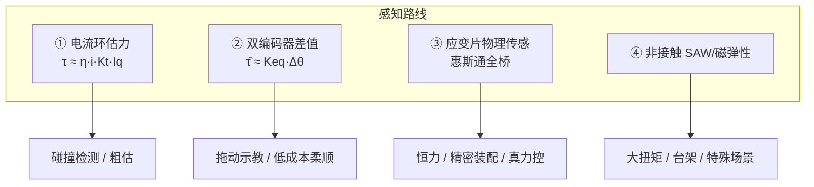

# 关节力矩传感器选型（估力 / 双编差值 / 物理传感）

**关节力矩反馈**决定力控模组的「跟手感、减震感与恒力精度」。进入力控时代，反馈获取方式直接约束控制品质、成本与轴向尺寸 — 编译自 [Zane Hub 公众号文](../../sources/blogs/wechat_zanehub_joint_torque_sensor_types_2026-09-24.md)。

## 一句话定义

按 **任务精度与成本** 在 **电流估力、双编码器差值、嵌入应变片传感、非接触 SAW/磁弹性** 四路线间选型，并区分 **关节单轴力矩** 与 **末端六维力** 的分工。

## 英文缩写速查

| 缩写 | 英文全称 | 简要说明 |
|------|----------|----------|
| FS | Full Scale | 传感器满量程 |
| F/T | Force/Torque Sensor | 六维力/力矩传感器 |
| SAW | Surface Acoustic Wave | 声表面波非接触扭矩检测 |
| EtherCAT | Ethernet for Control Automation Technology | 工业实时以太网，高端力矩传感常用 |
| QDD | Quasi-Direct Drive | 准直驱；电流估力与双编差值更常见 |

## 为什么重要

- **力控物理起点在传感：** 算法再强，测不到真实输出力矩则恒力/柔顺/碰撞检测都会系统性偏。
- **成本与尺寸硬约束：** 人形旋转执行器中扭矩传感约占 **~30%** 成本（次于谐波 ~36%）；串入传感必然 **增轴向尺寸、降串联刚度**。
- **与编码器选型耦合：** [双编码器](./joint-encoder-selection.md) 差值可「零成本」估力矩，但 **不能替代** 标定过的物理传感器做精密力控 — 本页与编码器页互补。

## 力矩感知四路线

### ① 电流环估力矩

$$ \tau_m \approx K_t \cdot I_q \qquad \tau_j \approx \eta \cdot i \cdot K_t \cdot I_q $$

- **局限：** 摩擦随温度/转速漂移；谐波柔轮变形、齿隙、偏心使映射 **慢时变非线性**；减速比越大，摩擦不确定性在输出端放大越厉害。
- **适用：** 判断「撞没撞」的碰撞检测；**不适用** 恒力打磨、精密装配。

### ② 双编码器差值

$$ \Delta\theta = \theta_{\mathrm{out}} - \theta_m / i \qquad \hat\tau_j \approx K_{\mathrm{eq}} \cdot \Delta\theta $$

- 17 位编码器谐波单关节最小可检测力矩约 **0.5 N·m** 量级（工程估算，须台架标定）。
- 测到的是传动链 **累计变形** — 外力、减速器摩擦、柔轮弹性 **无法解耦**。
- **零差云控 eRob T 版** 等采用此路线：**零增厚、零刚度损失、零额外传感成本** — 「够用哲学」，非权宜之计。
- 详见 [关节编码器选型](./joint-encoder-selection.md)「双编码器与力矩估计」。

### ③ 应变片式（当前主流）

- 位置：**减速器之后、输出法兰之前** 串入或嵌入；轴面 45° 方向主应变 + 惠斯通全桥，灵敏度典型 **2–3 mV/V**。
- 结构：**测量梁 / 辐条剪切 + 中孔走线** — 区别于通用扭矩传感器的关节集成要求。
- 标定后精度普遍 **0.1–0.5% FS**；批次一致性、过载疲劳后的零点漂移是档次分水岭。
- **代表产品（公开资料）：**

| 品牌 | 代表系列 | 特点 |
|------|----------|------|
| Bota Systems（瑞士） | BTS-T25–T300 | 7 mm 薄盘、4 kHz、500% 过载、EtherCAT |
| 宇立仪器 SRI（中国） | M221X | 10–800 N·m，协作关节大量应用 |
| 坤维科技（中国） | KWR61N150 等 | 61 mm 外径紧凑关节传感 |
| FUTEK（美国） | 定制薄型 | 协作谐波关节 |
| Aidin（韩国） | ATSB | 超薄、碰撞检测与力控 |

> HBK、Kistler、ME-Meßsysteme 等更多出现在 **台架标定与出厂试验**，而非直接嵌入关节；关节级集成供应由 Bota、宇立、坤维等机器人向厂商主导。

### ④ 非接触式（SAW / 磁弹性）

- **SAW：** 转子无源、无滑环；Sensor Technology TorqSense 为代表 — 射频成本高，关节 **大批量** 场景应用尚少。
- **磁弹性：** 大型动力总成测试为主；温漂与逐件标定门槛高，关节内更少见。

## 关节力矩 vs 末端六维力

| 维度 | 关节力矩传感器 | 六维 F/T 传感器 |
|------|----------------|-----------------|
| 轴数 | 单轴 | 六分量力螺旋 |
| 安装 | 嵌入关节内部 | 末端法兰 |
| 回答的问题 | 关节此刻输出多大力矩 | 末端与外界交互力 |
| 典型配置 | 人形以关节级为主 | 协作臂 **关节 + 腕部六维** 分层；人形腕/踝等交互密集处选配 |

勿混为一谈 — 两者 **不可互相替代**；分层架构是性价比最优解（文内判断）。

## 模组厂商趋势

- **泰科智能 MJBX：** 谐波 + 电机 + 抱闸 + 编码器 + 驱动 + **可选扭矩传感** 一体。
- **零差云控 eRob：** 后缀 **N**（无力矩传感）/ **T**（双编码器差值）；物理扭矩传感仍为选项。
- **趋势：** 力矩传感从「选配」走向 **髋/腰/大腿等力控强需求部位的标配**。

## 选型七参数（工程清单）

1. **量程与过载** — 峰值含撞击工况；**500% 过载** 使碰撞时传感非易损件（Bota 系列为参照）。
2. **刚度代价** — 串联合成：

$$ \frac{1}{K_{\mathrm{joint}}} = \frac{1}{K_{\mathrm{gear}}} + \frac{1}{K_{\mathrm{sensor}}} + \frac{1}{K_{\mathrm{shaft}}} $$

   弹性体越薄灵敏度越高、刚度越低 — 在灵敏度与力控带宽/定位刚度间切分。

3. **精度 / 迟滞 / 重复性** — 比静态标称更重要的是 **全温区综合误差**。
4. **带宽与延迟** — 电流内环常 >10 kHz；力矩反馈若仅百 Hz 级会成瓶颈；高端 ~**4 kHz** 采样 + EtherCAT。
5. **温漂与温补** — 电机热经壳体传导；自温补、全桥布置、出厂温度曲线缺一不可。
6. **结构接口** — 中孔直径、外径厚度、标准谐波法兰适配；**7 mm 级薄盘** 为关节集成主流形态。
7. **标定与数据闭环** — 索取出厂标定报告；确认传感数据 **能否进入驱动器控制环并对上层开放** — 比精度表更关键。

## 常见误区

- 把 **电流估力** 当精密力控 — 摩擦与非线性传动在输出端不可忽略。
- 用 **双编差值** 替代标定过的物理传感做恒力装配 — 传动内部状态无法解耦。
- 只比 **静态精度 %FS** — 忽略温漂、迟滞与批量一致性。
- 混淆 **关节单轴** 与 **末端六维** — 任务分工不同。

## 关联页面

- [关节编码器选型](./joint-encoder-selection.md) — 双编差值估力矩的物理基础
- [自研关节模组开发流程](./joint-module-self-development-workflow.md) — 五件套中的力矩传感选项
- [执行器驱动链选型闭环](../queries/actuator-drive-chain-selection-loop.md) — 力矩指令到真机执行的全链
- [力控制基础](./force-control-basics.md) — 末端 F/T 与阻抗控制语境
- [Humanoid Hardware 101 · 传动与感知链](../overview/humanoid-hardware-101-actuation-sensing-chain.md)

## 推荐继续阅读

- [Zane Hub 原文（微信公众号）](https://mp.weixin.qq.com/s/_Rs6EmAOlqxzP_rLTppWqQ)
- [Bota Systems BTS-T 系列](https://www.botasys.com/) — 薄型关节扭矩传感参照

## 参考来源

- [机器人力控关节模组力矩传感器类型与品牌（Zane Hub）](../../sources/blogs/wechat_zanehub_joint_torque_sensor_types_2026-09-24.md)
