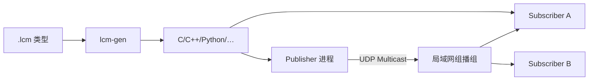

# LCM (Lightweight Communications and Marshalling) 基础

**LCM** 是一套面向实时系统的消息传递与数据编解码库：提供 publish/subscribe，并用类型描述语言自动生成多语言的强类型序列化代码；传输默认走 **UDP 组播**，无中心数据库、无守护进程。

## 英文缩写速查

| 缩写 | 英文全称 | 简要说明 |
|------|----------|----------|
| LCM | Lightweight Communications and Marshalling | 轻量通信与编解码中间件 |
| UDP | User Datagram Protocol | 无连接数据报；组播常用作 LCM 传输 |
| IDL | Interface Description Language | 此处指 `.lcm` 类型规格语言 |
| IPC | Inter-Process Communication | 进程间通信 |
| ROS 2 | Robot Operating System 2 | 生态向系统集成中间件；常与 LCM 分层并用 |
| DDS | Data Distribution Service | ROS 2 默认底层通信标准 |

## 为什么重要

- 官方定位：**high-bandwidth and low latency** 的实时系统（文档站 / README 一致）。
- 在人形与四足的「脊髓级」环路（常 500–1000 Hz）里，更看重**最新样本与尾延迟**，而不是 DDS 级可靠投递；LCM 是该层的事实常用选项之一。
- 与 [ROS 2](./ros2-basics.md) 形成清晰分工：ROS 2 管中高层生态，LCM 管跨进程/跨板的轻量状态与指令总线——见 [ROS 2 vs LCM](../comparisons/ros2-vs-lcm.md)。

## 核心原理

### 设计要点（官方特性）

1. **UDP Multicast 广播**：数据发到组播组，订阅者按 channel 过滤；无 TCP 握手/重传默认路径。
2. **Type-safe marshalling**：用 LCM Type Spec 写 `.lcm`，`lcm-gen` 生成 C/C++/Java/Python 等编解码。
3. **无 hub / 无 daemon**：对等直连；少依赖，易部署到运控机与嵌入式 Linux。
4. **Logging / playback**：配套 logger 与 logplayer，便于离线复现与对比。

形式化视角见 [UDP 组播动力学](../formalizations/udp-multicast-dynamics.md)；延迟预算见 [控制环路延迟建模](../formalizations/control-loop-latency-modeling.md)。

### 与 ROS 2/DDS 的机制差（选型用）

| 维度 | LCM | ROS 2（DDS） |
|------|-----|--------------|
| 发现与拓扑 | 组播直连，无 Master | DDS 发现 + RMW |
| QoS | 基本「尽力而为 / 最新优先」 | 丰富 Reliability/History/Deadline |
| 工具链 | spy / logger / logplayer | RViz、rosbag2、tf2、海量包 |
| 依赖体积 | 小 | 重 |

## 工程实践

### 开源与安装（2026-07-28 核查）

| 项 | 内容 |
|----|------|
| 代码 | **已开源** [lcm-proj/lcm](https://github.com/lcm-proj/lcm)（LGPL-2.1；归档 [sources/repos/lcm.md](../../sources/repos/lcm.md)） |
| 文档 | [lcm-proj.github.io/lcm](https://lcm-proj.github.io/lcm/)（归档 [sources/sites/lcm-proj-github-io.md](../../sources/sites/lcm-proj-github-io.md)） |
| 发行 | Releases（如 v1.5.2）；Ubuntu `liblcm-dev`、Homebrew `lcm`、`pip3 install lcm` |
| 语言 | C/C++/Java/Lua/MATLAB/Python 维护中；Go、C# **unmaintained**（README） |
| 路线 | 官方称项目再次活跃，优先稳定性与向后兼容 |

### 落地建议

1. **同机极限路径**：共享内存 / 无锁队列优先；跨进程或跨板再上 LCM。
2. **组播环境**：确认 NIC 组播路由与防火墙；参见官方 [UDP Multicast Setup](https://lcm-proj.github.io/lcm/content/udp-multicast-setup.html)。
3. **类型契约**：把 `.lcm` 放进版本库，生成代码进 CI，避免手写 struct 漂移。
4. **与 ROS 2 桥接**：慢路径 ROS 2 → 桥接节点 → LCM 快路径；实例见 [DimOS](../entities/dimensionalos-dimos.md)、[Yobotics E3 LCM 模板](../entities/jackhan-yobotics-e3-algorithm-template.md)。
5. **实时 OS**：中间件轻不等于硬实时；仍需 [PREEMPT_RT / CPU isolation](../queries/real-time-control-middleware-guide.md)。

## 局限与风险

- **不可靠投递**：默认 UDP，丢包、乱序、重复都可能；控制环必须容忍「只要最新」。
- **无丰富 QoS**：需要可靠命令或事务语义时，不要硬扛 LCM，改频率隔离或换通道。
- **生态窄**：没有 ROS 级驱动/规划/可视化生态；导航、MoveIt、标定仍走 ROS 2 更现实。
- **跨网段/云**：组播与企业网策略常冲突；广域场景需改传输或加网关。
- **语言维护差异**：选 Go/C# 绑定前先读 README「Unmaintained」声明。

## 关联页面

- [ROS 2 vs LCM 选型对比](../comparisons/ros2-vs-lcm.md)
- [ROS 2 基础](./ros2-basics.md)
- [DDS 通信机制](./dds-communication.md)
- [实时运控中间件配置指南](../queries/real-time-control-middleware-guide.md)
- [UDP 组播动力学](../formalizations/udp-multicast-dynamics.md)
- [控制环路延迟建模](../formalizations/control-loop-latency-modeling.md)
- [DimOS](../entities/dimensionalos-dimos.md)

## 参考来源

- [LCM 官方文档归档](../../sources/sites/lcm-proj-github-io.md)（https://lcm-proj.github.io/lcm/）
- [lcm-proj/lcm 仓库归档](../../sources/repos/lcm.md)（https://github.com/lcm-proj/lcm）
- Huang, A. S., et al. (2010). *LCM: Lightweight Communications and Marshalling*（IROS；文档站 Publications）
- MIT-CSAIL-TR-2009-041（文档站 Technical Report）

## 推荐继续阅读

- LCM Type Specification：https://lcm-proj.github.io/lcm/content/lcm-type-specification-language.html
- LCM UDP Multicast Protocol：https://lcm-proj.github.io/lcm/content/lcm-udp-multicast-protocol-description.html
- 安装说明：https://lcm-proj.github.io/lcm/content/install-instructions.html
