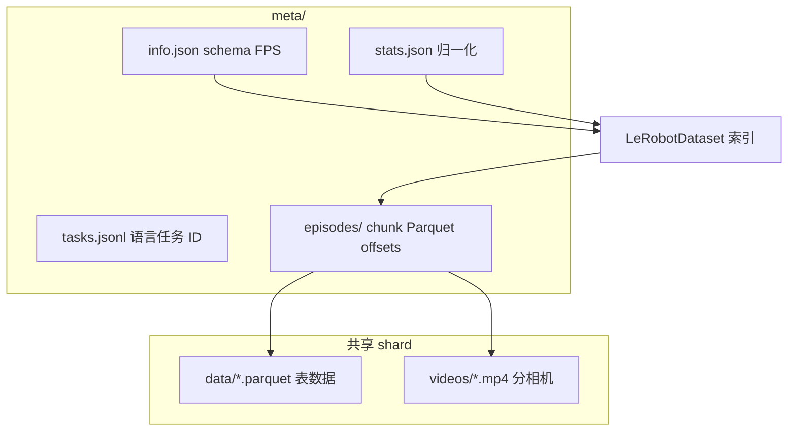

# LeRobotDataset v3.0

## 一句话定义

**LeRobotDataset v3.0** 是 Hugging Face LeRobot 的 **标准化机器人学习数据集格式**：把 **高频 state/action** 存 **Parquet**、**多相机视频** 存 **MP4 shard**，用 **`meta/`** 描述 schema、任务 ID 与 episode 在共享文件中的 **offset**；对用户仍暴露 **按 episode/帧索引** 的 Python API，并支持 **Hub 流式** 与训练期 **图像增广**。

## 英文缩写速查

| 缩写 | 英文全称 | 简要说明 |
|------|----------|----------|
| HF Hub | Hugging Face Hub | 数据集托管与 `StreamingLeRobotDataset` 源流 |
| MP4 | MPEG-4 Part 14 | v3 视觉模态的主容器（分相机 shard） |
| FPS | Frames Per Second | `meta/info.json` 中的时间基准 |
| IL | Imitation Learning | v3 数据集主要服务的示范学习管线 |
| CLI | Command-Line Interface | `lerobot-record` / `lerobot-train` 读写 v3 |
| API | Application Programming Interface | `LeRobotDataset` / `StreamingLeRobotDataset` |

## 为什么重要

- **存储与 API 解耦：** 磁盘上是 **少量大文件**（百万 episode 可扩展），训练代码仍 `dataset[100]` 随机访问。
- **Hub 训练友好：** `StreamingLeRobotDataset` + `lerobot-train --dataset.streaming=true` 降低 **全量下载** 门槛；Storage **Bucket** 同源流式。
- **生态正在切 v3：** [LeTools](../entities/letools.md)、[HandUMI](../entities/handumi.md) 等导出 v3；旧项目仍常见 **v2.1**（每 episode 单文件）— 混用前须 **转换或核对键名**。
- **与 EnvHub 并列：** 数据格式（本页）与环境分发（[EnvHub](./lerobot-envhub.md)）是 LeRobot 在 Hub 上的 **两条资产轴**。

## 核心原理

### v3 相对 v2.1（一手文档）

| 维度 | v2.1（典型） | v3.0 |
|------|--------------|------|
| 文件粒度 | 每 episode 独立 parquet/mp4 | **多 episode 聚合** 为 `file-*.parquet` / `file-*.mp4` |
| Episode 边界 | 文件名 | **`meta/episodes/`** offset |
| 大规模 Hub | 全量下载常见 | **`StreamingLeRobotDataset`** |
| 目录 | 较分散 | **`meta/` + `data/` + `videos/`** 模板统一 |

### 三柱存储



1. **Tabular（Parquet）**：`observation.state`、`action`、`timestamp` 等；经 Hugging Face `datasets` **memory-map**。
2. **Visual（MP4）**：同 episode 帧编码进 shard；键名如 `observation.images.<camera>`。
3. **Metadata**：重建 episode 视图；**task-conditioned** 策略读 `tasks.jsonl`。

### 训练时 API（官方）

```python
from lerobot.datasets import LeRobotDataset

dataset = LeRobotDataset("yaak-ai/L2D-v3")
sample = dataset[100]  # dict of torch.Tensor

# 相对当前帧的多时刻图像窗（秒）
dataset = LeRobotDataset(
    "yaak-ai/L2D-v3",
    delta_timestamps={"observation.images.front_left": [-0.2, -0.1, 0.0]},
)
# sample["observation.images.front_left"].shape -> [T, C, H, W]
```

**流式（无本地全量拷贝）：**

```python
from lerobot.datasets import StreamingLeRobotDataset
dataset = StreamingLeRobotDataset("yaak-ai/L2D-v3")
```

**图像增广：** 仅在 **训练加载** 时通过 `image_transforms`（`ImageTransforms` 或 `torchvision.transforms.v2`）；**录制存原图**。预览：`lerobot-imgtransform-viz`.

### 录制与推送（官方）

- `lerobot-record` 支持 `--dataset.streaming_encoding=true` 等；示例见 [官方文档](https://huggingface.co/docs/lerobot/lerobot-dataset-v3)。
- **推送 Hub 前必须** `dataset.finalize()`：关闭 Parquet writer、写 footer；否则 **数据集无法加载**（v3 增量写，见官方 PR #1903 说明）。

### v2.1 → v3 迁移

```bash
python -m lerobot.scripts.convert_dataset_v21_to_v30 --repo-id=<HF_USER/DATASET_ID>
```

聚合 per-episode 文件并刷新 `meta/episodes/*` offsets。

### Lance 可选实现

官方文档提及 **`lerobot-lancedb`**（`LeRobotLanceDataset` / `LeRobotLanceVideoDataset`）作为 **大规模随机 IO** 的 drop-in 变体；主路径仍以 Parquet+MP4 为准。

## 工程实践

### 版本与安装（2026-09-24）

- **稳定包：** 文档写明 v3 纳入 **`lerobot >= 0.4.0`**；此前用 **main 分支** 或文档给出的 **commit zip** 安装。
- **读 Hub 数据集：** 先 `pip install lerobot`（或源码），再 `LeRobotDataset("org/name")`；训练 `lerobot-train --dataset.repo_id=...`。
- **混版本生态：** 上传/合并数据前确认 **v2.1 vs v3**（见 [LeRobot 实体](../entities/lerobot.md) 误区）；旧集用官方 **convert** 脚本，勿手改 shard。
- **Bucket 训练：** `--dataset.repo_type=bucket` + `--dataset.streaming=true` 对 `hf://buckets/` 资产。

## 局限与风险

- **v2/v3 并存：** 键名、shard 布局不同；**未转换的 v2.1** 不能假设 v3 loader 行为。
- **finalize 遗漏：** 自建数据集推送后 **Parquet 损坏** 是常见人为错误。
- **流式 vs 随机访问：** 流式适合顺序/训练； heavy 随机探针仍可能更依赖本地缓存。
- **增广仅训练期：** 录制端无增广 → 域随机化完全在 **loader**；与「录时就打光」的数据集策略不同。
- **trust 与 Hub：** 数据集仓一般无 `trust_remote_code` 问题，但 **脚本转换/自定义 loader** 仍须钉版本。

## 关联页面

- [LeRobot（Hugging Face）](../entities/lerobot.md)
- [LeRobot EnvHub](./lerobot-envhub.md)
- [模仿学习](../methods/imitation-learning.md)
- [遥操作（Teleoperation）](../tasks/teleoperation.md)
- [HandUMI](../entities/handumi.md) — 导出 v3 兼容数据
- [LeTools](../entities/letools.md) — rosbag → LeRobot Dataset v3

## 参考来源

- [sources/sites/lerobot-dataset-v3-docs.md](../../sources/sites/lerobot-dataset-v3-docs.md)
- [sources/repos/lerobot.md](../../sources/repos/lerobot.md)

## 推荐继续阅读

- [LeRobotDataset v3.0 官方文档](https://huggingface.co/docs/lerobot/lerobot-dataset-v3)
- [LeRobot 文档首页](https://huggingface.co/docs/lerobot/index)
