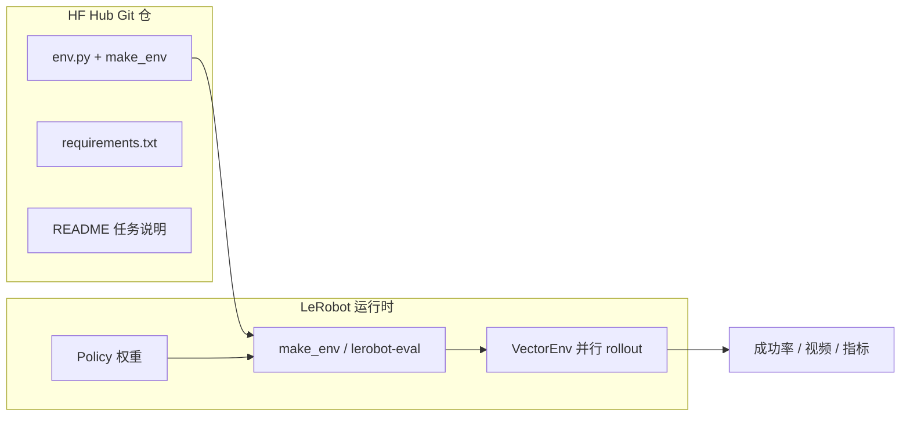

# LeRobot EnvHub

## 一句话定义

**EnvHub** 是 LeRobot 从 Hugging Face Hub **动态加载仿真环境**的机制：环境作者把任务封进 Hub 仓的 `env.py`，评测者用 `make_env("org/repo", trust_remote_code=True)` 或 `lerobot-eval --env.hub_path=...` 拉取，**无需把环境装进同一个 Python 包**。

## 英文缩写速查

| 缩写 | 英文全称 | 简要说明 |
|------|----------|----------|
| EnvHub | Environment Hub | LeRobot 在 HF Hub 上发现/加载仿真环境的约定与工具链 |
| HF Hub | Hugging Face Hub | 模型、数据集与环境 Git 仓托管平台 |
| VLA | Vision-Language-Action | 常通过 EnvHub 在仿真中批量评测的视觉–语言–动作策略 |
| API | Application Programming Interface | `make_env` 为环境与 LeRobot 之间的固定入口 |
| CLI | Command-Line Interface | `lerobot-eval` 等命令行评测入口 |
| GPU | Graphics Processing Unit | Isaac Lab-Arena 等 EnvHub 环境依赖的并行仿真算力 |

## 为什么重要

机器人学习长期有两个痛点：

1. **环境锁在单体库里** — 每换一个 benchmark 就要改依赖、fork 仿真栈，策略代码与任务代码缠在一起。
2. **复现靠「装一堆 git 子模块」** — 论文读者很难在相同 commit 上复跑评测。

EnvHub 把环境变成 **可版本化的 Hub 资产**（类似模型权重与 LeRobotDataset），带来：

- **策略 / 环境解耦：** `lerobot` 进程不直接 `import` 厨房任务仓；只下载 `env.py` 并按契约调用（见 [LW BENCHHUB TOUR](../entities/lw-benchhub-tour.md)）。
- **一行实验：** 从 Hub 发现环境到 `lerobot-eval` 可在分钟级完成。
- **钉扎复现：** `user/repo@<commit>` 与 Git tag 对齐论文实验。
- **生态接口：** [Isaac Lab-Arena](../entities/isaac-lab-arena.md)、光轮 LW-BenchHub、LIBERO 式多任务套件都走同一 `make_env` 形状。

## 核心机制

### 作者侧：`env.py` 契约

Hub 仓**至少**包含 `env.py`，暴露：

```python
def make_env(n_envs: int = 1, use_async_envs: bool = False, cfg: EnvConfig = None):
    ...
```

| 返回类型 | 场景 |
|----------|------|
| `gym.vector.VectorEnv` | 单任务 + 并行 env（最常见） |
| `gym.Env` | 单实例；框架自动向量化 |
| `dict[suite, dict[task_id, VectorEnv]]` | 多任务 benchmark |

可选用任意仿真后端（Gymnasium、Isaac Lab、自定义物理）；**唯一硬约束**是 Gymnasium 向量接口与上述入口函数。

### 读者侧：加载与评测

**Python：**

```python
from lerobot.envs import make_env

envs_dict = make_env("lerobot/cartpole-env", n_envs=4, trust_remote_code=True)
suite = next(iter(envs_dict))
env = envs_dict[suite][0]
```

**CLI（通才策略 + 重型仿真）：**

```bash
lerobot-eval \
  --policy.path=nvidia/smolvla-arena-gr1-microwave \
  --env.type=isaaclab_arena \
  --env.hub_path=nvidia/isaaclab-arena-envs \
  --env.environment=gr1_microwave \
  --trust_remote_code=True
```

### 流程总览



### 与内置 `env.type` 的关系

[LeRobot](../entities/lerobot.md) README 内置 **LIBERO**、**MetaWorld** 等 `--env.type=libero` 路径；EnvHub 是 **第三方 / 社区 / 厂商** 扩展层：

| 路径 | 环境来源 | 典型用途 |
|------|----------|----------|
| `--env.type=libero` | 主仓打包 | 标准操作 benchmark |
| `--env.hub_path=nvidia/isaaclab-arena-envs` | Hub `env.py` | GPU Isaac 仿真 + Arena |
| `--env.hub_path=LightwheelAI/lw_benchhub_env` | Hub `env.py` | 光轮厨房双臂任务 |

二者在 CLI 层统一为 **评测闭环**，但 EnvHub 强调 **远程代码 + Git 版本**。

## URL 与版本钉扎

| 写法 | 含义 |
|------|------|
| `org/repo` | main 上默认 `env.py` |
| `org/repo@abc123` | 钉 commit（**论文/CI 推荐**） |
| `org/repo@v1.0.0` | 钉 tag |
| `org/repo:path/to_env.py` | 非默认文件路径 |

## 安全与工程实践

| 实践 | 说明 |
|------|------|
| 审阅 `env.py` | `trust_remote_code=True` 等同执行第三方代码 |
| 钉 commit | 避免作者 force-push 改变行为 |
| 查 `requirements.txt` | 依赖需用户环境预装；缺包会 `ModuleNotFoundError` |
| 容器隔离 | 不信任来源时在 Docker/VM 内评测 |
| 观测键对齐 | Hub 环境相机/状态键可能与策略训练不一致；用 `--rename_map`（Arena 示例） |

## 生态实例

| Hub 仓 | 后端 | 说明 |
|--------|------|------|
| [`lerobot/cartpole-env`](https://huggingface.co/lerobot/cartpole-env) | Gymnasium | 官方文档参考实现 |
| [`nvidia/isaaclab-arena-envs`](https://huggingface.co/nvidia/isaaclab-arena-envs) | Isaac Lab-Arena | GR1 微波炉、G1 loco-manip 等 |
| [`LightwheelAI/lw_benchhub_env`](https://huggingface.co/LightwheelAI/lw_benchhub_env) | LW-BenchHub + Arena | 双臂 SmolVLA 厨房闭环 |

## 常见误区

- **把 EnvHub 当数据集 Hub：** 环境仓分发的是 **可执行仿真**；演示数据仍在 LeRobotDataset 仓。
- **省略 `trust_remote_code`：** 默认拒绝执行远程代码，报错 "Refusing to execute remote code"。
- **假设 `pip install lerobot` 够用：** Isaac / 光轮等环境仍需 Sim、GPU 与仓内 `requirements.txt`。
- **策略仓直接 import 任务仓：** 违背 EnvHub 设计；应只通过 `hub_path` 桥接。

## 与其他页面的关系

- [LeRobot](../entities/lerobot.md) — 宿主框架：`make_env`、`lerobot-eval`、策略与数据集格式
- [Isaac Lab-Arena](../entities/isaac-lab-arena.md) — 重型 GPU 环境的主要发布方之一
- [LW BENCHHUB TOUR](../entities/lw-benchhub-tour.md) — EnvHub 五层栈工程样例（观测改名、动作拆臂）
- [LIBERO benchmark](../entities/libero-benchmark.md) — 多任务 `dict` 返回形态的对照基准

## 推荐继续阅读

- 官方文档：<https://huggingface.co/docs/lerobot/envhub>
- LeRobot README 评测节：<https://github.com/huggingface/lerobot#inference--evaluation>
- NVIDIA × LeRobot 集成博文：<https://huggingface.co/blog/nvidia/generalist-robotpolicy-eval-isaaclab-arena-lerobot>

## 参考来源

- [LeRobot EnvHub 官方文档归档](../../sources/sites/lerobot-envhub-docs.md)
- [LeRobot 仓库归档](../../sources/repos/lerobot.md)

## 关联页面

- [LeRobot](../entities/lerobot.md)
- [Isaac Lab-Arena](../entities/isaac-lab-arena.md)
- [LW BENCHHUB TOUR](../entities/lw-benchhub-tour.md)
- [VLA](../methods/vla.md)
- [Sim2Real](./sim2real.md)

## 一句话记忆

> EnvHub = 仿真环境的「HF 模型仓」：`env.py` 是契约，`trust_remote_code` 是安全闸，`@commit` 是复现锚。
