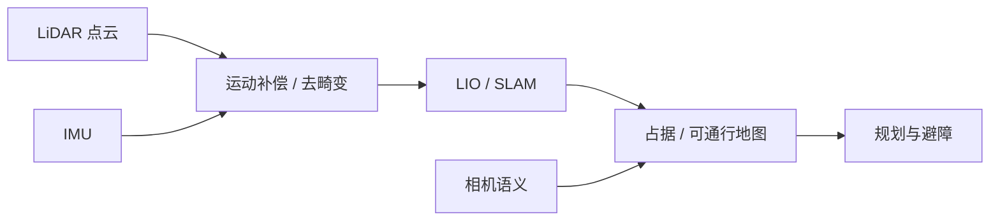

# LiDAR 传感（Light Detection and Ranging）

**LiDAR** 通过发射激光并测量回波时间（或相位）获得环境的 **度量点云**，为移动机器人提供与纹理无关的几何观测。四足与 VLN 实战中，它通常与相机、IMU、机载 Orin 组成导航感知前端。

## 一句话定义

**用激光点云直接量「空间里有什么几何」，给定位、建图和避障提供米制尺度的骨架。**

## 英文缩写速查

| 缩写 | 英文全称 | 简要说明 |
|------|----------|----------|
| LiDAR | Light Detection and Ranging | 激光雷达测距传感 |
| LIO | LiDAR-Inertial Odometry | 激光–惯性里程计 |
| IMU | Inertial Measurement Unit | 惯性测量单元，与 LiDAR 紧耦合常见 |
| FOV | Field of View | 视场；固态/机械式差异大 |
| ROS 2 | Robot Operating System 2 | 点云话题与驱动常见中间件 |
| SLAM | Simultaneous Localization and Mapping | 定位与建图 |

## 为什么重要

- **几何真值骨架：** 语义（相机/VLM）回答「是什么」，LiDAR 回答「在哪、多远、能否通过」。
- **课程硬件节点：** 实战营明确每组四足配备 **LiDAR**，与 Orin NX、相机并列，需要独立概念页而非只挂在某一 SDK 实体下。
- **选型入口：** 具体算法见 [LiDAR 里程计融合](../methods/lidar-odometry-fusion.md) 与 [LIO/VIO 选型](../comparisons/lidar-slam-lio-vio-selection.md)。

## 核心原理

| 维度 | 要点 |
|------|------|
| 测距 | ToF/相位 → 距离；扫描或面阵形成点云 |
| 坐标系 | 传感器帧 → 外参到基座/IMU；时间同步决定运动畸变 |
| 与相机 | 点云投影得深度；语义标签反投影到点（见语义地图） |
| 与 IMU | 高频传播 + 激光匹配校正 → LIO |

## 工程实践

| 项 | 建议 |
|----|------|
| 四足 | 关注震动、俯仰与近地盲区；楼梯场景验证竖直结构可见性 |
| 驱动 | 厂商 SDK → ROS 2 PointCloud2；与 [UniLidar](../entities/unilidar-sdk2.md) / [Point-LIO](../entities/point-lio-unilidar.md) 等栈对齐 |
| 同步 | 硬同步或可靠时间戳；不同步时先查时钟再调算法 |
| 机载 | 解码与 LIO 跑 [Orin NX](../entities/jetson-orin-nx.md)；控制频率与点云频率解耦 |

## 局限与风险

- **语义缺失：** 单靠 LiDAR 难区分「椅子 / 纸箱」；需相机或开放词汇模型。
- **天气与材质：** 雨雾、玻璃、黑色吸光物体可造成空洞或飞点。
- **成本与功耗：** 固态小雷达 FOV/量程有限；机械式体积与可靠性权衡。

## 关联页面

- [里程计与激光雷达融合定位](../methods/lidar-odometry-fusion.md)
- [LiDAR / LIO / VIO 选型](../comparisons/lidar-slam-lio-vio-selection.md)
- [状态估计](./state-estimation.md)
- [Jetson Orin NX](../entities/jetson-orin-nx.md)
- [四足×VLN 实战营总览](../overview/quadruped-vln-embodied-workshop.md)

## 参考来源

- [四足×VLN 实战营课程大纲](../../sources/courses/quadruped_vln_embodied_workshop_2day.md)
- [point_lio_unilidar 仓归档](../../sources/repos/point_lio_unilidar.md)

## 推荐继续阅读

- [导航·SLAM·自主栈总览](../overview/navigation-slam-autonomy-stack.md)
