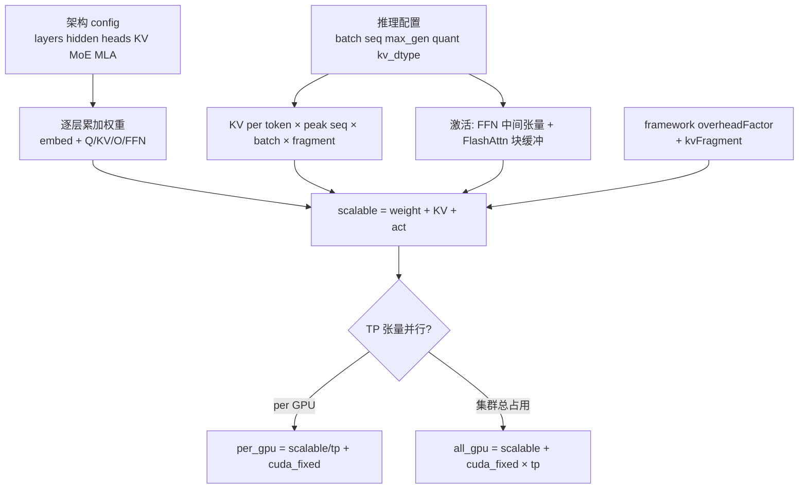

# LLM 推理显存估算（VRAM Budgeting）

**自回归大模型推理**时，GPU 显存通常被五块瓜分：**权重**（固定）、**KV cache**（随 batch 与上下文增长）、**激活**（相对小）、**每卡 CUDA 固定开销**（TP 不分摊）、**框架调度/碎片**（vLLM、HF 等）。具身场景里，VLA 骨干、云端 LLM teacher、或 Jetson 上并排跑 VLM 时，都需要这套估算，而不能只用「7B ≈ 14 GB」粗口算。

## 一句话定义

**per-GPU VRAM ≈ (权重 + KV + 激活) × 框架因子 ÷ TP + 每卡 CUDA 固定开销**；长上下文或 MoE 下 KV 与全量专家权重往往比参数量直觉更「吃显存」。

## 英文缩写速查

| 缩写 | 英文全称 | 简要说明 |
|------|----------|----------|
| VRAM | Video Random Access Memory | GPU 显存容量，推理部署的首要硬约束 |
| KV | Key-Value cache | 自回归解码缓存的历史注意力 K/V |
| GQA | Grouped-Query Attention | 多 Q 头共享少量 KV 头，缩小 KV 投影与 cache |
| MLA | Multi-head Latent Attention | DeepSeek 系低秩 KV 压缩，显著降低 KV 占用 |
| TP | Tensor Parallelism | 权重与大部分 KV/激活按卡切分；CUDA 固定开销每卡独立 |
| MoE | Mixture of Experts | 每 token 只算部分专家，但 **权重须全量驻留 VRAM** |

## 为什么重要（具身 / VLA 读法）

- **端侧 VLA**：多相机 + 大 VLM 骨干时，batch=1 的 KV 与 INT4/FP8 权重仍可能挤爆 [Jetson](../entities/jetson-openpi-pi05-on-thor.md) 或 Orin；需与 [APXInf](../entities/apxinf.md) 等 **batch=1 优化栈**分开看「算力 vs 显存」。
- **云端 teacher / 数据引擎**：Auto-labeling、VLM 重标注常走 vLLM 类 serving（见 [Agent Lightning](../entities/agent-lightning.md) 等栈）；**并发 × 上下文** 使 KV 超过权重，租 [国内 GPU 云](../comparisons/china-gpu-cloud-platforms.md) 前要先算 **per_gpu** 而非总参数量。
- **与训练 PEFT 区分**： [LoRA/QLoRA](./lora.md) 解决 **微调** 显存；本文解决 **推理驻留 + 解码 cache**，二者公式不可混用。

## 流程总览

## 核心公式（decoder，标准路径）

### 1. 模型权重（每层）

- **Embedding：** `vocab × hidden × quant_bytes`；**LM head** 若 tied 则不再占一份。
- **Q / O：** `numHeads × headDim × hidden`（**不要**默认 `hidden²`，Gemma-2 等会不等）。
- **KV（GQA/MQA）：** `2 × numKVHeads × headDim × hidden`。
- **KV（MLA）：** `hidden × kvLatentRank + 2 × kvLatentRank × numHeads × headDim`。
- **FFN（SwiGLU）：** 稠密 `3 × hidden × intermediate`；MoE `(numExperts + numShared) × 3 × hidden × expert_inter`（**全专家加载**）。
- **总权重 GB：** `(embed + lm_head + per_layer × layers) / 1024³`。

### 2. KV cache（峰值）

- **GQA：** `kv_per_token = 2 × layers × numKVHeads × headDim × kv_dtype_bytes`。
- **MLA：** `kv_per_token = layers × kvLatentRank × kv_dtype_bytes`。
- **峰值长度：** `peak_seq = seq_len + max_gen_len`（解码只增不减）。
- **总量：** `kv_GB = batch × peak_seq × kv_per_token × kv_fragment / 1024³`（fragment 例：vLLM ~1.12）。

### 3. 激活与开销

- 线性层 + FlashAttention 分块缓冲（随 batch、seq、heads 增）；推理通常 **0.2–3 GB** 量级，小于权重+KV 除非极大 batch。
- **CUDA 固定：** 按总参数量分档约 **0.6 / 0.9 / 1.3 GB/卡**，**不随 TP 分摊**。
- **框架：** `scalable × overheadFactor`（HF、vLLM、TensorRT-LLM 默认值不同）。

### 4. 张量并行

- `per_gpu = scalable / tp_size + cuda_fixed`
- `all_gpu = scalable + cuda_fixed × tp_size`

## 常见误区

| 误区 | 纠正 |
|------|------|
| 「70B 参数 ≈ 140 GB FP16 就能跑」 | 未加 KV、框架、CUDA 固定；长上下文 KV 可单独占数十 GB |
| MoE「活跃参数小所以显存小」 | **VRAM 按全专家权重**；活跃参数只影响算力/FLOPs |
| TP 把一切都除以卡数 | **每卡 CUDA 固定开销** 仍全额叠加 |
| Encoder（BERT）与 Decoder 同一套 | Encoder **无** 自回归 KV cache |
| 估算即实测 | 作者经验 **±15–20%**；生产建议 ×1.1–1.15 并用 `nvidia-smi` 验证 |

## 参考演算（文中数值，FP16 量级）

| 场景 | 要点 | 约 per-GPU |
|------|------|------------|
| LLaMA-3 8B | vLLM，seq 4096 + gen 2048，batch=1 | ~14.5 GB → 24 GB 卡可行 |
| DeepSeek-V3 671B MoE+MLA | TP=8；MLA 使 KV 相对标准 GQA ~69× 更小 | ~182 GB/卡 → 需多卡 H200 或 INT4 部署 |

## 局限

- 未覆盖 **Pipeline Parallel / Expert Parallel**；MLA 的 Q 低秩等细节略高估权重 ~1–2%。
- 配套「在线计算器」在原文中 **未给出稳定外链**；本页公式来自公众号归纳，非第三方论文定理。
- VLA **多模态** 还需加 vision encoder、投影层与机器人侧 action head 显存，不能只用纯 LLM 模板。

## 参考来源

- [一个大模型到底吃多少显存？如何计算？（微信公众号归档）](../../sources/blogs/wechat_llm_inference_vram_estimation_2026-10-01.md)

## 关联页面

- [VLA 真机部署指南](../queries/vla-deployment-guide.md)
- [国内 GPU 云平台选型](../comparisons/china-gpu-cloud-platforms.md)
- [VLA](../methods/vla.md)
- [LoRA](./lora.md)
- [Agent Lightning](../entities/agent-lightning.md)
- [APXInf](../entities/apxinf.md)

## 推荐继续阅读

- [VLA 部署指南](../queries/vla-deployment-guide.md) — TensorRT / 异步 chunk 与显存溢出回退
- vLLM 文档：[KV cache 量化](https://docs.vllm.ai/)（`--kv-cache-dtype` 等）
