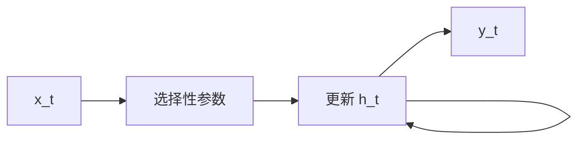

# Mamba

**Mamba**：在 [SSM](./state-space-model-ssm.md) 上加入 **选择性**——离散化参数随当前输入变化——并用硬件感知的 **并行扫描** 训练，推理时只更新常数大小的隐状态。

## 一句话定义

让状态空间「按内容决定记或忘」，同时保住近线性时间，而不是用 \(O(n^2)\) 注意力去看全历史。

## 英文缩写速查

| 缩写 | 英文全称 | 简要说明 |
|------|----------|----------|
| Mamba | Mamba | 选择性 SSM 块的代表架构 |
| SSM | State Space Model | 连续/离散状态空间序列模型 |
| S4 | Structured State Space | Mamba 的线性时不变前驱 |
| Scan | Parallel scan | 训练时的前缀扫描实现 |
| KV | Key-Value cache | Transformer 推理缓存；Mamba 不需要 |

## 为什么重要

- S4 证明结构化线性 SSM 能建模超长序列（[Gu et al., 2022](../../sources/papers/gu_s4_arxiv_2111_00396.md)）；Mamba 补上 **内容选择**，才在语言等离散数据上真正有竞争力（[Gu & Dao, 2023](../../sources/papers/gu_mamba_arxiv_2312_00752.md)）。
- 机器人触觉历史、事件流、长轨迹压缩需要 **线性于时间** 的记忆；库内已有 TacMamba 等挂接。
- 选型上它与 Transformer 是 **复杂度–生态** 权衡，不是年代替换。

## 核心原理

连续 SSM \(\dot h=Ah+Bx,\ y=Ch\)。S4 的 \(A,B\) 对所有时间共享；Mamba 让 \(\bar B_t,C_t\) 等依赖 \(x_t\)，从而动态写入/忽略。选择性破坏纯卷积等价，故训练改用扫描；推理逐步 \(h_t=\bar A_t h_{t-1}+\bar B_t x_t\)。

## 工程实践

| 项 | 建议 |
|----|------|
| 实现 | 使用官方 CUDA/Triton 核，避免 Python 循环扫描 |
| 视觉 | 扫描顺序是超参，见 [Vision Mamba](../entities/vision-mamba-vim.md) |
| 混合 | 局部卷积 + 少量注意力 + SSM 往往比纯 Mamba 更好部署 |
| 对比 | 同参数量下同时看精度、吞吐与编译复杂度 |

## 局限与风险

- 算子与量化生态仍不如 Transformer；机载编译失败是真实风险。
- 「线性复杂度」≠ 墙上时钟一定更快。
- 视觉/图数据没有天然一维顺序，乱扫会丢结构。

## 关联页面

- [SSM](./state-space-model-ssm.md)
- [Transformer](./transformer.md)
- [RNN vs CNN vs Transformer vs Mamba](../comparisons/rnn-cnn-transformer-mamba.md)
- [AI 架构地图](../overview/ai-architecture-map.md)

## 参考来源

- [Mamba（arXiv:2312.00752）](../../sources/papers/gu_mamba_arxiv_2312_00752.md)
- [S4（arXiv:2111.00396）](../../sources/papers/gu_s4_arxiv_2111_00396.md)
- [AI 架构地图一手论文簇](../../sources/papers/ai_architecture_foundations.md)

## 推荐继续阅读

- 官方仓：<https://github.com/state-spaces/mamba>
