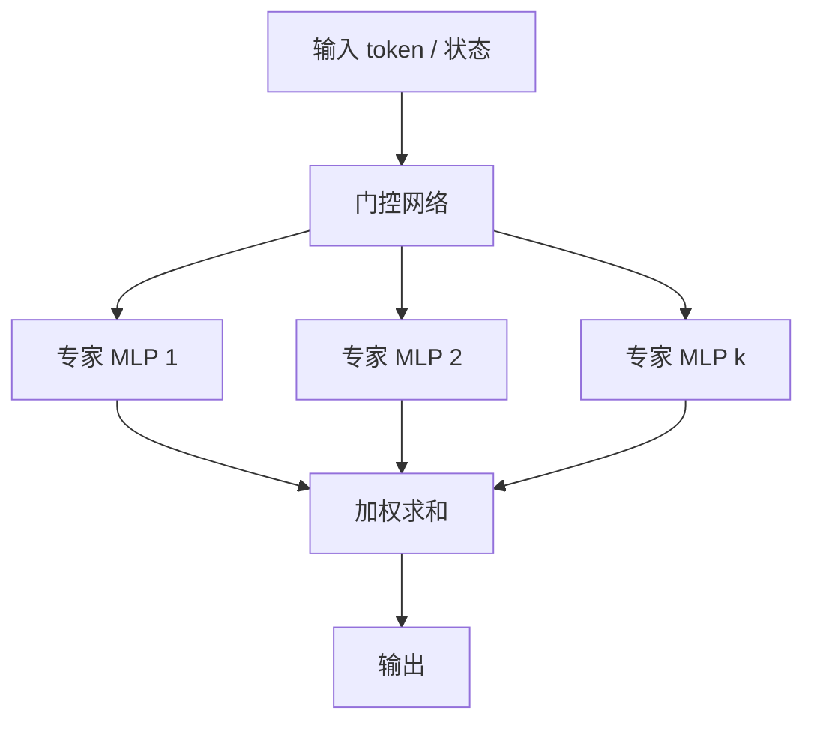

# MoE（Mixture-of-Experts，混合专家）

**MoE**：在一层里放多个 **专家**（通常是 MLP），由 **门控** 为每个 token/样本算出稀疏权重，只运行被选中的专家并把输出加权求和。

## 一句话定义

把「更大容量」做成 **按输入激活子集**，而不是每步把全部参数跑一遍。

## 英文缩写速查

| 缩写 | 英文全称 | 简要说明 |
|------|----------|----------|
| MoE | Mixture-of-Experts | 门控混合多个专家子网络 |
| Top-k | Top-k routing | 每样本只激活得分最高的 k 个专家 |
| FFN | Feed-Forward Network | 专家最常见的实现形态 |
| VLA | Vision-Language-Action | 现代 MoE 常出现在动作专家层 |
| Load balance | Load balancing | 防止所有样本涌向同一专家 |

## 为什么重要

- 语言模型用稀疏 MoE 把参数扩到千亿而逐步 FLOPs 近似稠密小模型（[Shazeer et al., 2017](../../sources/papers/shazeer_moe_arxiv_1701_06538.md)）。
- 机器人侧两条用法不要混：[多技能 locomotion gating](./humanoid-policy-network-architecture.md) 是 **可读的专家切换**；VLA 的稀疏动作专家是 **容量扩展**。
- 若不做负载均衡，门控会塌成只用一两个专家，容量承诺落空。

## 核心原理

稀疏门控对输入 \(x\) 计算分数 \(g(x)\)，取 Top-\(k\) 专家 \(\{E_i\}\)，输出

\[
y = \sum_{i\in \mathrm{Top}k} g_i(x)\, E_i(x)
\]

训练要同时学专家函数与门控。辅助损失鼓励专家被均匀使用；推理时未选中专家不计算。

## 工程实践

| 场景 | 倾向 |
|------|------|
| 高频关节策略 | 稠密小 [MLP](./mlp.md)，不上 MoE |
| 多步态 / 多技能 | 显式专家 + 可解释 gating（可硬路由） |
| VLA 连续动作头 | 稀疏 MoE 专家与冻结/慢更新 VLM 骨干搭配 |
| 调试 | 监控专家利用率、路由熵、负载方差 |

## 局限与风险

- **通信与实现**：专家并行需要好的 all-to-all；机载嵌入式很难直接搬 LLM MoE 运行时。
- **不可解释 ≠ 失败**：VLA 里的专家很少对应「左手/右手」语义。
- 误区：把 AMP 判别器或多个独立策略叫做 MoE——没有共享门控与稀疏路由就只是模型集成。

## 关联页面

- [MLP](./mlp.md)
- [人形策略网络架构](./humanoid-policy-network-architecture.md)
- [VLA](../methods/vla.md)
- [具身大模型分类学选型闭环](../overview/hub-embodied-foundation-model.md)
- [AI 架构地图](../overview/ai-architecture-map.md)

## 参考来源

- [Shazeer et al. 稀疏门控 MoE（arXiv:1701.06538）](../../sources/papers/shazeer_moe_arxiv_1701_06538.md)
- [AI 架构地图一手论文簇](../../sources/papers/ai_architecture_foundations.md)

## 推荐继续阅读

- [Switch Transformers (arXiv:2101.03961)](https://arxiv.org/abs/2101.03961)
