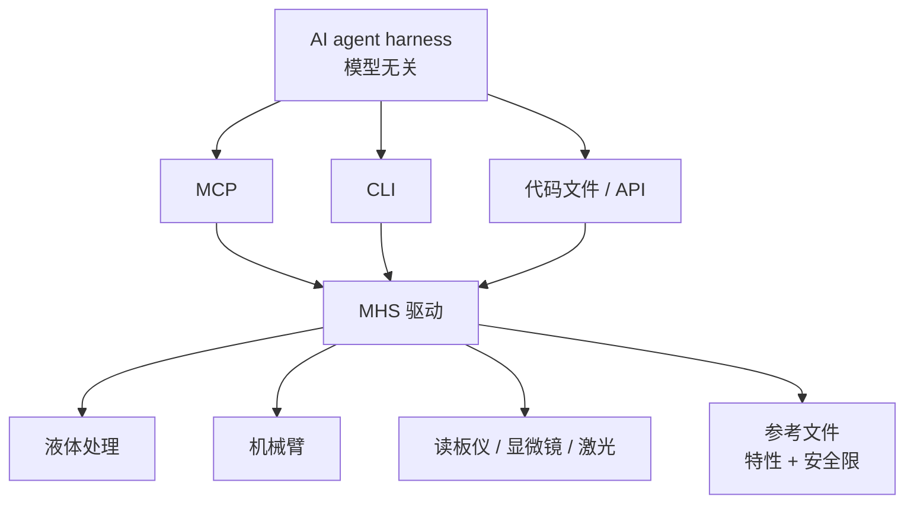

# Model Hardware Standard（MHS）

## 一句话定义

**Model Hardware Standard（MHS）** 是给 AI agent 用的 **硬件 USB-C**：标准化驱动把显微镜、液体处理工作站、机械臂等可编程设备暴露成可发现的 `read`/`write` 原语，并带上代码里读不到的物理特性与安全限，让任意模型无关的 harness 经 MCP、CLI 或脚本编排多机。

## 英文缩写速查

| 缩写 | 英文全称 | 简要说明 |
|------|----------|----------|
| MHS | Model Hardware Standard | 本页规范；agent ↔ 物理设备的共享驱动层 |
| MCP | Model Context Protocol | 三条控制通路之一；软件工具总线，MHS 的互补面 |
| CLI | Command Line Interface | 第二条通路；适合脚本与确定性长任务 |
| API | Application Programming Interface | 第三条通路；把驱动命令链进代码文件 |
| qPCR | quantitative Polymerase Chain Reaction | 早期案例：加热冷却循环复制 DNA，需看曲线适时停 |

## 为什么重要

1. **实验室/产线的集成税：** 异厂商仪器没有共享总线，接 AI 往往先花数周写翻译器。MHS 把主张从「再做一个厂商 SDK」改成「一次驱动、多 agent」。
2. **与 MCP 分工：** [MCP](./model-context-protocol.md) 连接 **软件工具与数据**；MHS 连接 **带物理副作用的设备**。公告写明任意 harness 可用 MCP 访问 MHS——二者叠加，不是替换。
3. **机器人栈的另一条「高层接口」：** [Embody](../entities/anthropic-embody.md) 证明 LLM 直接力矩弱、监督预训练策略强。MHS 是产线/实验室侧的同一逻辑：agent 不进伺服环，只编排带安全限的原语。对照 [LLM 控制接口](./llm-robotics-control-interfaces.md)。
4. **开源预告影响选型：** Hugging Face 称将把 MHS 加进 [LeRobot](../entities/lerobot.md)；Raspberry Pi 已测 Camera MHS Driver。入库日仍是预览，不能当可依赖的运行时。

## 核心原理

### 驱动三件事

| 能力 | 作用 |
|------|------|
| **原语** | 少量命令（`read` / `write` 等）覆盖「读温度、设温度」这类操作 |
| **发现** | 设备以标准格式出现在网上，agent 不必为每台机器写翻译器 |
| **标签 → 参考文件** | 自然语言写入臂重、量程、**强制安全限**；驱动生成「能测什么 / 能调什么 / 什么会被拦住」 |

用户可手写 tags，或让 agent 访谈操作者——把原先在纸手册和默会知识里的内容变成机器可读。

### 三条控制通路

长任务或必须快过在线推理时：把多设备命令链进 **确定性脚本**，设备本地执行，agent 只做高层监督与故障恢复。公告中的激光对准：先探索式调参看相机，再把序列固化成一条命令。

### 起源

HHMI Janelia 的 Arco Bast 先做 **共享内存字典**，让异厂商激光、电动调焦、相机以内存速度互通；再与 Anthropic Beneficial Deployments 的 Alek Kemeny 把模型接进该接口。这是「先统一设备，再接 LLM」，不是「让 Claude 直接讲厂商私有协议」。

## 工程实践

| 步骤 | 建议 |
|------|------|
| 准入 | 研究预览 **申请制**；入口 [modelhardwarestandard.com](https://modelhardwarestandard.com/) |
| 设备前提 | **必须有可编程接口**；纯旋钮仪器不在范围内 |
| 先写安全限 | tags 里的 limits 是强制执行，不是提示词里的「请小心」 |
| 探索 → 脚本 | 允许模型试探，但把稳定流程打成代码文件，避免每步在线推理 |
| 厂商路径 | 等 LeRobot / UR / Doosan / Tecan 等官方驱动；不要假设今日可 `pip install` |
| 开源状态 | **部分/待发布**：规范与 SDK 未公开；预览用于补安全评测后再开源 |

### 公告中的早期结果（量级，非本库复现）

- CMU 串稀释剂量–反应约 **3×** 墙钟加速（跨三台互不兼容电脑）。
- QuEra 激光 lock 恢复 **99.3%** 无人工。
- Janelia 把 7 套厂商程序的显微镜 rig 收成一套编排。
- Genentech BCA 蛋白定量：液体处理 + 臂 + 读板仪 PoC。

## 局限与风险

- **不是实时运控总线。** 与 MCP 一样，不替代 1 kHz 力矩环、EtherCAT 或 [Safety Filter](./safety-filter.md) 里的几何 CBF。MHS 停在「可编排的设备原语」。
- **物理直觉缺口。** 公告自述：泡沫导致的蛋白样本失败会被当成软件 bug，必须人教物理校正。空间/接触推理仍需专家盯场。
- **预览 ≠ 可依赖标准。** 无公开 schema 版本目录，不能按 MCP 的 `protocolVersion` 方式联调。
- **无编程接口的设备明确排除。** 厂商未内置驱动前，MHS 帮不上忙。
- **误用面扩大。** 把 agent 接到真实激光、液体处理与臂，安全评测与 physical safety roadmap 仍在预览期建设；开源时才会带部署指南。
- **模型无关是协议主张，不是能力保证。** 换弱模型不会自动获得 Claude 在激光对齐上的探索行为。

## 关联页面

- [Model Context Protocol](./model-context-protocol.md) — 软件工具总线；MHS 的互补标准
- [LLM 机器人控制接口](./llm-robotics-control-interfaces.md) — 为何 agent 应停在高层原语而非力矩
- [LeRobot](../entities/lerobot.md) — 官方预告将加 MHS 支持
- [Safety Filter](./safety-filter.md) — 物理副作用的最后一层约束
- [远程过程调用](./remote-procedure-call.md) — 驱动之下仍是读写作 RPC
- [Manipulation](../tasks/manipulation.md) — 实验室臂编排 vs 学习式抓取

## 参考来源

- [Previewing the Model Hardware Standard（Anthropic 公告归档）](../../sources/sites/anthropic-model-hardware-standard.md)
- [modelhardwarestandard.com 项目页归档](../../sources/sites/modelhardwarestandard-com.md)
- [Introducing MCP（对照）](../../sources/sites/anthropic-model-context-protocol.md)

## 推荐继续阅读

- 公告：<https://www.anthropic.com/news/model-hardware-standard-research-preview>
- 项目页 / 申请：<https://modelhardwarestandard.com/>
- MCP 入门：<https://modelcontextprotocol.io/docs/2026-07-28/getting-started/intro>
