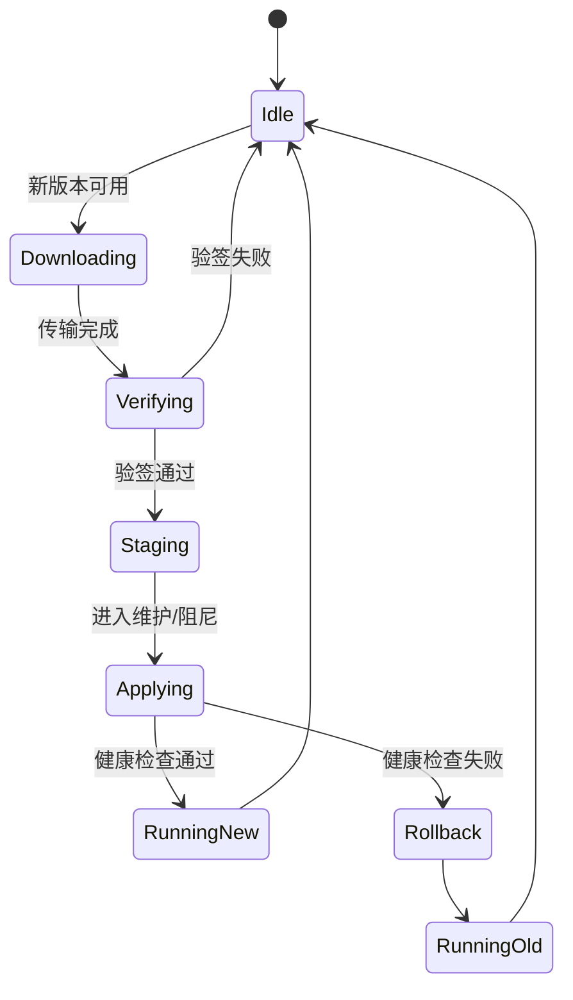

# 模型版本管理与 OTA

## 一句话定义

**模型版本管理与 OTA** 把策略/感知权重与机载固件当作 **可签名、可回滚、可审计** 的发布物，经空中或近场通道安全晋升到机器人。

## 英文缩写速查

| 缩写 | 英文全称 | 简要说明 |
|------|----------|----------|
| OTA | Over-The-Air | 空中更新 |
| A/B | A/B seamless update | 双槽无缝更新与回滚 |
| MLOps | Machine Learning Operations | 机器学习运维 |
| digest | Content Digest | 内容哈希指纹 |
| RAUC | Robust Auto-Update Controller | 嵌入式 A/B 更新框架 |

## 为什么重要

- 「U 盘拷最新 onnx」无法追溯、无法回滚、无法验真。
- 错误权重上线的破坏力不亚于固件变砖——必须进安全态再切换。

## 核心原理

1. **版本谱系**：训练 commit、数据快照、超参、评估分数、制品 digest。
2. **分通道**：OS/驱动固件 OTA ≠ 策略权重 OTA；权限与窗口不同。
3. **A/B 或双槽**：新槽验证失败则启动旧槽。
4. **签名验签**：构建链签名；机载验公钥——见 [软件安全](./software-security-basics.md)。

## 工程实践

- Registry 禁止可变 `latest` 作为生产指针；用不可变 tag/digest。
- 更新窗口与 [安全 FSM](./robot-safety-state-machine.md) 联动：仅 Passive/阻尼允许切权重。
- 金丝雀：先 1 台 → 小批量 → 全队。

## 局限与风险

- 大模型无线 OTA 耗带宽与电量；可近场/店内更新。
- 只更新权重不更新预处理器/归一化参数会导致静默性能崩塌。

## 关联页面

- [软件安全基础](./software-security-basics.md)
- [边缘–云端协同](./edge-cloud-robotics.md)
- [机器人安全状态机](./robot-safety-state-machine.md)

## 参考来源

- [DDS/RTOS/边云/OTA/安全 FSM 一手资料](../../sources/sites/dds_omg_rtos_edge_ota_safety_primary_refs.md)
- [部署可观测安全一手资料](../../sources/sites/systems_engineering_deploy_obs_security_primary_refs.md)

## 推荐继续阅读

- RAUC：<https://rauc.io/>；Mender：<https://mender.io/>
