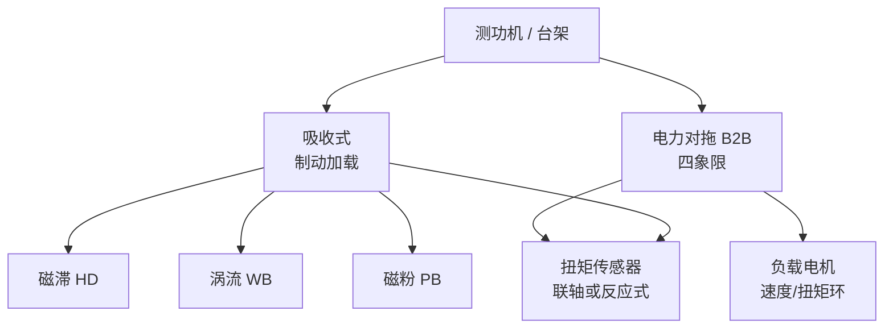

# 电机测功机（Dynamometer）

**测功机**是给被测电机或关节模组施加可控机械负载，并同步测量扭矩、转速（进而机械功率）的试验台核心设备；仿真出来的 [TN](./motor-torque-speed-curve.md) / [TI](./motor-torque-current-curve.md) 曲线，最终要在测功台上对账。

## 一句话定义

测功机回答：「在某一转速/负载工况下，这台电机或关节 **真实能输出多少扭矩、消耗多少电功率、能撑多久不超温**」。

## 英文缩写速查

| 缩写 | 英文全称 | 简要说明 |
|------|----------|----------|
| Dyno | Dynamometer | 测功机（吸收式或电力对拖） |
| DUT | Device Under Test | 被测电机或关节模组 |
| TN | Torque-Speed (curve) | 台架扫出的转矩-转速曲线 |
| B2B | Back-to-Back | 双机对拖；IEC 效率试验与电力测功同构 |
| ABS | Absorber (machine) | 对拖台架中的负载/吸收电机 |

## 为什么重要

- **设计闭环**：[电机设计流程](../overview/motor-design-workflow.md) 步骤 6–8 与 [力矩电机纵深 Stage 6](../../roadmap/depth-torque-motor-design.md) 的交付物，本质是测功报告 + 可进仿真的执行器模型。
- **选型防坑**：峰值扭矩广告 ≠ 连续区；没有测功机（或错误类型）就无法区分电流限幅、热降额与减速器损耗。
- **标准接口**：国内一体化关节验收对标 [GB/T 43200-2023](../../sources/sites/gbt_43200_2023_robot_joint_performance.md)；国际电机效率直接法依赖扭矩–转速测功（[IEC 60034-2-1](../../sources/sites/iec_60034_2_1_motor_efficiency.md)）。
- **Sim2Real 上游**：台架阶跃/摩擦数据是 [Actuator Network](../methods/actuator-network.md) 与隐式/显式执行器建模的原料。

## 核心结构/机制

### 测功机家族（先分清吸收 vs 对拖）

| 类型 | 加载原理 | 扭矩–转速直觉 | 人形场景提示 |
|------|----------|---------------|--------------|
| **磁滞吸收** | 无接触磁滞制动 | 扭矩≈与转速无关，可到 **堵转** | 扫全斜坡 TN、堵转/低速齿槽相关试验 |
| **涡流吸收** | 涡流制动，常水冷 | 扭矩随转速升，额定速附近达峰 | 高速、高连续功率耗散 |
| **磁粉吸收** | 磁粉剪切 | **零速** 可达额定扭矩 | 低速大扭矩短时 |
| **电力对拖** | 第二台电机作负载 | 可驱动也可制动（四象限） | 效率地图、发电工况、能量回馈；关节模组双轴对拖主力 |

工业手册（Magtrol）选型顺序：**最大扭矩（含堵转）→ 最大机械功率（散热）→ 最高安全转速**。机械功率 \(P = T\omega\)；短时峰值与连续额定是两条不同包络——连续测满功率可能烧毁制动器。

### 台架最小闭环

| 环节 | 作用 |
|------|------|
| 机械接口 | 联轴器同轴、刚度与安全罩；模组级还要固定法兰与输出端惯量盘 |
| 扭矩通道 | 联轴扭矩传感器 **或** 反应式（摆臂 + load cell） |
| 转速通道 | 编码器 / 测速齿盘 |
| 电功率 | 功率分析仪或母线 V/I（DIY） |
| 负载控制 | 吸收励磁电流，或负载电机速度/扭矩环 |
| 上位机 | 斜坡/曲线脚本（如 M-TEST Curve）→ 导出 TN/效率 |

开源四象限示例：[ODrive 电力测功机](../../sources/repos/odrive_based_electric_motor_dynamometer.md)（吸收机 + 摆臂测扭矩 + 母线回馈）。

### 电机单体 vs 关节模组

| 层级 | 测什么 | 典型设备叙事 |
|------|--------|--------------|
| 电机单体 | TN/TI、效率、齿槽/摩擦、堵转电流、温升 | 磁滞/涡流测功或小功率对拖 |
| 一体化关节 | 背隙、反向驱动转矩、整机 TN、力矩带宽、总线延迟 | 双轴对拖 + 同步采集；对标 GB/T 43200 |
| 产线电气安全 | 匝间、耐压、低电感空心杯等 | **不是**测功机主业（静态/安规仪） |

国内关节对拖试验项三分（AIP 公开列表）：**机械 / 电气（含 T-N）/ 控制（阶跃与频带）**。

## 工程实践

1. **先写验收大纲再选型**：要不要堵转？要不要连续 30 min 温升？要不要四象限？没有答案就不要下单磁滞或涡流。
2. **功率包络校核**：用 \(P = T \cdot n / 9.55\)（约，\(T\) in N·m，\(n\) in rpm）核对测功机连续/短时曲线；关节峰值常落在短时区。
3. **传感器量程与分辨率**：齿槽/摩擦在 mN·m 级；髋膝峰值可能数十–上百 N·m——往往需要 **两套量程** 或换传感器，而不是一台吃全家。
4. **对仿真对账**：同一母线电压与冷却假设下对比 Stage 2 仿真 TN；偏差大时回磁路/冷却，而不是只调 FOC 增益。
5. **模组级加总线**：1 kHz 力矩指令测「指令 → 电流 → 输出扭矩」端到端延迟，写入交付报告。
6. **低成本入门**：ODrive/同类对拖可验证 \(K_t\) 与效率地图方法学；量产与国标验收再上商用对拖。

## 局限与风险

| 风险 | 说明 |
|------|------|
| 用峰值点代替曲线 | 行走看连续区与温升；单点测功无意义 |
| 吸收机选型只看扭矩 | 忽略连续功率 → 过热损坏 |
| 电机 TN 当关节 TN | 减速器效率、背隙、驱动限流改写包络 |
| DIY 测功无标定 | 摆臂力臂、传感器零点与串扰未溯源 → \(K_t\) 不可信 |
| 标准正文未入库 | 本页映射公开元数据与厂商清单；执行试验须购买/查阅 GB/T、IEC 全文 |

## 关联页面

- [电机转矩-转速曲线（TN 曲线）](./motor-torque-speed-curve.md)
- [电机转矩-电流曲线（TI 曲线）](./motor-torque-current-curve.md)
- [电机设计流程（规格 → 仿真 → 样机 → 控制）](../overview/motor-design-workflow.md)
- [路线：力矩控制电机设计](../../roadmap/depth-torque-motor-design.md)
- [磁场定向控制（FOC）](./field-oriented-control.md)
- [Actuator Network](../methods/actuator-network.md)
- [执行器驱动链选型闭环知识链](../queries/actuator-drive-chain-selection-loop.md) — 台架 TN/TI 是选型闭环②层物理证据

## 参考来源

- [电机 / 关节测功机一手资料索引](../../sources/sites/motor_dynamometer_primary_refs.md)
- [GB/T 43200-2023 归档](../../sources/sites/gbt_43200_2023_robot_joint_performance.md)
- [IEC 60034-2-1:2024 归档](../../sources/sites/iec_60034_2_1_motor_efficiency.md)
- [Magtrol 测功机手册归档](../../sources/sites/magtrol_dynamometer_manuals.md)
- [ODrive 开源电力测功机](../../sources/repos/odrive_based_electric_motor_dynamometer.md)
- [AIP 关节对拖测试系统](../../sources/sites/aip_robot_joint_dynamometer.md)

## 推荐继续阅读

- [Magtrol Manuals 索引](https://www.magtrol.com/manuals/) — HD/ED、WB、M-TEST 官方 PDF
- [GB/T 43200-2023 国家标准信息页](https://openstd.samr.gov.cn/bzgk/std/newGbInfo?hcno=B2E40B3445ACE9E166E8E402E89853AF)
- [Capo01 ODrive Dynamometer](https://github.com/Capo01/odrive_based_electric_motor_dynamometer) — 四象限 DIY 参考
