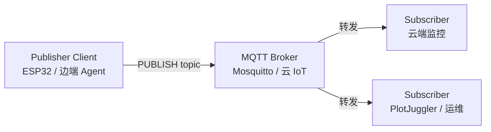

# MQTT 通信协议

**MQTT（Message Queuing Telemetry Transport）** 是 OASIS 维护的 **Client–Server 发布/订阅** 消息传输协议：Client 只与 **Broker（Server）** 通信，由 Broker 按 **Topic** 路由 Application Message。协议 **与 payload 内容无关**，报文头紧凑，适合 **MCU、蜂窝弱网、百万级连接** 的 IoT/M2M 场景。

## 一句话定义

基于 **Topic 名称** 的异步 pub/sub：**Publisher** 向 Broker 发送消息，**Subscriber** 通过 **Topic Filter** 订阅；Broker 负责会话、QoS 握手与可选持久化——**不是** 对等 mesh，也 **不是** 硬实时现场总线。

## 英文缩写速查

| 缩写 | 英文全称 | 简要说明 |
|------|----------|----------|
| MQTT | Message Queuing Telemetry Transport | OASIS 标准 IoT pub/sub 消息协议 |
| QoS | Quality of Service | 消息投递语义：0 至多一次 / 1 至少一次 / 2 恰好一次 |
| TLS | Transport Layer Security | 传输层加密，MQTT 常用 TCP+TLS（如 8883 端口） |
| IoT | Internet of Things | 物联网；MQTT 最主要部署语境 |
| M2M | Machine to Machine | 机器间通信 |
| LWT | Last Will and Testament | 异常断连时由 Broker 代为发布的遗言消息 |

## 为什么重要

- **机器人分层总线**：本库运控主线中，**500 Hz–1 kHz 关节环** 走 CAN/EtherCAT/LCM/共享内存；**10–100 Hz 感知/规划** 走 ROS 2/DDS；**MQTT** 更常出现在 **遥测、远程运维、边云状态同步、ESP32 上报**——与 [实时运控中间件指南](../queries/real-time-control-middleware-guide.md) 的分层一致。
- **生态事实标准**：AWS IoT Core、Azure IoT Hub、HiveMQ、EMQX 等均原生 MQTT；桌面调试工具 [PlotJuggler](../entities/plotjuggler.md) 有 MQTT 流插件；[Wokwi](../entities/wokwi.md) 可仿真 ESP32 连公网 Broker。
- **勿与 ROS 2 混淆**：ROS 2 Topic 底层是 **DDS 无 Broker 发现**；MQTT 强制 **中心 Broker**，语义与 QoS 模型不同——见下文对照表。

## 核心原理

### 架构：Client ↔ Broker ↔ Client



- **Application Message**（规范术语）：Payload + QoS + Properties + **Topic Name**。
- **Subscription**：**Topic Filter** + maximum QoS，绑定 **Session**。
- **Shared Subscription**（MQTT 5）：多个 Client 分担同一 Filter，每条消息只投递其一——类似消费组。

### Topic 与 Filter

| 概念 | 规则 |
|------|------|
| **Topic Name** | 发布时使用；UTF-8 字符串，如 `robot/g1/telemetry/battery` |
| **Topic Filter** | 订阅时使用；支持 **`+`**（单级通配）、**`#`**（多级通配，须放末尾） |
| **层级** | 用 `/` 分隔；语义由应用约定（无 ROS 式强类型） |

### 三级 QoS（OASIS 规范 §4.3）

| QoS | 名称 | 语义 | 机器人侧典型用途 |
|-----|------|------|------------------|
| **0** | At most once | 尽力发送，**可丢** | 高频温度/IMU 采样流 |
| **1** | At least once | **至少一次，可能重复** | 模式切换指令（消费端需幂等） |
| **2** | Exactly once | **恰好一次**（四次握手） | 计费、关键配置（开销大，少用于高频） |

> QoS 是 **Publisher → Broker** 与 **Broker → Subscriber** 两段语义的组合；两端协商取 **较低** maximum QoS。

### 连接与会话

- **CONNECT**：Client ID、Keep Alive、Clean Start / Session Expiry（v5）、**Will Message**（Client 异常离线时 Broker 发布）。
- **持久 Session**：Broker 为离线 Client **缓存 QoS 1/2** 消息（受 Broker 配置与 expiring interval 约束）。
- **DISCONNECT**（v5）：携带 Reason Code，区分正常关闭与错误。

### MQTT 3.1.1 vs 5.0

| 维度 | 3.1.1（2014） | 5.0（2019） |
|------|---------------|-------------|
| 部署面 | 现网最广 | 新 Broker/云首选 |
| 扩展 | 固定字段为主 | **User Properties**、Reason Code、Topic Alias |
| 流控 | 无 | Maximum Packet Size / Receive Maximum |
| 共享订阅 | 无 | **Shared Subscription** |
| 请求/响应 | 应用层自建 | **Response Topic + Correlation Data** 辅助 |

一手全文：[OASIS MQTT 5.0](../../sources/sites/mqtt-oasis-primary-refs.md) · [3.1.1 基线](http://docs.oasis-open.org/mqtt/mqtt/v3.1.1/os/mqtt-v3.1.1-os.html)

### 与 ROS 2 / LCM / gRPC 对照

| 维度 | MQTT | ROS 2 (DDS) | LCM |
|------|------|-------------|-----|
| 拓扑 | **Broker 星型** | 无 Broker，Participant 发现 | UDP 组播 |
| 类型 | **Payload 不透明** | IDL/ `.msg` 强类型 | LCM 类型定义 |
| 典型频率 | Hz 级遥测 | 10–100 Hz 感知 | 500 Hz–1 kHz 运控 |
| 弱网 | Session/Will 友好 | DDS 需额外配置 | 局域网为主 |
| 机器人角色 | **边云/IoT** | 系统集成 | 底层运控 |

## 工程实践

### 本地冒烟（参考 Broker）

开源参考实现 [Eclipse Mosquitto](../entities/mosquitto.md)（[归档](../../sources/repos/mosquitto.md)）：

```bash
mosquitto -v
mosquitto_sub -t 'robot/+/state' -q 1 -v
mosquitto_pub -t 'robot/g1/state' -q 1 -m '{"mode":"stand"}'
```

### 机器人常见 Topic 约定（应用层，非标准）

| Topic 示例 | 载荷 | QoS 建议 |
|------------|------|----------|
| `fleet/{id}/telemetry/joint_temp` | JSON 数组 | 0 或 1 |
| `fleet/{id}/cmd/mode` | `stand` / `walk` | 1（消费端幂等） |
| `fleet/{id}/status/lwt` | `offline` | Will QoS 1 |

### 安全

- **传输：** `mqtts://`（TLS）；生产禁用明文 1883 暴露公网。
- **认证：** 用户名/密码、客户端证书；MQTT 5 生态可接 **OAuth**（见 [mqtt.org](https://mqtt.org/)）。
- **授权：** Broker ACL（Mosquitto `aclfile`、云 IoT Policy）按 Topic 限制 pub/sub。

### 调试与可视化

- [PlotJuggler](../entities/plotjuggler.md) **MQTT DataStreamer** 插件订阅实时曲线。
- [Wokwi](../entities/wokwi.md) ESP32 工程可连公网 Broker 验证 **Wi-Fi + MQTT** 固件路径。

## 局限与风险

- **不适合硬实时关节环**：Broker 中转 + TCP 抖动，无法保证 1 ms 级周期；运控环应留在 CAN/EtherCAT/LCM/SHM。
- **Broker 单点**：需 HA 集群或云托管；断连时依赖 Session/Will，但 **不等于** 控制级 fail-safe。
- **QoS 1 重复**：模式指令必须 **幂等** 或带版本号/序号去重。
- **无内建类型**：Team 需自建 schema（Protobuf/JSON Schema）与版本策略，否则跨团队互操作易碎。
- **与 ROS 2 桥接**：常用 `mqtt_bridge` 等独立组件——**不要** 默认把 ROS Topic 全量镜像到 MQTT 而不做带宽与 QoS 审计。

## 关联页面

- [进程间通信（IPC）](./ipc-inter-process-communication.md)
- [ROS 2 基础](./ros2-basics.md)
- [LCM 基础](./lcm-basics.md)
- [DDS 通信机制](./dds-communication.md)
- [硬件通信知识链](../overview/hub-communication.md)
- [Eclipse Mosquitto](../entities/mosquitto.md)
- [PlotJuggler](../entities/plotjuggler.md)
- [Wokwi](../entities/wokwi.md)

## 参考来源

- [MQTT（OASIS）规范一手资料索引](../../sources/sites/mqtt-oasis-primary-refs.md)
- [mqtt.org 官方站点](../../sources/sites/mqtt-org.md)
- [Eclipse Mosquitto 仓库归档](../../sources/repos/mosquitto.md)

## 推荐继续阅读

- OASIS [MQTT Version 5.0 规范 PDF](https://docs.oasis-open.org/mqtt/mqtt/v5.0/os/mqtt-v5.0-os.pdf)
- Mosquitto [Documentation](https://mosquitto.org/documentation/)
- AWS [MQTT 协议介绍（工程视角）](https://docs.aws.amazon.com/iot/latest/developerguide/mqtt.html)
