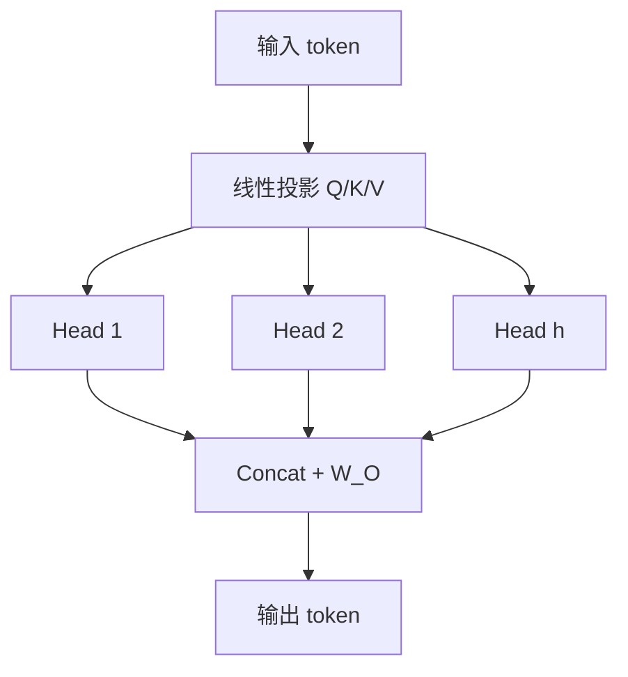

# 多头注意力（Multi-Head Attention）

## 一句话定义

**Multi-Head Attention（MHA）** 把 Query/Key/Value 投影到 $h$ 个子空间，各自做缩放点积注意力后拼接再投影，使模型在不同表示子空间 **并行关注不同关系模式**。

## 英文缩写速查

| 缩写 | 英文全称 | 简要说明 |
|------|----------|----------|
| MHA | Multi-Head Attention | 多头自/交叉注意力 |
| SDPA | Scaled Dot-Product Attention | 带 √d_k 缩放的点积注意力 |
| QKV | Query / Key / Value | 注意力三组投影 |
| Self-Attn | Self-Attention | Q/K/V 来自同一序列 |
| Cross-Attn | Cross-Attention | Q 与 K/V 来自不同模态或序列 |

## 为什么重要

- 是 [Transformer](./transformer.md) 与 [ViT](./vision-transformer.md) 的计算核心；作业 1 即实现并调试该模块。
- 机器人侧：ACT、RT 系列、VLA 视觉–语言–动作交互均建立在自注意力 / 交叉注意力之上。
- 与早期通道注意力（[SENet/DANet](../methods/channel-spatial-attention.md)）不同：MHA 直接对 **token 集合** 做内容寻址。

## 核心原理

$$
\mathrm{Attention}(Q,K,V)=\mathrm{softmax}\Big(\frac{QK^\top}{\sqrt{d_k}}\Big)V
$$

多头：将 $Q,K,V$ 线性分成 $h$ 组，每组注意力后 `Concat` 再乘 $W^O$。自注意力中序列任意两位置路径长度为 $O(1)$，但复杂度随长度平方增长。

## 工程实践

| 项 | 建议 |
|----|------|
| 实现 | 先写单头 SDPA，再 reshape 为多头；对齐 `torch.nn.MultiheadAttention` |
| 数值 | 务必除以 $\sqrt{d_k}$；半精度注意 softmax 溢出 |
| 掩码 | 因果掩码用于自回归；视觉 ViT 分类通常全连接无掩码 |
| 调试 | 可视化注意力图：是否塌缩到对角线/少数 token |
| 加速 | FlashAttention / SDPA 后端；长序列考虑窗口或可变形注意力 |

## 局限与风险

- **$O(n^2)$** 限制高分辨率密集视觉；需补丁化、窗口、可变形采样等。
- 多头并非「越多越好」——头数与 $d_k$ 需匹配隐藏维；过碎会欠表达。
- 跨模态时应对齐哪侧做 Q（见 [跨模态注意力](../formalizations/cross-modal-attention.md)）。

## 关联页面

- [Transformer](./transformer.md)
- [Vision Transformer](./vision-transformer.md)
- [通道/空间注意力（SENet/DANet）](../methods/channel-spatial-attention.md)
- [Transformer CV 课程策展](../entities/transformer-cv-curriculum.md)

## 参考来源

- [Transformer 视觉应用课程大纲](../../sources/courses/transformer_cv_applications_syllabus.md)
- [Attention Is All You Need（sources）](../../sources/papers/attention_is_all_you_need.md)

## 推荐继续阅读

- [Vaswani et al. Attention Is All You Need](https://arxiv.org/abs/1706.03762)
- [The Illustrated Transformer](https://jalammar.github.io/illustrated-transformer/)
