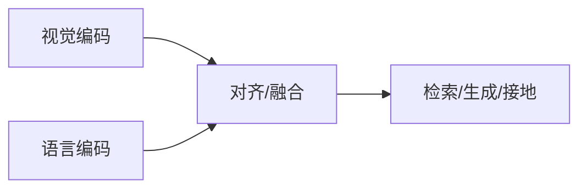

# 多模态基础概念

## 一句话定义

**多模态（Multimodality）** 指在同一模型中联合表示并交互 **两种以上感官/符号模态**（常见为视觉+语言），目标是学习跨模态对齐的语义，以支持检索、描述、问答与具身指令跟随。

## 英文缩写速查

| 缩写 | 英文全称 | 简要说明 |
|------|----------|----------|
| MM | Multimodal Learning | 多模态学习 |
| VLM | Vision-Language Model | 视觉–语言模型 |
| MLLM | Multimodal Large Language Model | 多模态大语言模型 |
| Alignment | Cross-modal Alignment | 跨模态语义对齐 |
| Contrastive | Contrastive Learning | CLIP 类对齐损失 |

## 为什么重要

- 课程第 5 章先修：后续 CLIP→LLaVA 都建立在「对齐 + 条件生成」上。
- 机器人 [VLA](../methods/vla.md) / VLN 把动作当作第三模态，但视觉–语言对齐仍是上游。

## 核心原理

常见三块：**编码器**（各模态专用）→ **融合/对齐**（对比、交叉注意力、Q-Former 等）→ **任务头**（检索、生成、检测 grounding）。数据可以是图文对、视频文本、区域短语等。

## 工程实践

| 项 | 建议 |
|----|------|
| 入门路径 | 对比学习 CLIP → 桥接 BLIP-2 → 指令微调 LLaVA |
| 数据质 | 对齐噪声直接伤害零样本；先清洗再堆规模 |
| 具身 | 明确任务要检索、描述还是输出动作 |

## 局限与风险

「多模态」不等于「具身」；缺少动作与力模态时不能直接当策略。幻觉与错误接地在物理世界代价更高。

## 关联页面

- [视觉–语言特征融合](./vision-language-feature-fusion.md)
- [VLM 分类法](../comparisons/vlm-vln-vla-vlx-world-model-taxonomy.md)
- [多模态 LLM 发展路线](../overview/multimodal-llm-development.md)
- [Transformer CV 课程策展](../entities/transformer-cv-curriculum.md)

## 参考来源

- [Transformer 视觉应用课程大纲](../../sources/courses/transformer_cv_applications_syllabus.md)

## 推荐继续阅读

- [CLIP paper](https://arxiv.org/abs/2103.00020)
