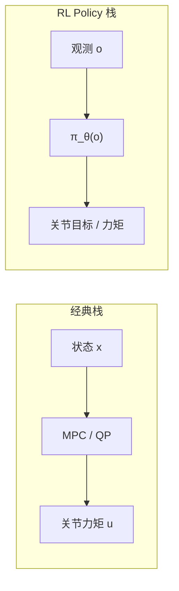

# 神经反馈控制器（Neural Feedback Controller）

**神经反馈控制器**：强化学习训练完成后导出的 **策略网络** $\pi_\theta$，在控制论意义上是一个 **非线性状态反馈律** $u_t = \pi(o_t)$——把当前观测映射为关节目标或力矩，参数 $\theta$ 不是人工设计，而是由数百万至数亿步仿真交互自动学出。

## 一句话定义

Policy 不是「背下一条动作录像」，而是把 **「在这种状态下该怎么动」** 的经验压缩进神经网络权重里的 **高维 $\pi(x)$ 控制器**。

## 英文缩写速查

| 缩写 | 英文全称 | 简要说明 |
|------|----------|----------|
| RL | Reinforcement Learning | 通过与环境交互最大化长期回报来学习策略的范式 |
| PPO | Proximal Policy Optimization | 人形/足式 locomotion 中最常用的 on-policy 策略梯度算法 |
| AMP | Adversarial Motion Prior | 用对抗判别约束状态转移接近专家运动分布的先验 |
| MLP | Multi-Layer Perceptron | 多层感知机，locomotion policy 最常见骨干 |
| ONNX | Open Neural Network Exchange | 跨框架神经网络模型交换格式，真机部署常用 |
| FLOPs | Floating Point Operations | 浮点运算次数，衡量单次推理计算量 |
| PD | Proportional–Derivative | 关节位置/阻抗底层控制，策略输出常为其 setpoint |
| MPC | Model Predictive Control | 滚动时域内优化控制序列的预测控制 |
| GAE | Generalized Advantage Estimation | PPO 计算优势函数的标准配套 |

## 为什么重要

- **读训练日志 / 部署 ONNX 时**：需要区分「学的是轨迹」还是「学的是反馈律」——后者才能泛化到新速度指令、新扰动。
- **与经典控制对照**：PID/LQR 的 $u=Kx$ 是线性反馈；AMP/PPO policy 是同构思路的 **非线性版**，便于和 [WBC](./whole-body-control.md)、MPC 分层讨论。
- **算力预算**：人形常见 **Policy 100 Hz + PD 1 kHz**；policy 推理通常只占整机算力极小比例，视觉/VLA 才是瓶颈（见下文 FLOPs 估算）。

## 训练产物：压缩了什么

以 [AMP_mjlab](../entities/amp-mjlab.md) 类项目为例，训练结束得到 `model.pt` 或 `policy.onnx`：

```text
观测 o_t（机身角速、重力、关节状态、速度指令、历史帧…）
        ↓
   MLP π_θ（典型 1024→512→256）
        ↓
动作 a_t（关节位置目标增量，如 29 维）
```

- **输入输出**：$a_t = \pi(o_t)$；底层 [PD](./whole-body-control.md) 跟踪目标位置。
- **压缩对象**：数百万步仿真 ×（任务奖励 + 参考动作风格）→ 几十 MB 浮点权重。
- **学到的是规律，不是一条轨迹**：同一网络在 `cmd_vel=0.3` 时走、`1.0` 时快走、`2.0` 时跑——状态空间上的 **运动律**，而非固定时间序列。

### AMP 的双老师（直觉）

| 老师 | 作用 |
|------|------|
| **任务奖励** | 跟速度、别摔、少打滑、恢复高度等 |
| **AMP 判别器** | 状态转移是否像 mocap 参考（对抗，类似 GAN） |

详见 [AMP 奖励 shaping](../methods/amp-reward.md) 与 [AMP_mjlab 实体页](../entities/amp-mjlab.md)。

## 与经典控制的对比



| 控制器 | 形式 | 参数来源 |
|--------|------|----------|
| PID / LQR | $u = Kx$（线性） | 人工整定 /  Riccati |
| MPC | 在线优化 $u^*(x)$ | 模型 + 求解器 |
| **RL Policy** | $u = \pi_\theta(x)$（非线性 NN） | 仿真数据自动学习 |

## PPO 更新在干什么（直觉层）

形式化目标见 [PPO](../methods/ppo.md)；此处回答「改权重到底改什么」：

1. Policy 输出 **动作分布** $\pi(a|s)$，采样得到 $a_t$。
2. [GAE](../formalizations/gae.md) 给出优势 $\hat{A}_t$：该动作比「平均水平」好多少。
3. $\hat{A}_t > 0$ → 提高该动作概率；$\hat{A}_t < 0$ → 降低。
4. 参数沿 $\nabla_\theta J(\theta)$ 移动一小步 → 浮点权重微变（如 $0.513241 \to 0.513268$）。

**本质**：强化导致高奖励的 **状态→动作** 神经连接，削弱导致摔倒、打滑、偏航的连接。数亿步之后，形成可用的 $\pi$。

## 推理算力：参数量 ≠ FLOPs

典型 locomotion MLP（`obs ~700 → 1024 → 512 → 256 → action ~23`）：

- **参数量**：约 1–3M（远小于「2000 万参数」的夸张说法）。
- **单次前向 FLOPs**：约 **1–5M**（全连接层经验：FLOPs $\approx 2 \times$ 参数量）。
- **100 Hz 控制**：约 **0.1–0.5 GFLOPS/s**；50MB FP32 ONNX（~13M 参数）@100Hz ≈ 2.6 GFLOPS/s。

| 平台 | 量级 | Policy @100Hz |
|------|------|----------------|
| RK3588 | ~100+ GFLOPS | 轻松 |
| Jetson Orin | ~数十 TFLOPS（INT8 Tensor Core） | 可忽略 |
| 桌面 CPU + ONNX Runtime | 充足 | 常见部署路径 |

**工程结论**：在 **Policy 100 Hz / PD 1 kHz** 架构下，真机算力压力通常在 **深度、VLA、点云、世界模型**，而非低层 policy 推理。

## 常见误区

- **「Policy 学会了跑步这一段动作」** — 学会的是 **反馈律**；换指令/扰动会走不同步态，而非回放固定 clip。
- **「参数量 = 推理 FLOPs」** — MLP 前向 FLOPs 与参数量同阶但不相等；应用 FLOPs × 控制频率估算部署负载。
- **「网络越大 locomotion 越强」** — 真机 SOTA 常是 **2–3 层、256–512 宽 MLP**；瓶颈在观测、奖励、sim2real（见 [人形策略网络架构](./humanoid-policy-network-architecture.md)）。

## 关联页面

- [PPO](../methods/ppo.md) — clip 目标与 GAE 的形式化
- [AMP_mjlab](../entities/amp-mjlab.md) — G1 统一 locomotion+recovery 工程范例与 TensorBoard 判据
- [人形策略网络架构](./humanoid-policy-network-architecture.md) — MLP 层宽与架构代际
- [控制环路延迟建模](../formalizations/control-loop-latency-modeling.md) — 100 Hz policy 在整机时序中的位置
- [MDP](../formalizations/mdp.md) — $\pi(a|s)$ 的问题形式

## 参考来源

- [AMP_mjlab Policy 训练本质 FAQ（维护者整理）](../../sources/personal/amp_mjlab_policy_training_essence.md)
- [ccrpRepo/AMP_mjlab](https://github.com/ccrpRepo/AMP_mjlab) — 统一 walk/run/recovery 工程参考

## 推荐继续阅读

- Schulman et al., *Proximal Policy Optimization Algorithms* (2017) — PPO 原论文
- Peng et al., *AMP: Adversarial Motion Priors* — 对抗运动先验与风格奖励
