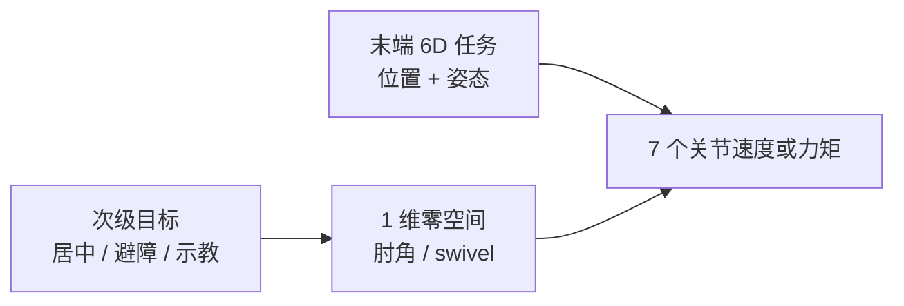

# Null-Space Control（零空间控制）

**零空间控制**：当关节数 $n$ 大于任务维数 $m$ 时，主任务的雅可比 $J\in\mathbb{R}^{m\times n}$ 有非平凡核；把次级目标投影进 $\ker J$，即可在**不改变主任务速度/力**（在所选一致性意义下）的前提下利用剩余自由度。

## 一句话定义

主任务用伪逆完成；剩下的关节运动只允许活在 $J$ 的零空间里——7 轴臂上这通常就是「末端 6D 已经定死，肘部还能转」。

## 英文缩写速查

| 缩写 | 英文全称 | 简要说明 |
|------|----------|----------|
| DoF | Degrees of Freedom | 7 轴臂 $n=7$，笛卡尔位姿任务 $m=6$，零空间维数 $n-m=1$ |
| IK | Inverse Kinematics | 速度层 $\dot q=J^+\dot x+(I-J^+J)z$ 是零空间控制的运动学形态 |
| DLS | Damped Least Squares | 近奇异时给 $JJ^\top$ 加阻尼，避免 $J^+$ 爆炸 |
| OSF | Operational Space Formulation | Khatib 操作空间：动力学一致投影 $N=I-J^\top\bar J^\top$ |
| HQP | Hierarchical Quadratic Programming | 用分层 QP 代替显式 $N$，可加限位/接触不等式 |
| TCP | Tool Center Point | 末端工具中心；7 轴实验里常作主任务坐标系 |
| LWR | Lightweight Robot | DLR/KUKA 七轴轻型臂，Dietrich 2015 真机平台 |

## 为什么重要

工业 6 轴把末端 6D 用尽，姿态与肘部绑死。7 轴（Panda、FR3、iiwa、LWR-III）多出的 1 维不是装饰：

- **避奇异 / 避限位**：同样 TCP 位姿可换肘角，躲开腕部奇异或关节撞墙。
- **避障**：焊缝跟踪时末端沿缝走，肘部绕开夹具。
- **阻抗叠加**：笛卡尔弹簧跟踪位姿，关节弹簧在零空间里把构型拉回舒适姿态。
- **示教与消滞**：冗余自运动可保持关节微动，减轻静摩擦（协作臂 kinesthetic teaching）。

人形 WBC 里同一数学出现在更高维：平衡/接触是主任务，手臂姿态是零空间装饰。HQP 是它的不等式升级，不是另一种物理。

## 核心原理

### 1. 速度层（Nakamura 1987）

$$
\dot q = J_1^+ \dot x_1 + (I - J_1^+ J_1)\, z
$$

| 项 | 含义 |
|----|------|
| $J_1^+\dot x_1$ | 最小范数关节速度，完成主任务 |
| $N_1=I-J_1^+J_1$ | 正交投影到 $\ker J_1$ |
| $z$ | 任意次级速度；常用 $z=\alpha\nabla H(q)$（最大化可操作度、关节居中、障碍距离） |

多层时不要把所有 $z_i$ 直接相加。**Successive** 把 $N$ 递推相乘；**Augmented** 把已占用任务堆进 $J_{1:i}$ 再投影一次（Siciliano & Slotine 1991）。后者层次更严，也更容易碰到算法奇异。

### 2. 力矩层（Khatib 1987 / Ott 2008）

$$
\tau = J^\top F + N^\top \tau_0,\quad N = I - J^\top (J^\top)^\#
$$

$(J^\top)^\#$ 的加权决定**一致性**：

| 加权 $W$ | 名称 | 工程含义 |
|----------|------|----------|
| $W=I$（Moore–Penrose） | 静力学一致 | 稳态不干扰末端力；**不需要 $M(q)$**；非静平衡时 $\tau_0$ 可能漏到笛卡尔方向 |
| $W=M(q)$（Khatib $\bar J$） | 动力学一致 | 次级力矩不产生主任务加速度；要可信惯量模型 |
| 刚度信息 | 刚度一致（Dietrich 2015） | 高层任务由机械弹簧维持时，避免主动环对抗弹簧 |

Dietrich 指出：满足动力学一致的 $W$ 有无穷多，$M$ 只是特例。真机上因摩擦与惯量误差，**$W=I$ 往往够用**——这正是 Franka 示例和 Mayr 开源控制器的选择。

### 3. 7 轴几何

- **解析 IK**（[ssik](../entities/ssik.md)）把该 1 维离散成 swivel 采样，返回多分支。
- **实时控制**不枚举分支，而是每周期投影：Franka FCI 笛卡尔运动生成器用 **elbow** 参数暴露这 1 维；力矩环则显式乘 $N$。
- 不要把 7 轴零空间想象成「随便甩肘」：接近奇异时 $\mathrm{rank}(J)<6$，核的维数跳变，投影必须加 DLS 或改任务。

### 4. 与 HQP / TSID 的分界

| 路线 | 机制 | 何时用 |
|------|------|--------|
| 显式 $N$ | 解析投影，kHz 级矩阵乘 | 单臂 7 轴、不等式少、要读懂每一项力矩 |
| [HQP](./hqp.md) / [TSID](./tsid.md) | 上层最优值变下层等式；可加 $q_{\min}\le q\le q_{\max}$、摩擦锥 | 人形、多接触、限位必须当硬约束 |

HQP 的「低优先级在高优先级零空间里优化」与 Nakamura 公式是同一优先级语义；Kanoun 2011 把不等式任务接进这个框架。

## 工程实践

### 实现步骤（7 轴力矩阻抗，对照开源）

1. 读 $q,\dot q$，用 [Pinocchio](../entities/pinocchio.md) 或 RBDyn 算 TCP 位姿与 $J$。
2. 主任务：笛卡尔 PD → $F = -K\Delta\xi - D J\dot q$，映射 $\tau_{\mathrm{task}}=J^\top F$。
3. 次级：$\tau_0=-K_{\mathrm{ns}}(q-q_{\mathrm{ns}})-D_{\mathrm{ns}}\dot q$，再 $\tau_{\mathrm{ns}}=N\tau_0$。
4. 可选 $\tau_{\mathrm{ext}}=J^\top F_{\mathrm{cmd}}$（力控/混合）。
5. 叠加后限 $|\Delta\tau|$，下发；重力若机体内补偿则不要再加 $g(q)$。

| 检查项 | 建议 |
|--------|------|
| 开源入口 | 多机型：[Mayr 控制器](../entities/paper-cartesian-impedance-controller.md)；只跑 Franka：[libfranka](../../sources/repos/libfranka.md) `cartesian_impedance_control` |
| 运动学 IK | [Pink](../entities/pink-ik.md) 加权任务速度；教学级 `IK_velocity_null` 见 Penn 7DOF 课设仓（无许可证，勿当生产依赖） |
| 全身 / 接触 | [TSID 库](../../sources/repos/tsid.md)，不要在 30+ DoF 上手写多层 $N$ |
| MoveIt 轨迹 | 必须设**非零零空间刚度**，否则 7 轴规划构型被丢掉，只剩 TCP |
| 调参 | 先 $K_{\mathrm{ns}}=0$ 确认 TCP 阻抗；再缓加 $K_{\mathrm{ns}}$，观察 TCP 是否被肘部拖偏（投影泄漏） |

### 调试指标

- 主任务位置误差应与 $K_{\mathrm{ns}}$ **近似无关**；若加大零空间刚度后端位明显漂，投影实现或奇异处理有问题。
- 盯 $J$ 最小奇异值；肘部自运动在奇异附近会突然「卡死」或放大。
- Dietrich LWR-III 实验的最小层次：**平移阻抗 > 姿态阻抗 > 关节构型**，可直接当 7 轴验收脚本。

## 局限与风险

1. **投影不是碰撞约束** — $N\tau_0$ 不保证关节不超限；超限要用饱和（SNS）或 HQP 不等式，不能只靠梯度启发。
2. **静力学一致 ≠ 动态解耦** — 快速甩肘时末端发力，这是 Mayr 论文脚注写明的代价，不是实现 bug。
3. **惯性加权在真机上常不值得** — Dietrich 实验：仿真里 $W=M$ 更优，LWR 上优势被模型误差吃掉。
4. **把零空间当规划器** — 局部投影不能穿越肘部死区；大范围换构型要外层 IK 分支或轨迹优化。
5. **6 轴上硬套公式** — $n=m$ 时 $N=0$，次级任务完全无效。

## 关联页面

- [逆运动学](../formalizations/inverse-kinematics.md) — 速度层伪逆 + 零空间 $z$
- [雅可比矩阵](../formalizations/robot-jacobian.md) — $J$、$J^+$、$\ker J$
- [HQP](./hqp.md) — 分层 QP，显式 $N$ 的不等式升级
- [TSID](./tsid.md) — 加速度/力矩层多任务，内部用 HQP 而非手写投影
- [Whole-Body Control](./whole-body-control.md) — 全身任务堆叠的控制基础设施
- [阻抗控制](./impedance-control.md) — 7 轴上最常见的主任务形态
- [Query：接触力旋量闭环知识链](../queries/contact-wrench-closed-loop.md) — 阻抗主任务之上，零空间只整形姿态、不替代力控方向选择
- [控制分配](./control-allocation.md) — 冗余执行器求 $\tau$；零空间是运动学对偶问题
- [零空间投影综述（Dietrich 2015）](../entities/paper-null-space-projections-survey.md)
- [SurgLAT](../entities/paper-surglat.md) — 腹腔镜 RCM 控制里用冗余零空间初始化放大旋转工作空间
- [Cartesian Impedance Controller（Mayr 2024）](../entities/paper-cartesian-impedance-controller.md)
- [Franka Research 3](../entities/franka-research-3.md)
- [Pink](../entities/pink-ik.md) — Pinocchio 上的任务空间 IK
- [Pinocchio](../entities/pinocchio.md)

## 参考来源

- [零空间控制论文簇](../../sources/papers/null_space_control.md)
- [Dietrich et al. IJRR 2015 综述归档](../../sources/papers/dietrich_null_space_projections_ijrr_2015.md)
- [Mayr JOSS 2024 归档](../../sources/papers/mayr_cartesian_impedance_joss_2024.md)
- [Cartesian-Impedance-Controller 仓库](../../sources/repos/cartesian-impedance-controller.md)
- [libfranka 仓库](../../sources/repos/libfranka.md)
- [stack-of-tasks/tsid 仓库](../../sources/repos/tsid.md)

## 推荐继续阅读

- Dietrich, Ott, Albu-Schäffer, *An overview of null space projections for redundant, torque-controlled robots*, IJRR 2015（开放 PDF：<https://elib.dlr.de/101443/2/NullspaceSurvey.pdf>）
- Mayr 控制器 README 与 ROSCon 闪电讲：<https://github.com/matthias-mayr/Cartesian-Impedance-Controller>
- Lynch & Park, *Modern Robotics* Ch 6（冗余 IK）
