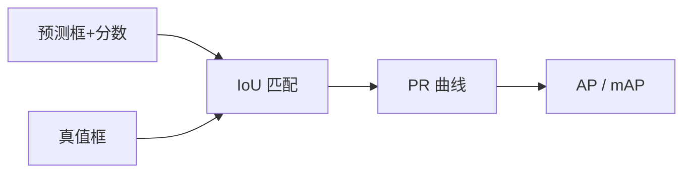

# 目标检测评价指标

## 一句话定义

以 **IoU** 判定预测框与真值是否匹配，再在各类别上计算精度–召回曲线并汇总为 **mAP**（及 COCO 的 AP@[.5:.95] 等），形成检测器精度的标准报告口径。

## 英文缩写速查

| 缩写 | 英文全称 | 简要说明 |
|------|----------|----------|
| IoU | Intersection over Union | 预测框与真值重叠比 |
| AP | Average Precision | 单类 PR 曲线面积 |
| mAP | mean Average Precision | 各类 AP 平均 |
| AR | Average Recall | 平均召回 |
| COCO AP | AP at IoU=.50:.05:.95 | 主看指标 |

## 为什么重要

- 课程 3.1.2：没有统一指标就无法比较两阶段/单阶段/DETR。
- 机器人验收常另加延迟、端侧功耗；但论文对比仍以 mAP 为共同语言。

## 核心原理

1. 对每个预测按置信度排序，与未匹配真值算 IoU。  
2. IoU ≥ 阈值则计为 TP，否则 FP；漏检为 FN。  
3. 扫置信度得 PR 曲线 → AP；对类平均得 mAP。COCO 主指标对 IoU 0.5–0.95 取平均。

## 工程实践

| 项 | 建议 |
|----|------|
| 工具 | `pycocotools` / torchvision COCO evaluator |
| 报告 | 同时给 AP50、AP75、APs/APm/APl |
| 机器人 | 另报 FPS@目标硬件与漏检代价 |

## 局限与风险

mAP 不直接等于任务成功（抓取/避障）；类别长尾与定位误差敏感度因阈值而异。小物体 AP 常主导机器人失败模式。

## 关联页面

- [Object Detection](../methods/object-detection.md)
- [COCO](../entities/dataset-coco.md)
- [DETR](../entities/detr.md)
- [Transformer CV 课程策展](../entities/transformer-cv-curriculum.md)
- [具身大模型评测基准选型闭环知识链](../queries/embodied-eval-benchmark-selection-loop.md) — mAP 属四层评测链的上游代理指标：检测分高 ≠ ③策略任务成功率高
- [机器人视觉感知栈选型闭环知识链](../queries/robot-perception-stack-selection-loop.md) — mAP 是②层检测选型的共同尺，但 mAP 高 ≠ 机载帧率够

## 参考来源

- [Transformer 视觉应用课程大纲](../../sources/courses/transformer_cv_applications_syllabus.md)

## 推荐继续阅读

- [COCO Detection Evaluation](https://cocodataset.org/#detection-eval)
