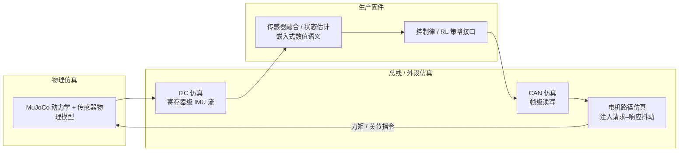

# 处理器在环 Sim2Real（Processor-in-the-loop）

**处理器在环 Sim2Real**：不把控制器当成「数学上完美的函数」，而把**真实固件执行路径**（线程优先级、周期抖动、总线协议、嵌入式浮点语义）当作与环境动力学并列的**闭环组成部分**，在仿真里与物理引擎联合训练或回归测试，以缩小腿式 locomotion 在真机上的非物理类失效。

## 一句话定义

让**未改动的生产固件**在仿真里闭环跑起来，并对 **I2C/CAN 等外设路径** 故意注入延迟与噪声，使策略与底层栈在同一训练分布里「见过现实的不公平」。

## 为什么重要

- **失效模式错位**：许多 sim2real 管线把 gap 主要归因于摩擦、接触与刚体参数；真机上同样常见的是 **CAN 包迟到**、**实时线程错过窗口**、**IMU 融合在有限精度与节拍错位下漂移**——这些更接近**嵌入式与通信系统**问题。
- **DR 与「可测性」脱钩**：在仿真里随机化执行器延迟，若不经真实驱动栈解析与调度，很难暴露 **协议解析错误**、**线程竞态** 或 **C 融合库与 Python 双精度语义不一致** 等缺陷。
- **协同设计抓手**：当固件与策略在同一仿真闭环里被联合施压，硬件带宽、控制频率与策略观测合同更容易**并行演化**，而不是在集成末期才发现不可调和。

## 核心结构 / 机制

### 1. 控制环穿过真实固件模型

「Processor-in-the-loop」在此语境下指：**传感器数据不绕过固件直接喂给策略**；仿真侧按硬件语义产生原始 IMU 流，经 **I2C 外设仿真**进入固件；固件内的姿态/重力估计（例如开源 **Fusion** C 库）以**嵌入式浮点**运行；力矩指令经 **CAN 总线仿真**以与真机相同的帧格式发出，使固件**无法区分**仿真与实物总线。

### 2. 抖动作为一等训练维度

在电机请求–响应路径上注入**有界随机延迟**（例如均匀分布在 datasheet 名义响应时间与更慢上界之间），把「执行器延迟随机化」从纯 RL 鲁棒化假设，推进为对 **固件时序假设 + 策略抖动耐受** 的**联合压力测试**：可暴露控制周期先于响应返回、驱动在负载下解析异常、估计器对采样节拍敏感等模式。

### 3. 与「黑盒机器人」对比

若电机驱动与中间件闭源、日志不足，现场失效往往难以归因。处理器在环路线依赖**可替换的仿真外设与可重复注入**，把 sim2real 部分还原为**观测与日志充分**的系统问题——与全栈开源或至少固件可测的平台天然契合。

## 流程总览

## 常见误区或局限

- **误区：把「高保真 PhysX/MuJoCo」当成 sim2real 充分条件**。若跳过真实通信栈与调度，仍可能在真机首次站立时遭遇**确定性物理仿真从未出现过的崩溃路径**。
- **误区：认为 DR 覆盖延迟就等于覆盖嵌入式**。未经过真实解析与线程交互的延迟模型，**统计上**可能相似，**机制上**可能漏掉协议与优先级相关的缺陷。
- **局限：搭建成本高**。外设仿真、周期精确的半实物协同与 CI 资源消耗，对小型团队是门槛；收益集中在**高频闭环腿式**与**自研固件**场景。

## 关联页面

- [Sim2Real](./sim2real.md) — gap 来源总览；本页聚焦 **执行器 + 嵌入式 + 通信** 交叉层
- [Domain Randomization](./domain-randomization.md) — **抖动注入**可视为面向总线/调度的结构化随机化
- [Asimov v1](../entities/asimov-v1.md) — Menlo 博文线与全栈仓库交叉引用入口
- [Sim2Real gap 缩减实战](../queries/sim2real-gap-reduction.md) — gap 分类与缓解策略
- [实时控制中间件指南](../queries/real-time-control-middleware-guide.md) — 调度与通信负载侧补充

## 参考来源

- [Menlo：Noise is all you need…](../../sources/blogs/menlo_noise_is_all_you_need.md)

## 推荐继续阅读

- [Noise is all you need to bridge the sim-to-real locomotion gap](https://menlo.ai/blog/noise-is-all-you-need) — 原文：方法论、电机抖动注入区间与 Asimov 部署叙事
- [Teaching a humanoid to walk](https://menlo.ai/blog/teaching-a-humanoid-to-walk) — 同一产品线的观测合同与 CAN 建模讨论
- [Query：如何缩小 sim2real gap](../queries/sim2real-gap-reduction.md) — 与本概念互补的 gap 分类与缓解策略
