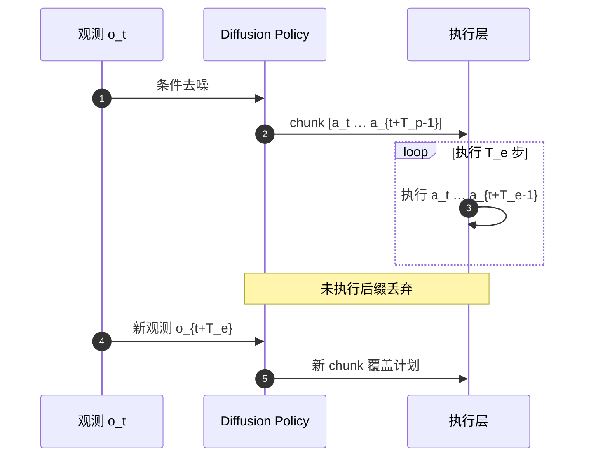
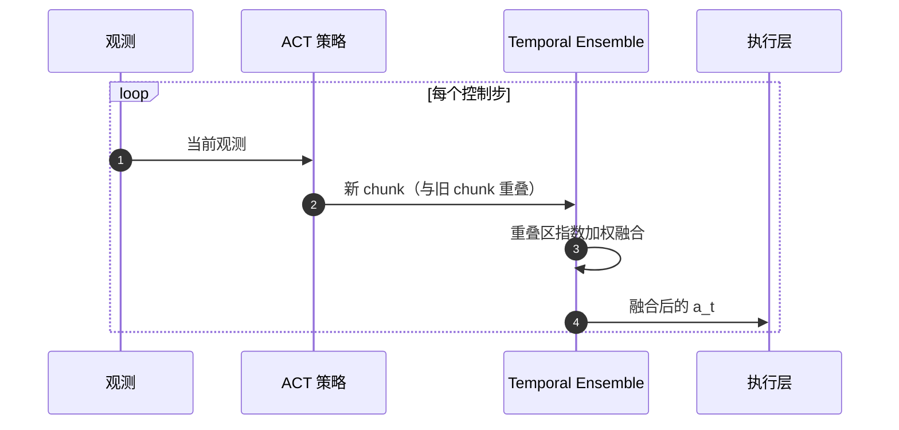

# 滚动预测执行（Receding-Horizon Policy Execution）

**滚动预测执行**：模仿学习 / VLA 部署里，策略 **不是每步只吐一个动作**，而是 **预测一段未来 action sequence**，**只执行其中前缀**，再在下一周期用 **更新后的观测重新预测** 下一段。Diffusion Policy 把这一闭环写进方法设计；ACT 也输出 action chunk，但默认 **Temporal Ensembling** 与经典 receding horizon **不是同一套执行协议**。

## 一句话定义

把控制论里的「滚动时域」搬到学习式策略：**有限视界预测 + 前缀执行 + 周期性重规划**，用闭环反馈抵消开环前缀误差。

## 英文缩写速查

| 缩写 | 英文全称 | 简要说明 |
|------|----------|----------|
| RH | Receding Horizon | 滚动时域：只执行预测序列前缀并重规划 |
| DP | Diffusion Policy | 以 receding horizon 为部署核心的扩散 IL 代表 |
| ACT | Action Chunking with Transformers | ALOHA 论文提出的 chunk 生成架构 |
| TE | Temporal Ensemble | ACT 默认：重叠 chunk 的指数加权融合 |
| \(T_p\) | Prediction Horizon | 单次推理预测的动作步数 |
| \(T_e\) | Execution Horizon | 两次重规划之间实际执行的步数（\(T_e \le T_p\)） |

## 为什么重要

- **解耦推理与控制频率**：慢策略（5–20 Hz）可驱动快控制器（50–1000 Hz），见 [控制/推理频率解耦](./control-inference-frequency-decoupling.md)。
- **降低逐步复合误差**：局部多步联合建模比「每步独立 BC」更平滑；但长开环前缀仍会在扰动下过期——[Why Action Chunking Improves BC](../entities/paper-why-action-chunking-improves-bc.md) 强调 **训练目标与执行协议可以分开设计**。
- **术语混乱成本高**：工程文档常把「用了 action chunk」一律叫 receding horizon；ACT 的 TE、VLA 的异步 buffer、MPC 的首步执行 **机制不同**，混称会导致错误的部署与消融。

## 核心原理

### 与控制论 MPC 的同名异构

[MPC](../methods/model-predictive-control.md) 的 receding horizon：每步解有限时域 OCP，**只执行第一个控制量**，再滚动。IL 滚动执行 **共享骨架**（有限视界 → 前缀执行 → 重规划），但 **无显式动力学约束优化**，而是神经网络生成动作序列。体系⑥总览见 [滚动优化与 ILC](../overview/robot-control-paradigm-receding-horizon-ilc.md)。

### 两个一手 canonical 对照

#### A. Diffusion Policy — 经典 receding horizon

[Diffusion Policy](../entities/paper-diffusion-policy.md)（Chi et al., RSS 2023 / IJRR 2024）明确把 **receding-horizon control** 作为核心设计：

1. 给定观测 \(o_t\)，去噪生成动作序列 \(\hat{a}_{t:t+T_p-1}\)
2. 机器人 **只执行前 \(T_e\) 步**（\(T_e < T_p\)）
3. 到达 \(t+T_e\) 时用 **新观测** 重新去噪，**丢弃** 旧 chunk 未执行后缀

典型量级：\(T_p\) 16–32；\(T_e\) 依推理延迟与任务，常见 4–8 或更少。

#### B. ACT — chunk 生成 + Temporal Ensembling（≠ 经典 RH）

[ACT](../entities/paper-act.md)（Zhao et al., RSS 2023）同样 **一次预测 K 步 chunk**，但默认执行机制是 **Temporal Ensembling**：

- **每个控制时刻** 都发起新的 chunk 预测（即使上一 chunk 尚未「播完」）
- 对 **同一未来时刻** 的多条预测做 **指数加权平均** 再下发
- 效果：**平滑抖动** + 隐式多模型集成；**不是**「执行固定前缀后整段丢弃重规划」

[Why Action Chunking Improves BC](../entities/paper-why-action-chunking-improves-bc.md) 进一步指出：ACT 式 **指数 TE** 会 **压近时刻权重**，与 **Randomized Delay Ensemble (RDE)** 的线性/随机时延集成 **机制不同**——读论文与复现时勿把三者混为一谈。

### 三轴分解（读任何 chunk 论文前先问）

| 轴 | 问什么 | 例子 |
|----|--------|------|
| **预测视界 \(T_p\)** | 一次 forward 输出几步？ | DP 16–32；ACT 常见 100（任务相关） |
| **执行视界 \(T_e\)** | 两次重规划之间开环几步？ | DP 显式 \(T_e\)；ACT+TE 每步重预测，\(T_e\) 语义弱 |
| **重叠协议** | 旧计划未执行部分怎么办？ | DP **丢弃**；ACT **融合**；异步 VLA **前缀条件化** |

## 工程实践

| 场景 | 推荐读法 | 备注 |
|------|----------|------|
| 桌面 visuomotor IL | DP 式 RH：\(T_e \ll T_p\) | 去噪延迟高时缩小 \(T_e\) |
| 双臂 ALOHA 复现 | ACT 官方 TE 配方 | 换 RH 需改执行环，非 drop-in |
| 高延迟 VLA | 异步 chunk + 前缀条件化 | 见 [Action Chunking](../methods/action-chunking.md) §VLA |
| 接触丰富 / 动态扰动 | 缩短 \(T_e\) 或加长观测上下文 | [Revisiting Open-Loop](../entities/paper-revisiting-open-loop-action-chunking.md) |

**调试指标：** 重规划频率 \(1/T_e\)、chunk 边界 jerk、推理队列年龄、开环前缀内的跟踪误差。

## 局限与风险

- **开环前缀风险：** \(T_e\) 过大时环境变化使整段前缀失效；TE 通过每步融合缓解，但引入 **滞后** 与 **隐式低通**。
- **术语误用：** 把 TE 或异步 buffer 统称 receding horizon，会掩盖 **是否丢弃旧计划** 这一关键差异。
- **与 MPC 混淆：** IL 滚动执行 **不提供** 动力学可行性与硬约束保证。
- **训练≠部署：** 同一条 chunk 策略可用 Delay / RDE 部署而 **不必** 播完整 chunk（Why AC 2026）。

## 关联页面

- [Action Chunking（动作块输出）](../methods/action-chunking.md) — chunk 训练与多种部署协议总览
- [Diffusion Policy](../methods/diffusion-policy.md) — 去噪生成 + RH 部署
- [Diffusion Policy 论文实体](../entities/paper-diffusion-policy.md)
- [ACT 论文实体](../entities/paper-act.md)
- [Why Action Chunking Improves BC](../entities/paper-why-action-chunking-improves-bc.md) — Delay / RDE vs TE
- [控制/推理频率解耦](./control-inference-frequency-decoupling.md)
- [MPC（模型预测控制）](../methods/model-predictive-control.md) — 控制论 receding horizon 对照
- [滚动优化与 ILC（体系⑥）](../overview/robot-control-paradigm-receding-horizon-ilc.md)

## 参考来源

- [sources/papers/receding_horizon_il_primary_refs.md](../../sources/papers/receding_horizon_il_primary_refs.md) — 本页一手资料索引（DP + ACT）
- [sources/papers/diffusion_policy_arxiv_2303_04137.md](../../sources/papers/diffusion_policy_arxiv_2303_04137.md)
- [sources/papers/act_arxiv_2304_13705.md](../../sources/papers/act_arxiv_2304_13705.md)
- [sources/papers/why_action_chunking_improves_bc_corl2026.md](../../sources/papers/why_action_chunking_improves_bc_corl2026.md)

## 推荐继续阅读

- Chi et al., [*Diffusion Policy*](https://arxiv.org/abs/2303.04137) — receding-horizon 设计的原论文
- Zhao et al., [*Learning Fine-Grained Bimanual Manipulation with Low-Cost Hardware*](https://arxiv.org/abs/2304.13705) — ACT + temporal ensemble
- [Diffusion Policy 项目页](https://diffusion-policy.cs.columbia.edu/)
- [ALOHA 项目页](https://tonyzhaozh.github.io/aloha/)
