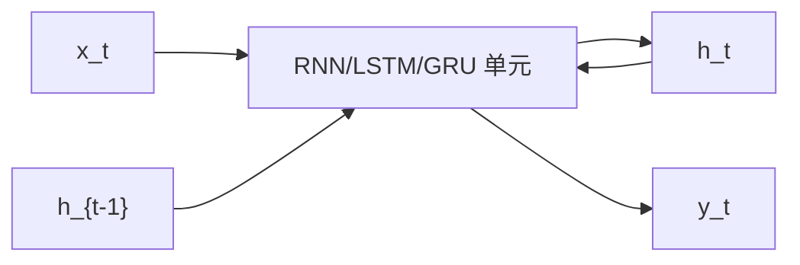

# RNN / LSTM / GRU（循环神经网络）

**RNN**：每一步用同一组参数把「当前输入 + 上一隐状态」映射为新隐状态与输出。**LSTM** 与 **GRU** 是加了 **可学习门** 的实用变体，用来减轻长时滞上的梯度消失。

## 一句话定义

把历史压进一个随时间更新的向量，而不是每次把整段序列摊开做全局交互。

## 英文缩写速查

| 缩写 | 英文全称 | 简要说明 |
|------|----------|----------|
| RNN | Recurrent Neural Network | 隐状态递推序列模型 |
| LSTM | Long Short-Term Memory | 细胞状态 + 输入/遗忘/输出门 |
| GRU | Gated Recurrent Unit | 更新门 + 重置门的轻量门控 RNN |
| BPTT | Backpropagation Through Time | 沿展开时间步的反向传播 |
| POMDP | Partially Observable MDP | 机器人用 RNN 编码历史的典型设定 |

## 为什么重要

- 真机观测几乎总是 **部分可观测**：接触、滑移、外部扰动只在时间里显现。
- LSTM 给出「误差沿时间乘 1 传送」的结构解（[Hochreiter & Schmidhuber, 1997](../../sources/papers/hochreiter_lstm_1997.md)）；GRU 用更少门达到相近效果（[Cho et al., 2014](../../sources/papers/cho_rnn_encoder_decoder_arxiv_1406_1078.md)）。
- 腿式 RL 里「MLP + 短历史」与「GRU 编码器」仍然常见；不要因为 Transformer 流行就先上注意力。

## 核心原理

### 1. 朴素 RNN

\(h_t = \sigma(W_x x_t + W_h h_{t-1} + b)\)。训练用 BPTT。若 \(W_h\) 的谱半径偏离 1，梯度指数消失或爆炸。

### 2. LSTM

细胞状态 \(c_t\) 近似加性更新：遗忘门决定擦除、输入门决定写入、输出门决定读出。长程误差可以沿 \(c_t\) 走捷径。

### 3. GRU

更新门同时混合旧状态与新候选；重置门控制候选读取多少历史。参数更少，推理更快，许多策略实现默认 GRU。

## 工程实践

| 项 | 建议 |
|----|------|
| 历史长度 | 先试 8–32 步；再决定要不要换 TCN/Transformer |
| 动作头 | GRU 编码器 + [MLP](./mlp.md) 策略头，比整网循环更稳 |
| 训练 | 梯度裁剪几乎必开；序列不要在每个 env step 重新 warm-start 而无状态 |
| 选型 | 延迟敏感、上下文短 → GRU；上下文很长 → [Transformer](./transformer.md) / [Mamba](./mamba.md) |

## 局限与风险

- **训练难并行**：逐步依赖限制吞吐，大规模 IL 常被 Transformer 取代。
- **记忆容量有限**：单一向量压缩不了开放词汇指令与多相机 token。
- 误区：LSTM「理论上能记无限长」——门会饱和，有效记忆远短于展开长度。

## 关联页面

- [GRU](./gru.md)
- [TCN](./temporal-convolutional-network.md)
- [Transformer](./transformer.md)
- [Mamba](./mamba.md)
- [RNN vs CNN vs Transformer vs Mamba](../comparisons/rnn-cnn-transformer-mamba.md)
- [AI 架构地图](../overview/ai-architecture-map.md)

## 参考来源

- [LSTM（Neural Computation 1997）](../../sources/papers/hochreiter_lstm_1997.md)
- [GRU / Encoder–Decoder（arXiv:1406.1078）](../../sources/papers/cho_rnn_encoder_decoder_arxiv_1406_1078.md)
- [AI 架构地图一手论文簇](../../sources/papers/ai_architecture_foundations.md)

## 推荐继续阅读

- [Understanding LSTM Networks (colah)](https://colah.github.io/posts/2015-08-Understanding-LSTMs/)
