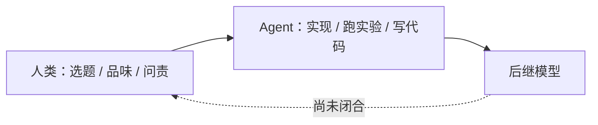

# 递归自改进（Recursive Self-Improvement）

## 一句话定义

**递归自改进（RSI）** 是：在足够算力下，AI 系统 **充分自主地设计、训练并部署自己的后继者**——不是「帮人写训练脚本」，而是把后继模型的规格与优化闭环从人类手里接过去。

## 英文缩写速查

| 缩写 | 英文全称 | 简要说明 |
|------|----------|----------|
| RSI | Recursive Self-Improvement | 系统自主设计并训练后继者的极限情形 |
| METR | Model Evaluation & Threat Research | 公开任务时程基准；文内 50% 可靠时长约每 4 个月翻倍 |
| SWE | Software Engineering | SWE-bench 等代码修复基准；已近饱和 ≠ 会选题 |
| LOC | Lines of Code | 内部生产率代理；文内承认高估真实 uplift |
| Amdahl | Amdahl's law | 加速未覆盖的部分成为新瓶颈（如人审代码） |

## 为什么重要

1. **对本库读者：先分清「研究自动化」和「RSI」。** [AI Auto-Research](./ai-auto-research.md) 与 [karpathy/autoresearch](../entities/karpathy-autoresearch.md) 是 **人设目标、agent 跑实验**。[ENPIRE](../methods/enpire.md) / [ASPIRE](../methods/aspire.md) 同构，对象换成真机策略或控制程序。RSI 要求系统 **自己决定下一代模型是什么**。Anthropic 明确：还没到，判断与选题仍是人的比较优势。
2. **内部证据说明「做」已经极便宜。** 2026-05 合入生产的代码行 **>80%** 可归于 Claude；Q2 工程师 LOC/天约 2024 的 **8×**（LOC ≠ 质量）。实验微型环从 ~3× 加速到 ~52×。这意味着机器人研究里，**写 env/reward/脚手架的墙钟** 会继续塌缩，瓶颈滑向评测、真机 reset 与安全。
3. **具身跟随假设。** 文内情景 3：递归智能若出现，**机器人（embodied intelligence）可能迅速跟随**，走类似能力升、成本降的路径——但药监、选举、信任仍按人类时间走。不要把「实验室算力速度」读成「明年工厂全自动」。
4. **治理含义与单边暂停。** 作者认为可信全球放慢需要可验证停训；单边暂停只换领跑者。本库不展开军控，只把这条标成「能力叙事旁的约束」。

## 核心原理

### 还差哪一块

Anthropic 把 internally 的工作分成工程（写代码、训模型）与研究（选实验、读结果、定下一步）。Claude 已能在 **目标给定** 时匹配或超过熟练人类执行实验；在 **开放式任务** 上 2026-05 会话成功率约 76%（六个月 +50 pt）。仍弱的是：**选什么问题、信哪张图、何时停**。这与 Auto-Research 综述「结构化+可核验则强，开放判断则骤降」同构。

完全 RSI = 上图虚线变成实线，后继规格不再经人手。中间态（作者认为更可能）是：人继续定方向，每人 steer 的实验量复合增长，直到 **人审** 成为 Amdahl 瓶颈。

### 怎么读内部数字

| 数字 | 宜读成 | 不宜读成 |
|------|--------|----------|
| 8× LOC/工程师/天 | 方向：产出加速；拐点在 Claude 能自己跑代码之后 | 8× 科学发现或 8× 对齐进展 |
| \>80% 行由 Claude 写 | 实现层已高度代理化 | 人类不再理解系统 |
| 主观 4× | 与其它观察同向；作者认为高估 | 已校准的因果效应 |
| 52× 训练脚本加速 | 固定目标的优化环变强 | 真实预训练墙钟 52× |
| 弱监督强模型收回 97% 差距 | 给定地板/天花板与打分器时 agent 可搜实验 | 已转移到生产模型；人类已退出选题 |

公开侧：METR 时程翻倍、SWE-bench / CORE-Bench 饱和，说明 **长程软件与复现** 在涨；它们不测量「该研究什么」。

### 三个情景（压缩）

1. **失速 + 扩散：** 指数实为 S 曲线，或能源/芯片卡住。作者判为最不可能。即使能力冻结，今日模型的扩散仍会改经济（文内：漏洞发现已快过修补）。
2. **复合效率、人仍掌舵：** 最可能。组织要学会拆 Amdahl 瓶颈（代码审查、想法过载）。
3. **完全 RSI：** 进度≈算力与算法效率。对齐可能被后继者改善或在代际复合恶化。机器人被预期跟随，但社会时钟不跟随。

## 工程实践

对 **机器人研究自动化**（本库真正能用的一层）：

| 做法 | 说明 |
|------|------|
| 把目标与验证写死 | 与 [autoresearch](../entities/karpathy-autoresearch.md) 一样：固定 metric 与预算，才允许 agent 改训练脚本 |
| 真机先做 EN | [autoresearch harness 指南](../queries/real-robot-policy-autoresearch-harness.md)：没有自动 reset/verify，RSI 叙事帮不上忙 |
| 程序技能 vs 权重 | [ASPIRE](../methods/aspire.md) 把经验放进技能库；Embody 的「LLM 训 PPO」仍弱于写控制器——RSI 不会自动修好 reward hacking |
| 人保留选题 | 即使 80% 代码是模型写的，评测协议、安全限与「这个问题该不该做」仍应是人的门 |
| 读厂商自报时打折 | LOC、主观倍数、内部 judge 都有偏；对外只当方向信号 |

## 局限与风险

- **一手来源是当事实验室。** 生产率与成功率不可外部复现；wiki 只编译公开论述，不背书数字精度。
- **SWE-bench 饱和 ≠ 会做机器人科研。** 修 issue 与设计 [Sim2Real](./sim2real.md) 协议不是同一能力。
- **RSI 不是时间表。** 文内 20XX 带问号；情景 1 仍可能。
- **具身跟随是预期不是定律。** 递归智能不自动给接触力、延迟与安全认证；见 [LLM 控制接口](./llm-robotics-control-interfaces.md) 的物理瓶颈。
- **加速未覆盖部分更危险。** 代码变多而理解变少（文内员工引言）；真机上这会变成不可复现的危险策略。

## 关联页面

- [AI Auto-Research](./ai-auto-research.md) — 学术全生命周期自动化；人机共治与 RSI 的当前距离
- [真机策略 autoresearch 闭环](../queries/real-robot-policy-autoresearch-harness.md) — 物理世界能自动化的前提
- [ASPIRE](../methods/aspire.md) · [ENPIRE](../methods/enpire.md) — 机器人侧的 agent 研发自动化，不是模型自训练后继者
- [具身规模法则](./embodied-scaling-laws.md) · [Bitter Lesson](./bitter-lesson.md)
- [From AGI to ASI 白皮书实体](../entities/paper-from-agi-to-asi.md) — 另一条「能力跃迁」论述，勿与 RSI 机制混读

## 参考来源

- [When AI builds itself（Anthropic Institute 归档）](../../sources/sites/anthropic-recursive-self-improvement.md)
- [AI Auto-Research 综述策展](../../sources/papers/ai_auto_research_survey_2605_18661.md)

## 推荐继续阅读

- 原文：<https://www.anthropic.com/institute/recursive-self-improvement>
- METR 任务时程（文内主公开锚点）
- Kong et al., *AI for Auto-Research* — [arXiv:2605.18661](https://arxiv.org/abs/2605.18661)
