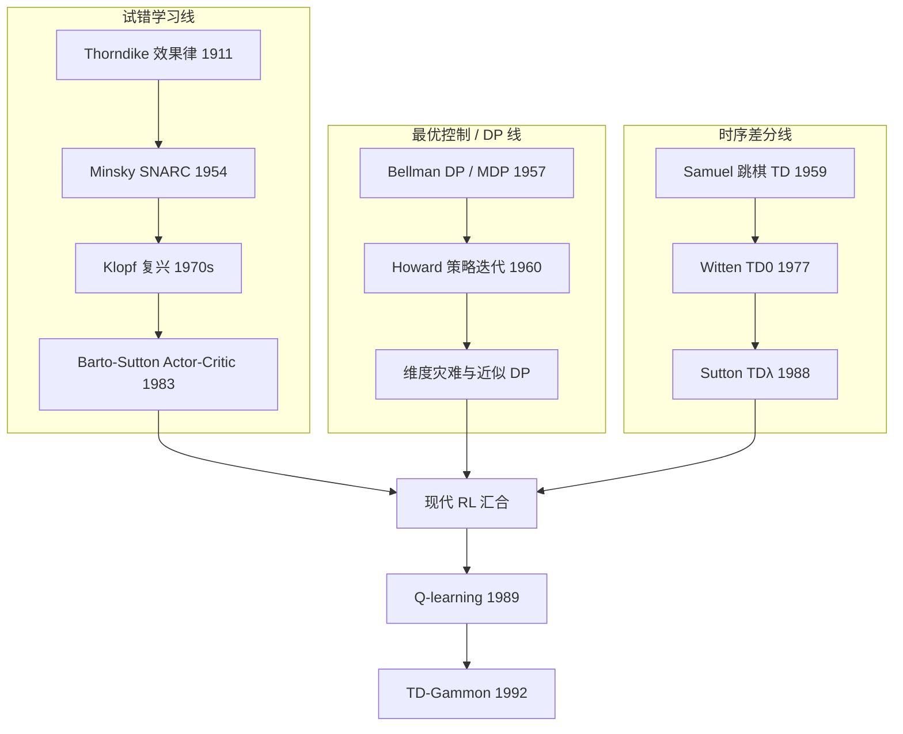

# 强化学习史（Sutton & Barto §1.6）

## 一句话定义

**强化学习史**：Sutton & Barto 将现代 RL 追溯为 **试错学习**（心理学与早期 AI）、**最优控制 / 动态规划**（Bellman、MDP）与 **时序差分学习**（Samuel、Sutton、Watkins）三条脉络，在 1980 年代末经 Q-learning 等工作的汇合而形成当代学科版图。

## 英文缩写速查

| 缩写 | 英文全称 | 简要说明 |
|------|----------|----------|
| RL | Reinforcement Learning | 通过与环境交互最大化长期回报的学习范式 |
| DP | Dynamic Programming | Bellman 方程求解最优控制 / MDP 的经典方法 |
| MDP | Markov Decision Process | 离散随机最优控制的标准形式化 |
| TD | Temporal-Difference Learning | 用连续时刻估计之差驱动的 bootstrapping 学习 |
| GA | Genetic Algorithm | Holland 分类器系统中的演化表示组件（本身非 RL） |

## 为什么重要

- **定位本库 RL 页的理论来源**：读 [Reinforcement Learning](../methods/reinforcement-learning.md)、[MDP](../formalizations/mdp.md)、[Bellman Equation](../formalizations/bellman-equation.md) 时，知道符号与算法从 Bellman–Howard DP 线而来，而 **Actor–Critic / Q-learning** 来自试错 + TD 汇合。
- **避免概念混淆**：1960s 许多「奖惩网络」实为监督学习；现代教材把 **selectional（试选）+ associative（情境绑定）** 当作试错学习的试金石。
- **机器人读者的最短史学路径**：1983 杆平衡 Actor–Critic → 1989 Q-learning → 1992 TD-Gammon → 当代 PPO/深度 RL；[Cartpole](../concepts/cartpole.md) 与 [深度 RL 游戏里程碑](./deep-rl-game-milestones.md) 均可挂在此时间线上。

## 三条主线

### 1. 最优控制与动态规划（通常先验知模型）

- **Bellman（1950s）**：value function、Bellman 方程、动态规划；**MDP** 为离散随机最优控制形式。
- **Howard（1960）**：策略迭代。
- **教材立场**：DP 需要完整系统知识，但增量迭代与学习方法同族；与不完全知识 RL **应一并讲授**。

### 2. 试错学习（心理学 → AI）

- **Thorndike 效果律**：好/坏结果强化或削弱动作—情境联结；**选择 + 联想** ≈ search + memory。
- **早期 AI**：Minsky (1954) SNARC；Minsky (1961) **credit assignment**（功劳分配）问题。
- **1960s–70s 低谷**：Widrow、Rosenblatt 等「奖惩语言」实为监督学习；真试错工作稀少（例外：Andreae STeLLA、learning automata、Holland classifier systems）。
- **Klopf（1972–82）**：强调 hedonic / 目标驱动，推动 Barto & Sutton 厘清监督 vs RL。
- **1981–83**：Barto、Sutton、Anderson 将 TD 用于试错，**Actor–Critic** 解决杆平衡——见 [Cartpole](../concepts/cartpole.md) 谱系。

### 3. 时序差分（三线胶水）

- **Samuel（1959）** 跳棋：在线更新评估函数，含 TD 思想。
- **Witten（1977）**：最早发表的 tabular **TD(0)** 规则（MDP 控制）。
- **Sutton（1988）**：TD 与 control 分离；**TD(λ)**。
- **Watkins（1989）**：**Q-learning** — 三线正式汇合。
- **Tesauro（1992）**：**TD-Gammon** 将注意力引向实用 RL。

## 工程实践（读者怎么用这段史）

| 场景 | 建议 |
|------|------|
| 入门 RL 理论 | 先读 [Sutton & Barto 教材](../entities/sutton-barto-rl-book.md) 第 1 章 §1.6，再进 Ch.3 MDP |
| 面试「RL 与监督学习区别」 | 用 **selectional + associative** 与 credit assignment 回答，而非「有没有 reward」 |
| 选型 model-based vs model-free | DP 线提醒：**已知模型**时 DP/规划仍是最强基线；RL 价值在**不完全模型** |
| 读 Actor–Critic / PPO | 追溯 1983 杆平衡与 1988 TD(λ)，理解 critic 的 bootstrapping 由来 |

## 局限与风险

- **本节止于约 1992**：深度 RL、机器人 loco、离线 RL 等需另读专章或 [深度 RL 游戏里程碑](./deep-rl-game-milestones.md)。
- **在线 HTML 为第 1 版 LaTeX2HTML**：与第 2 版 PDF 小节编号一致但排版陈旧；引文以 MIT Press 第 2 版为准。
- **史学叙事有作者立场**：将 DP 纳入 RL 是教材定义选择，工程团队常把「有模型规划」与「无模型 RL」分开管理。

## 关联页面

- [Reinforcement Learning](../methods/reinforcement-learning.md) — 方法总览
- [Sutton & Barto RL 教材](../entities/sutton-barto-rl-book.md) — 一手教材与章节映射
- [Richard Sutton](../entities/richard-sutton.md) — TD / Options / GVF 提出者
- [MDP](../formalizations/mdp.md) — Howard 策略迭代的现代形式
- [Cartpole](../concepts/cartpole.md) — 1983 Actor–Critic 实验原点
- [深度 RL 游戏里程碑](./deep-rl-game-milestones.md) — Q-learning 之后的深度 RL 叙事

## 参考来源

- [Sutton & Barto §1.6 强化学习史](../../sources/courses/sutton_barto_rl_book_ch01_sec06_history.md)
- [incompleteideas.net 一手资料索引](../../sources/sites/incompleteideas-net-rich-sutton.md)

## 推荐继续阅读

- [§1.6 History of Reinforcement Learning（官方 HTML）](http://incompleteideas.net/book/ebook/node12.html)
- [Sutton & Barto 第 2 版官方页](http://incompleteideas.net/book/the-book-2nd.html)
- [Alberta RL Coursera 专项](https://www.coursera.org/specializations/reinforcement-learning) — 教材配套 MOOC
