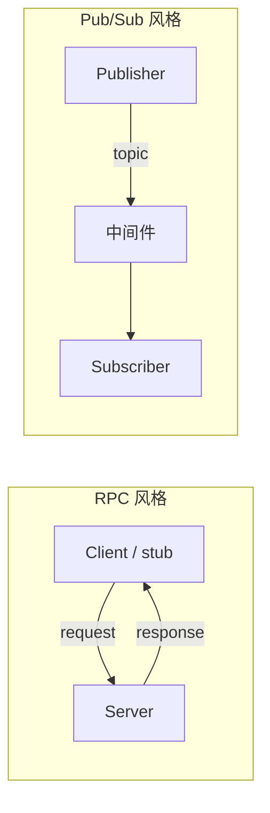

# 远程过程调用（Remote Procedure Call, RPC）

## 一句话定义

**RPC** 是一种分布式通信范式：调用方像调用本地过程一样发起远程方法，运行时负责 **参数编解码、跨机传递、远端执行与结果返回**；经典论述见 Birrell & Nelson（1984），线上历史标准见 ONC RPC（RFC 5531），当代主流实现见 [gRPC](../entities/grpc.md)。

## 英文缩写速查

| 缩写 | 英文全称 | 简要说明 |
|------|----------|----------|
| RPC | Remote Procedure Call | 远程过程调用（本页） |
| IDL | Interface Definition Language | 描述服务与消息类型（如 Protobuf、ONC RPC Language） |
| ONC | Open Network Computing | Sun/IETF 系 RPC 协议族（RFC 5531） |
| gRPC | gRPC Remote Procedure Calls | Google/CNCF 现代 RPC 框架（HTTP/2 + Protobuf） |
| XDR | External Data Representation | ONC RPC 的数据表示（RFC 4506） |

> **缩写冲突：** 本库另有 **Regularized Predictive Control（RPC）**（Bledt / Mini Cheetah 控制线）。本页专指 **Remote Procedure Call**。

## 为什么重要

- 机器人系统大量「配置一下 / 查一下 / 触发一次」交互本质是 **请求–响应**，不是连续状态流——ROS 2 **Services** 在官方叙述中即同步请求/响应 RPC 风格。
- 选型时要分清三层：**概念（像本地调用）**、**线协议（ONC / gRPC / 自研）**、**中间件原语（ROS Service vs DDS Topic）**——混谈会导致把 gRPC 塞进 1 kHz 力矩环，或误以为 DDS Topic「也是 RPC」。
- 边云模型服务、工具桥（如部分 MCP/CAD）、遥操作后端常默认 [gRPC](../entities/grpc.md)；运控数据面仍应优先 [LCM](./lcm-basics.md) / 共享内存 / 现场总线。

## 核心原理

### 经典模型（Birrell & Nelson 1984）

1. 调用环境 **挂起**；参数传到 callee 环境并执行。
2. 结果回传后，调用环境像普通过程返回一样继续。
3. 设计者必须显式处理：**失败语义、无共享地址空间的指针、语言集成、binding、传输协议、安全**。

一手归档：[birrell_nelson_implementing_rpc_tocs_1984](../../sources/papers/birrell_nelson_implementing_rpc_tocs_1984.md)。

### 协议层 vs 框架层

| 层 | 一手入口 | 回答什么 |
|----|----------|----------|
| **概念** | Birrell & Nelson TOCS 1984 | 语义与设计议题 |
| **历史线协议** | [RFC 5531 ONC RPC](../../sources/sites/rfc-5531-onc-rpc.md) | Program/Procedure、XDR 消息、与传输/绑定解耦 |
| **现代框架** | [gRPC 文档](../../sources/sites/grpc-io-docs.md) / [grpc/grpc](../../sources/repos/grpc.md) | Protobuf IDL、四种 RPC、HTTP/2、多语言 stub |

RFC 5531 写明：规范 **不论证**「为何用 RPC」，概念背景指向 Birrell & Nelson；且 **binding 可独立于 RPC 报文协议**。

### 与 pub/sub 对照（机器人通信）

| 维度 | RPC（请求/响应） | Pub/Sub（如 DDS / LCM） |
|------|------------------|-------------------------|
| 耦合 | 调用方等待（或异步等待）特定服务 | 发布者不指定订阅者 |
| 典型用途 | 标定、切换模式、查询、模型推理 API | 关节状态、传感器流、高频设定 |
| ROS 2 | **Services**（及长时 **Actions**） | **Topics** |
| 实时风险 | 阻塞/排队放大尾延迟 | 仍可能因 Reliable/重传抖动 |

### gRPC 四种方法（官方 Core Concepts）

| 类型 | 含义 | 机器人直觉 |
|------|------|------------|
| Unary | 一问一答 | 最接近 ROS Service |
| Server streaming | 一问多答流 | 类似「一次订阅切片」但仍是单次 RPC |
| Client streaming | 多问一答 | 批量上传后汇总 |
| Bidi streaming | 双向流 | 长会话；仍不是 DDS 发现域 |

## 工程实践

### 开源与资料状态（2026-07-28）

- **概念论文**：PDF 公开可读（ACM 版权）。
- **RFC 5531**：公开标准文本。
- **gRPC**：**已开源**（Apache-2.0；~45k★，v1.83.0）——见 [entities/grpc](../entities/grpc.md)。

### 机器人落地建议

1. **控制环（≥500 Hz）**：不要用 gRPC/HTTP/2 或阻塞式 ROS Service 传力矩/关节设定；用 [LCM](./lcm-basics.md)、共享内存或 EtherCAT——见 [实时中间件指南](../queries/real-time-control-middleware-guide.md)。
2. **系统服务面**：标定、地图切换、录包控制、云端策略服务 → RPC/gRPC/ROS Service 合适；设 **deadline**，避免无限阻塞。
3. **契约先行**：先写 IDL（`.proto` / `.srv`），再生成 stub；版本化 service 名与消息字段。
4. **失败语义**：网络会丢包/重复；明确至少一次 vs 至多一次，并对非幂等命令做防重。
5. **与 DDS 共存**：同一机器人上常见「Topic 流状态 + Service 做 RPC」；经 [RMW](./rmw-interface.md) 的 Service 仍受 DDS/QoS 影响，排障时两边都查。

## 局限与风险

- **泄漏的抽象**：看起来像本地调用，实际有延迟、部分失败、时钟与取消不一致（gRPC 文档明确两端成功判定可能不同）。
- **误用于数据面**：把高频状态塞进 unary RPC 会产生队头阻塞与尾延迟。
- **协议碎片**：ONC、gRPC、JSON-RPC、ZeroRPC、进程内「RPC server」名称相同、线格式不通。
- **缩写误读**：检索本库 `RPC` 时先确认是通信还是 Regularized Predictive Control。

## 关联页面

- [gRPC](../entities/grpc.md)
- [ROS 2 基础](./ros2-basics.md)
- [DDS 通信机制](./dds-communication.md)
- [RMW 接口](./rmw-interface.md)
- [网络协议栈](./network-protocol-stack.md)
- [LCM 基础](./lcm-basics.md)
- [通信协议专题](../overview/topic-communication.md)
- [FreeCAD MCP](../entities/freecad-mcp.md)（本地 Addon RPC 暴露）

## 参考来源

- [Birrell & Nelson 1984](../../sources/papers/birrell_nelson_implementing_rpc_tocs_1984.md)
- [RFC 5531 ONC RPC](../../sources/sites/rfc-5531-onc-rpc.md)
- [gRPC 官方文档](../../sources/sites/grpc-io-docs.md)
- [sources/repos/grpc.md](../../sources/repos/grpc.md)
- [ROS 2 官方文档索引](../../sources/sites/ros2-official-documentation.md)（Services = 请求/响应同步 RPC）

## 推荐继续阅读

- Birrell & Nelson PDF：<http://birrell.org/andrew/papers/ImplementingRPC.pdf>
- RFC 5531：<https://www.rfc-editor.org/rfc/rfc5531>
- gRPC Core concepts：<https://grpc.io/docs/what-is-grpc/core-concepts/>
