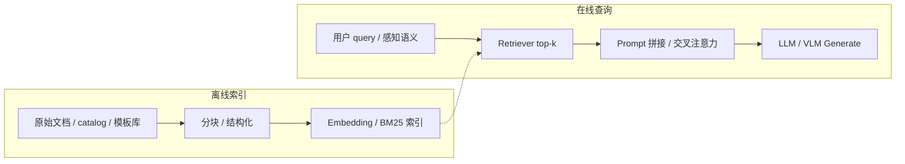

# Retrieval-Augmented Generation（RAG，检索增强生成）

**RAG**：在 **大语言模型（或 VLM）生成答案/动作语义之前**，先从 **外部知识库**（文档、向量库、结构化 catalog、安全模板库等）**检索** top-$k$ 相关条目，将其作为 **条件上下文** 再 **生成** 输出——用 **非参数化、可热更新** 的记忆补足模型权重里的参数化知识，并改善 **归因与faithfulness**。

## 一句话定义

> **RAG = Retrieve（找证据）→ Augment（拼进上下文）→ Generate（条件生成）**；知识存在 **库** 里而不只存在 **权重** 里，换库即可更新事实边界。

## 英文缩写速查

| 缩写 | 英文全称 | 简要说明 |
|------|----------|----------|
| RAG | Retrieval-Augmented Generation | 检索增强生成；本页主题 |
| DPR | Dense Passage Retrieval | 双塔稠密段落检索；RAG 奠基检索器 |
| BM25 | Best Matching 25 | 经典稀疏检索；常与向量检索 hybrid |
| HyDE | Hypothetical Document Embeddings | 用 LLM 先写假文档再检索，缓解 query-document gap |
| FAISS | Facebook AI Similarity Search | 向量近邻库；机器人模板检索亦常用 |

## 为什么重要

- **知识密集型任务的基础范式：** 开放域 QA、企业知识库问答、代码/日志 grounding 都依赖「先找再答」；Lewis et al.（NeurIPS 2020）证明 **retrieve-then-generate** 在 QA 上优于纯生成与 extractive 基线，且 **换检索语料即可更新知识**。
- **降低幻觉、改善溯源：** 生成可指向检索段（attribution）；本库 [Karpathy LLM Wiki 模式](../references/llm-wiki-karpathy.md) 把 RAG 的反面讲透——**预编译 wiki + 强制 `## 参考来源`** 让综合洞见 **复利**，而非每次 query 重新拼片段。
- **机器人/agent 的通用「外脑」结构：** 不限于文本段落——[Scanford](../entities/paper-scanford-robot-powered-data-flywheel.md) 用 **图书馆 catalog RAG** 约束 VLM 书标签；[SafeHumanoid](../entities/paper-notebook-safehumanoid-vlm-rag-driven-control-of-upper-bod.md) 用 **FAISS 检索安全阻抗模板**；与 [VLA](../methods/vla.md) / 技能库检索同属 **「检索约束 + 生成/控制」** 家族。
- **AI Auto-Research 方法族之一：** [AI Auto-Research](./ai-auto-research.md) 综述将 RAG 列为 S2 文献综合的 **五类方法** 之一；Structured、可检索任务上 RAG 成熟，但 **不保证源正确或忠实转述**。

## 核心原理

### 奠基架构（Lewis et al. 2020）

给定查询 $x$，检索器 $p_\eta(z|x)$ 从语料取段落 $z$，生成器 $p_\theta(y|x,z)$ 输出 $y$：

$$
p(y|x) \approx \sum_{z \in \text{top-}k} p_\eta(z|x)\, p_\theta(y|x,z)
$$

- **RAG-Sequence：** 固定一组检索段生成整段输出。
- **RAG-Token：** 每个 token 可在不同检索段间边际化，更细粒度融合多文档。

**DPR 检索器：** 查询/段落 **双塔编码 + 内积相似度**（见 [`facebookresearch/DPR`](../../sources/repos/facebookresearch_dpr.md)），是现代 **向量 RAG** 的直接前传。

### 三代演进（Gao et al. 2023 综述 taxonomy）

| 代际 | 流程 | 典型增强 |
|------|------|----------|
| **Naive RAG** | Index → Retrieve → Generate | 固定 chunk、top-$k$、prompt 拼接 |
| **Advanced RAG** | 检索前后处理 | query rewrite、HyDE、rerank、context compression |
| **Modular RAG** | 可编排模块 + 反馈 | routing、GraphRAG、Self-RAG、agent 工具环 |

### 流程总览

## 工程实践

### 最小可行链路（Naive RAG checklist）

1. **Indexing** — 解析 PDF/Markdown/DB；chunk 大小（典型 256–512 token）与 overlap；写入向量库 + 元数据（来源、日期）。
2. **Retrieval** — 稠密（bi-encoder）、稀疏（BM25）或 **hybrid**；top-$k$（3–10）经 **reranker**（cross-encoder）精排。
3. **Augmentation** — 检索段拼进 system/user prompt；超长时用 **context compression** 或 **parent-child chunk**。
4. **Generation** — 温度、引用格式约束；必要时 **Self-RAG / CRAG** 让模型自判检索是否够用。
5. **评测** — 检索 Recall@k；生成 **faithfulness**（RAGAS、人工 attribution）；机器人任务看 **下游成功率** 而非 BLEU。

### 机器人侧读法

| 场景 | 「检索库」是什么 | 「生成」是什么 | 本库实例 |
|------|------------------|--------------|----------|
| 野外 VLM 微调 | 图书馆 catalog | VLM 书脊标签/OCR | [Scanford](../entities/paper-scanford-robot-powered-data-flywheel.md) |
| 安全阻抗控制 | 16 条验证模板 + FAISS | 每关节 Kp/Kd/速度 | [SafeHumanoid](../entities/paper-notebook-safehumanoid-vlm-rag-driven-control-of-upper-bod.md) |
| 知识库维护 | `sources/` + wiki 页 | ingest/query 写回 wiki | [LLM Wiki](../references/llm-wiki-karpathy.md) |

### 框架与工具

- **编排：** [LangChain](../entities/painode-125-langchain.md) 等提供 retriever、document loader、chain 抽象；生产还需观测（latency、retrieval hit rate）。
- **复现检索器：** [`facebookresearch/DPR`](../../sources/repos/facebookresearch_dpr.md) — 理解 bi-encoder + FAISS 的经典路径。

## 局限与风险

- **检索失败 = 全盘失败：** chunk 切分丢上下文、embedding 域偏移、query 与文档 **语义 gap**（Advanced RAG 用 rewrite/HyDE/rerank 缓解）。
- **生成忽略检索：** 模型仍可能「自信胡编」；需 faithfulness 评测与 **引用强制**。
- **延迟与成本：** 每次 query 两次模型调用（embed + generate）+ 向量检索；机器人 **50 Hz 控制环**（SafeHumanoid）暴露 **感知–推理–检索** 频率瓶颈。
- **与 LLM Wiki 的分工：** RAG 适合 **大语料、低频更新、 ad-hoc 问答**；本库 wiki 适合 **高频交叉引用、综合洞见、强制溯源**——二者可组合（wiki 作 RAG 索引源，且质量高于 raw chunk）。

## 关联页面

- [LLM Wiki（Karpathy 模式）](../references/llm-wiki-karpathy.md) — 预编译知识 vs 查询时 RAG
- [AI Auto-Research（学术研究自动化）](./ai-auto-research.md) — RAG 在 S2 文献综合中的位置
- [Transformer](./transformer.md) — 现代 RAG 生成器骨干
- [VLA（Vision-Language-Action）](../methods/vla.md) — 多模态策略与 catalog/技能检索
- [SafeHumanoid（VLM-RAG 阻抗控制）](../entities/paper-notebook-safehumanoid-vlm-rag-driven-control-of-upper-bod.md)
- [Robot-Powered Data Flywheel（Scanford）](../entities/paper-scanford-robot-powered-data-flywheel.md)
- [数据飞轮（Data Flywheel）](./data-flywheel.md)
- [LangChain](../entities/painode-125-langchain.md)

## 参考来源

- [Lewis et al. RAG（NeurIPS 2020）](../../sources/papers/lewis_rag_neurips_2020.md)
- [Gao et al. RAG Survey（arXiv:2312.10997）](../../sources/papers/rag_survey_arxiv_2312_10997.md)
- [facebookresearch/DPR 仓库归档](../../sources/repos/facebookresearch_dpr.md)
- [LangChain 仓库归档（awesome-physical-ai #125）](../../sources/repos/pai_awesome_resource_125_langchain.md)

## 推荐继续阅读

- Lewis, P., et al. (2020). *Retrieval-Augmented Generation for Knowledge-Intensive NLP Tasks*. NeurIPS. <https://arxiv.org/abs/2005.11401>
- Gao, Y., et al. (2023). *Retrieval-Augmented Generation for Large Language Models: A Survey*. <https://arxiv.org/abs/2312.10997>
- [RAG Survey 配套 GitHub 论文索引](https://github.com/Tongji-KGLLM/RAG-Survey)
